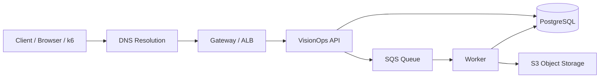
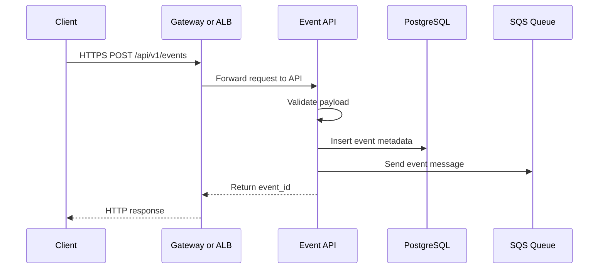
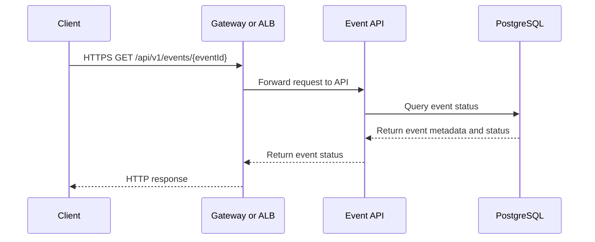
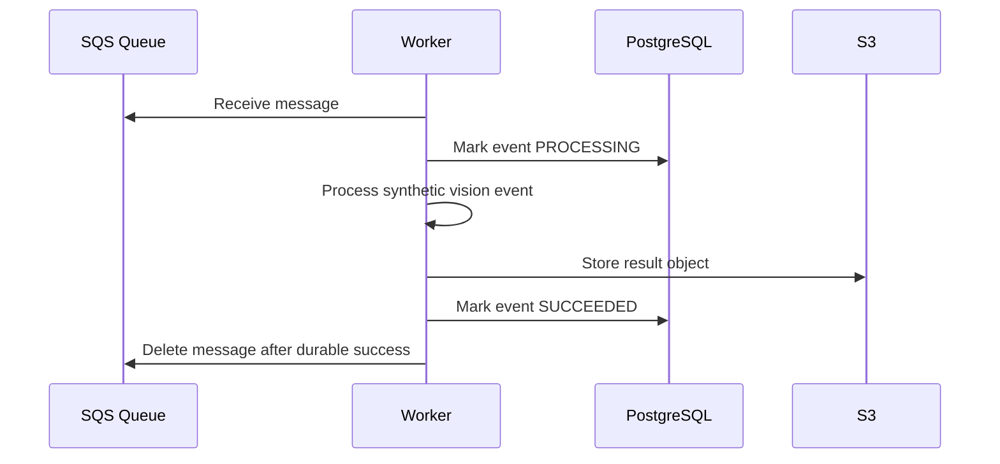
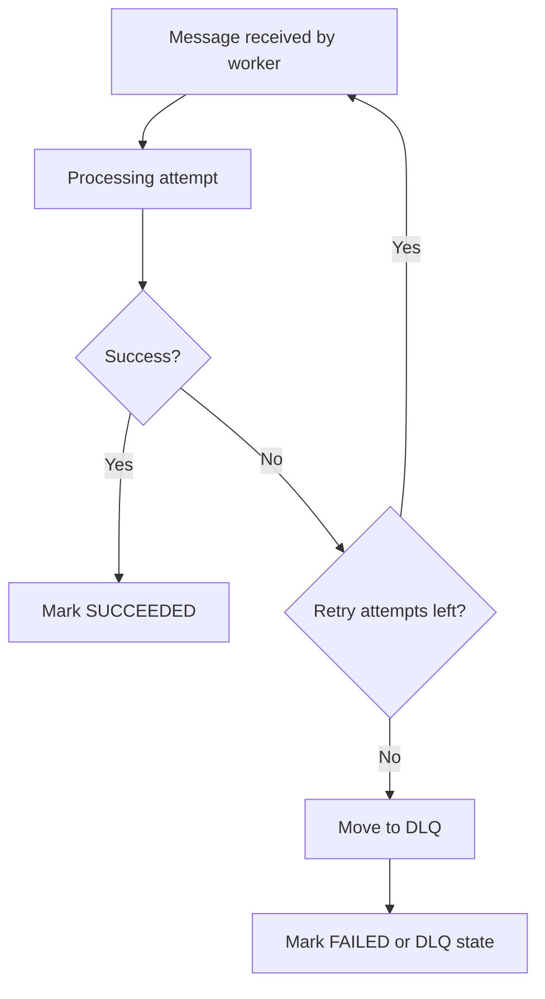
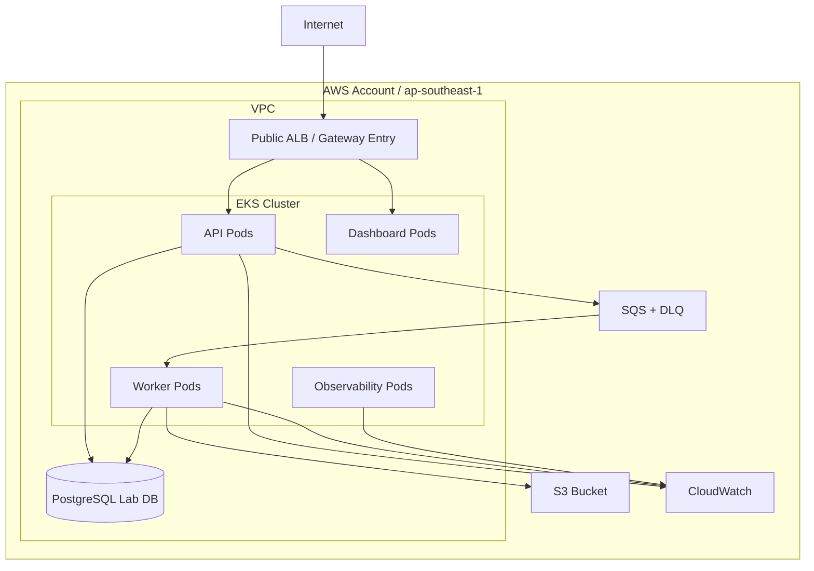
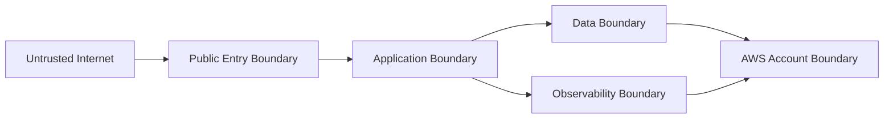

# Network Architecture — VisionOps Reliability Platform

## วัตถุประสงค์

เอกสารนี้อธิบาย Network Architecture v0 และ Packet Flow ของ VisionOps Reliability Platform

เป้าหมายคือทำให้เข้าใจว่า request หนึ่งรายการเดินทางจาก client ไปยัง Gateway, API, Database, Queue, Worker, Object Storage และ Observability stack อย่างไร

เอกสารนี้เป็น design baseline เท่านั้น ยังไม่มีการสร้าง AWS resources จริงใน issue นี้

เอกสารนี้อ้างอิงจาก:

- `docs/project-charter.md`
- `docs/requirements/functional-requirements.md`
- `docs/requirements/non-functional-requirements.md`

---

## Architecture Status

| รายการ | ค่า |
|---|---|
| Version | v0 |
| Phase | M0 — Safety & Design |
| Status | Design baseline |
| Cloud resources created | No |
| Sensitive details recorded | No |

---

## High-level Network Flow



---

## Request Flow — Create Event



Expected behavior:

1. Client ส่ง request เพื่อสร้าง Event
2. Gateway หรือ ALB รับ request
3. Event API validate payload
4. API บันทึก metadata ลง PostgreSQL
5. API ส่ง message เข้า Queue
6. API ตอบกลับ `event_id` โดยไม่รอ Worker ประมวลผลเสร็จ

---

## Request Flow — Get Event Status



---

## Worker Flow — Process Event



Expected behavior:

1. Worker รับ message จาก Queue
2. Worker update Event เป็น `PROCESSING`
3. Worker ประมวลผล synthetic workload
4. Worker เขียนผลลัพธ์ลง Object Storage
5. Worker update Event เป็น `SUCCEEDED`
6. Worker delete message หลังจาก durable success เท่านั้น

---

## Failure Flow — Retry and DLQ



Failure handling intent:

- transient failure ต้อง retry ได้
- retry ต้องมีขอบเขต
- poison message ต้องไป DLQ หรือ terminal failed state
- ไม่มี Event ที่รับสำเร็จแล้วหายเงียบโดยไม่มีสถานะ

---

## AWS Lab Network Boundary

Network นี้เป็น design direction สำหรับ AWS Lab ในอนาคต ไม่ใช่ resource ที่สร้างแล้ว



---

## Packet Path Explanation

เมื่อ client ส่ง request เพื่อสร้าง event ใหม่ เส้นทางโดยรวมคือ:

```text
Client
  → DNS lookup
  → TCP connection
  → TLS handshake
  → Gateway / ALB
  → API pod
  → PostgreSQL metadata write
  → SQS message publish
  → API response
```

เมื่อ worker ประมวลผล event:

```text
Worker
  → SQS receive
  → PostgreSQL update PROCESSING
  → synthetic processing
  → S3 write result
  → PostgreSQL update SUCCEEDED
  → SQS delete message
```

---

## Network Security Intent

| Boundary | Intent |
|---|---|
| Internet → Gateway/ALB | อนุญาตเฉพาะ HTTP/HTTPS ตาม environment |
| Gateway/ALB → API/Dashboard | route เฉพาะ service ที่ต้อง public |
| API → Database | อนุญาตเฉพาะ connection ที่จำเป็น |
| API → SQS | API publish message เท่านั้น |
| Worker → SQS | Worker consume/delete message เท่านั้น |
| Worker → S3 | Worker write result เฉพาะ prefix ที่กำหนดในอนาคต |
| Observability → Services | scrape/collect telemetry เฉพาะ endpoint ที่ตั้งใจ |

---

## Trust Boundaries



Trust boundary intent:

| Boundary | ความหมาย |
|---|---|
| Untrusted Internet | client หรือ traffic ภายนอกที่ระบบควบคุมไม่ได้ |
| Public Entry Boundary | Gateway/ALB ที่รับ request จากภายนอก |
| Application Boundary | API, Dashboard และ Worker |
| Data Boundary | PostgreSQL, SQS, S3 และ DLQ |
| Observability Boundary | Metrics, logs, traces, dashboard และ alerting |
| AWS Account Boundary | IAM, VPC, EKS, CloudWatch, Budgets และ cloud resources |

---

## Lab Network Assumptions

- AWS Lab ใช้ region `ap-southeast-1`
- EKS จะเปิดแบบ short-lived เท่านั้น
- ไม่มีการเปิด database public โดยไม่จำเป็น
- ไม่มีการ commit account ID, subnet ID, security group ID หรือ endpoint จริงในเอกสารนี้
- Network design นี้เป็น v0 และจะเปลี่ยนได้เมื่อทำ Terraform จริง
- Cost optimization เป็นข้อจำกัดสำคัญของ Lab Architecture

---

## Production Reference Direction

ถ้าระบบต้องใช้ production จริง ควรเพิ่ม:

- private subnets สำหรับ worker nodes
- public subnets สำหรับ ALB เท่านั้น
- RDS private subnet
- controlled egress ผ่าน NAT Gateway หรือ VPC endpoints ตาม cost/reliability trade-off
- WAF เมื่อ threat model ต้องการ
- TLS certificate management
- centralized logging และ audit
- network policy ที่ enforce ได้จริง
- separation ระหว่าง dev, staging และ production accounts

---

## Limitations

- ยังไม่ได้สร้าง VPC จริง
- ยังไม่ได้กำหนด CIDR สุดท้าย
- ยังไม่ได้สร้าง Security Group จริง
- ยังไม่ได้เลือก subnet strategy สุดท้าย
- ยังไม่ได้ validate cost ของ NAT Gateway, ALB หรือ VPC endpoints
- ยังไม่ได้สร้าง EKS, SQS, S3 หรือ RDS จริง
- รายละเอียดจริงจะถูกกำหนดใน Terraform phase และ ADR ที่เกี่ยวข้อง

---

## Change Log

| Date | Change |
|---|---|
| 2026-09-07 | Created initial network architecture v0 |