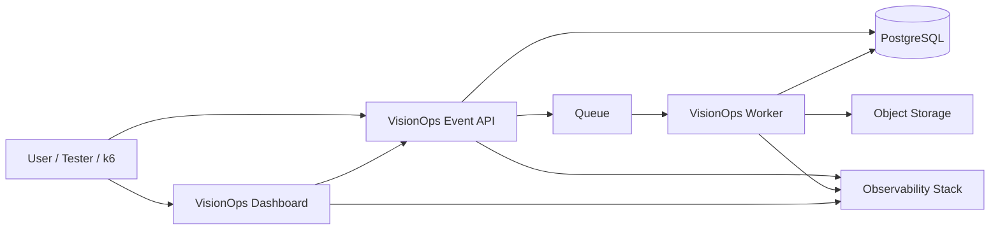
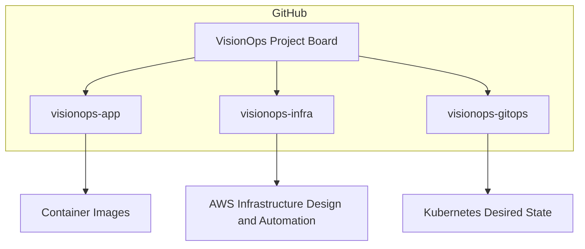
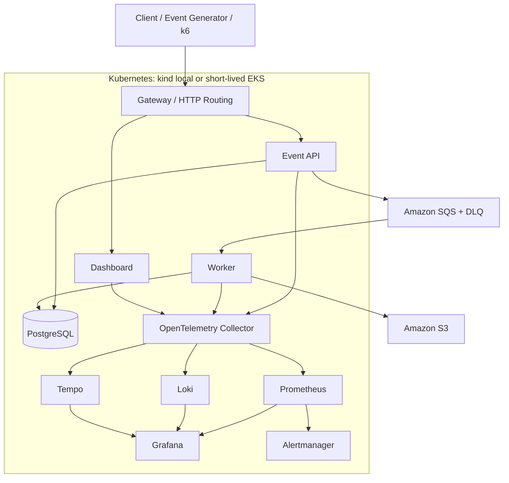
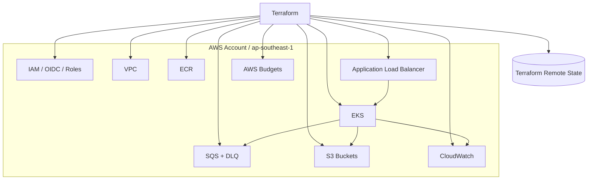
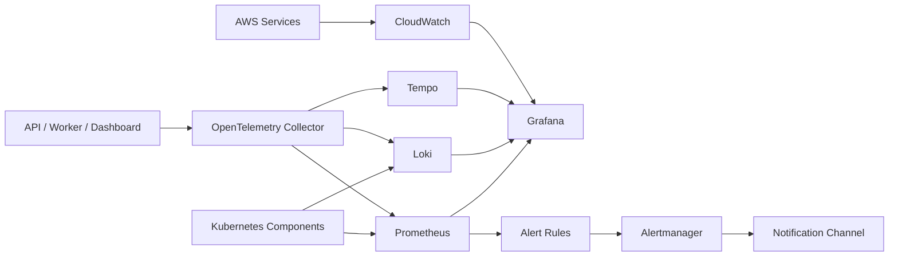
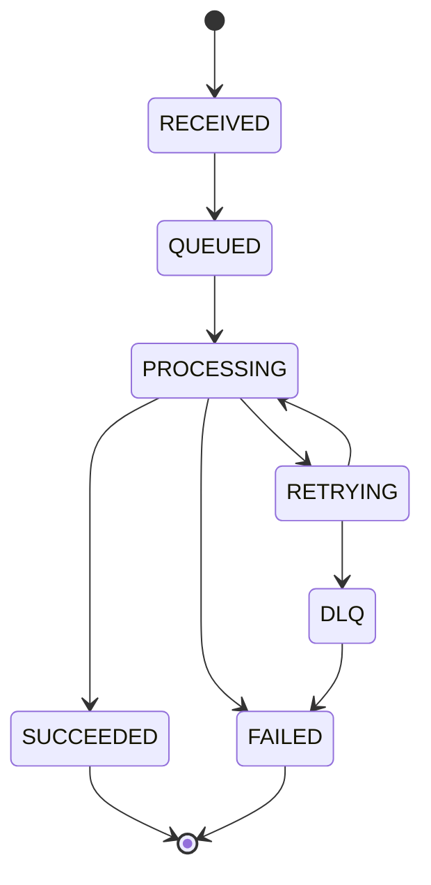

# System Architecture — VisionOps Reliability Platform

## วัตถุประสงค์

เอกสารนี้อธิบาย System Architecture v0 ของ VisionOps Reliability Platform

Architecture นี้เป็น baseline สำหรับ M0 — Safety & Design ใช้เพื่ออธิบาย component หลักของระบบ ความสัมพันธ์ระหว่าง repository, application workload, infrastructure, GitOps, observability และ reliability workflow

เอกสารนี้อ้างอิงจาก:

- `docs/project-charter.md`
- `docs/requirements/functional-requirements.md`
- `docs/requirements/non-functional-requirements.md`

---

## Architecture Status

| รายการ | ค่า |
|---|---|
| Version | v0 |
| Phase | M0 — Safety & Design |
| Status | Design baseline |
| Implementation status | Not implemented yet |
| Cloud resources created | No |
| Sensitive details recorded | No |

---

## System Context

VisionOps Reliability Platform เป็นระบบทดลองแบบ Production-Oriented สำหรับเรียนรู้ Cloud, DevOps, Platform Engineering และ SRE

ระบบใช้ Synthetic Vision Event เป็น workload กลาง โดยมีเป้าหมายหลักคือพิสูจน์ว่าเจ้าของโปรเจกต์สามารถออกแบบ deploy observe secure และ recover ระบบได้ ไม่ใช่แค่เขียน application ให้รันได้

---

## Repository Architecture

VisionOps แยก repository ตาม responsibility เพื่อให้เห็นขอบเขตระหว่าง application source code, infrastructure source code และ GitOps desired state

| Repository | Responsibility |
|---|---|
| `visionops-app` | API, Worker, Dashboard, Event Generator และ application tests |
| `visionops-infra` | Terraform, AWS, Linux, automation, security, observability, SRE docs และ evidence |
| `visionops-gitops` | Kubernetes manifests, Helm chart, Argo CD applications และ environment desired state |

---

## Runtime Architecture — Lab Baseline

Runtime Architecture นี้แสดงภาพเป้าหมายของระบบเมื่อเข้าสู่ phase ที่มี local Kubernetes หรือ AWS EKS แล้ว

ใน M0 ยังไม่มีการสร้าง Cloud resource จริง

---

## Application Component Responsibilities

| Component | Responsibility |
|---|---|
| Dashboard | แสดงรายการ Event, สถานะ Event และ service health แบบพื้นฐาน |
| Event API | รับ request, validate payload, สร้าง event_id, บันทึก metadata และส่งงานเข้า Queue |
| Worker | รับ message จาก Queue, ประมวลผล synthetic event, เขียนผลลัพธ์ และ update status |
| PostgreSQL | เก็บ metadata, state transition และ event status |
| Queue | decouple API และ Worker, รองรับ retry และ DLQ |
| Object Storage | เก็บ object หรือ result ที่เกี่ยวข้องกับ Event |
| Event Generator | สร้าง traffic ปกติ, invalid traffic และ spike traffic สำหรับ test |
| Observability Stack | เก็บ metrics, logs, traces, dashboard และ alerts |

---

## Delivery Architecture — CI/CD and GitOps

Delivery Architecture นี้แสดงทิศทางใน phase ถัดไป เมื่อมี CI/CD, ECR, GitOps และ Kubernetes deployment แล้ว

```mermaid
flowchart LR
    DEV[Developer]
    PR[Pull Request]
    CI[GitHub Actions CI]
    TEST[Test / Lint / Scan]
    BUILD[Build Container Image]
    ECR[Amazon ECR]
    GITOPS[visionops-gitops]
    ARGO[Argo CD]
    K8S[Kubernetes Cluster]
    VERIFY[Smoke Test / Metrics Check]

    DEV --> PR
    PR --> CI
    CI --> TEST
    TEST --> BUILD
    BUILD --> ECR
    ECR --> GITOPS
    GITOPS --> ARGO
    ARGO --> K8S
    K8S --> VERIFY
```

Expected delivery direction:

1. Developer เปิด Pull Request
2. GitHub Actions ตรวจ test, lint, security scan และ build
3. Image ถูก build และ push เข้า registry
4. GitOps repository ถูก update ด้วย image tag หรือ digest
5. Argo CD reconcile desired state เข้าสู่ Kubernetes
6. Smoke test และ metrics ใช้ตรวจว่าการ deploy สำเร็จหรือไม่

---

## Infrastructure Architecture — AWS Lab Direction

Infrastructure Architecture นี้เป็นเป้าหมายของ AWS Lab ใน phase ถัดไป ไม่ใช่สิ่งที่สร้างใน M0

---

## Observability Architecture

Observability Architecture นี้เป็นเป้าหมายของ M7 เป็นต้นไป โดยใช้ metrics, logs และ traces เพื่อเชื่อมจาก symptom ไปสู่ root cause

---

## Event Lifecycle Architecture

---

## Lab Implementation vs Production Reference

| Area | Lab Implementation | Production Reference |
|---|---|---|
| Cloud account | Single AWS account | Separate dev, staging และ production accounts |
| Kubernetes | kind local และ short-lived EKS | Long-running managed cluster with upgrade policy |
| Database | Local/in-cluster PostgreSQL หรือ short-lived RDS | Managed private RDS/Aurora with backups and PITR |
| Network | Cost-optimized lab network | Private subnets, controlled egress, WAF where needed |
| Secrets | Local ignored files / future secret manager | Managed secrets with rotation |
| Observability | Short retention stack | Centralized durable telemetry |
| Reliability | Controlled GameDay | Real on-call, SLO review และ incident process |
| Cost | Hard cap 100 USD | Organization-level FinOps governance |

---

## Architecture Assumptions

- ระบบใช้ synthetic data เท่านั้น
- AWS region หลักคือ `ap-southeast-1`
- EKS จะถูกใช้แบบ short-lived lab ไม่เปิดทิ้ง 24/7
- GitHub Actions จะใช้ OIDC ใน phase ที่เกี่ยวข้อง
- Terraform จะเป็น source of truth สำหรับ AWS infrastructure
- GitOps จะใช้ Argo CD ใน phase ที่เกี่ยวข้อง
- Observability stack จะเพิ่มใน phase M7
- Optional AI/CV worker จะยังไม่เริ่มจนกว่า Core Platform ผ่านก่อน

---

## Architecture Limitations

- ยังไม่มี implementation จริงใน phase นี้
- ยังไม่มี Terraform module
- ยังไม่มี Kubernetes manifest
- ยังไม่มี CI/CD pipeline
- ยังไม่มี SLO measurement จริง
- ยังไม่มี AWS infrastructure ถูกสร้าง
- Diagram นี้เป็น v0 และจะต้องปรับเมื่อ implementation จริงเปลี่ยน

---

## Change Log

| Date | Change |
|---|---|
| 2026-09-07 | Created initial system architecture v0 |