# VisionOps Reliability Platform

## ชื่อภาษาไทย

> **วิชันออปส์: แพลตฟอร์มคลาวด์เนทีฟเพื่อการส่งมอบ การสังเกตการณ์ และความเชื่อถือได้ของระบบ**

## ชื่อภาษาอังกฤษ

> **VisionOps Reliability Platform — Production-Oriented Cloud-Native Delivery, Observability, and Reliability Platform on AWS**

## คำอธิบายหนึ่งประโยค

โปรเจกต์ Portfolio แบบลงมือปฏิบัติจริงสำหรับแสดงความสามารถด้าน **Cloud, DevOps, Platform Engineering และ Site Reliability Engineering (SRE)** ตั้งแต่ Linux และ Network พื้นฐาน ไปจนถึง Infrastructure as Code, Containers, Kubernetes, CI/CD, GitOps, Observability, Security, Incident Response, Disaster Recovery และ Cost Management โดยใช้ระบบประมวลผล Vision Event ขนาดเล็กเป็น Workload กลางของทุกการทดลอง

> [!IMPORTANT]
> เอกสารนี้ตั้งใจเป็นทั้ง **Project Charter** และ **Master Design Baseline** เพื่อให้ผู้พัฒนาคนเดียวสามารถเริ่มทำงานได้โดยไม่ต้องเดาว่าแต่ละระยะต้องสร้างอะไร ใช้เทคโนโลยีใด เหตุใดจึงเลือก และจะพิสูจน์ผลอย่างไร

---

# สารบัญ

1. [บทสรุปผู้บริหาร](#1-บทสรุปผู้บริหาร)
2. [เหตุผลที่เลือกทำโปรเจกต์นี้](#2-เหตุผลที่เลือกทำโปรเจกต์นี้)
3. [โครงสร้าง Portfolio และชื่อแต่ละโปรเจกต์](#3-โครงสร้าง-portfolio-และชื่อแต่ละโปรเจกต์)
4. [วิสัยทัศน์ พันธกิจ และคุณค่าที่ต้องการพิสูจน์](#4-วิสัยทัศน์-พันธกิจ-และคุณค่าที่ต้องการพิสูจน์)
5. [นิยาม Production-Oriented](#5-นิยาม-production-oriented)
6. [ผู้มีส่วนเกี่ยวข้องและบทบาท](#6-ผู้มีส่วนเกี่ยวข้องและบทบาท)
7. [สมมติฐาน ข้อจำกัด และ Guardrails](#7-สมมติฐาน-ข้อจำกัด-และ-guardrails)
8. [หลักการออกแบบ](#8-หลักการออกแบบ)
9. [เป้าหมายและตัวชี้วัดความสำเร็จ](#9-เป้าหมายและตัวชี้วัดความสำเร็จ)
10. [Workload กลางของระบบ](#10-workload-กลางของระบบ)
11. [ขอบเขตรวมของ Portfolio](#11-ขอบเขตรวมของ-portfolio)
12. [Project 1 — ฐานรากปฏิบัติการ Linux และเครือข่าย](#12-project-1--ฐานรากปฏิบัติการ-linux-และเครือข่าย)
13. [Project 2 — โรงงานส่งมอบซอฟต์แวร์บน Cloud-Native](#13-project-2--โรงงานส่งมอบซอฟต์แวร์บน-cloud-native)
14. [Project 3 — สนามทดสอบ SRE และการรับมือเหตุขัดข้อง](#14-project-3--สนามทดสอบ-sre-และการรับมือเหตุขัดข้อง)
15. [Project 4 — ส่วนต่อขยาย AI/Computer Vision Operations](#15-project-4--ส่วนต่อขยาย-aicomputer-vision-operations)
16. [สถาปัตยกรรมรวม](#16-สถาปัตยกรรมรวม)
17. [กลยุทธ์ Environment](#17-กลยุทธ์-environment)
18. [Network Architecture และ Packet Flow](#18-network-architecture-และ-packet-flow)
19. [Technology Selection และ Trade-off](#19-technology-selection-และ-trade-off)
20. [Infrastructure as Code](#20-infrastructure-as-code)
21. [Container และ Kubernetes Design](#21-container-และ-kubernetes-design)
22. [CI/CD และ GitOps](#22-cicd-และ-gitops)
23. [Security และ DevSecOps](#23-security-และ-devsecops)
24. [Observability](#24-observability)
25. [SRE, SLI, SLO และ Error Budget](#25-sre-sli-slo-และ-error-budget)
26. [Testing Strategy](#26-testing-strategy)
27. [GameDay, Incident Response และ Disaster Recovery](#27-gameday-incident-response-และ-disaster-recovery)
28. [Cloud Cost Management](#28-cloud-cost-management)
29. [โครงสร้าง Repository](#29-โครงสร้าง-repository)
30. [Deliverables และ Portfolio Evidence](#30-deliverables-และ-portfolio-evidence)
31. [Definition of Done](#31-definition-of-done)
32. [Roadmap](#32-roadmap)
33. [ความเสี่ยงและแผนรับมือ](#33-ความเสี่ยงและแผนรับมือ)
34. [Architecture Decision Record Backlog](#34-architecture-decision-record-backlog)
35. [Demo Story สำหรับ Recruiter](#35-demo-story-สำหรับ-recruiter)
36. [Resume Bullets หลังจบโปรเจกต์](#36-resume-bullets-หลังจบโปรเจกต์)
37. [รายการ Issue เริ่มต้น](#37-รายการ-issue-เริ่มต้น)
38. [อภิธานศัพท์](#38-อภิธานศัพท์)
39. [การอนุมัติ Charter](#39-การอนุมัติ-charter)
40. [แหล่งมาตรฐานและเอกสารทางการที่ต้องตรวจระหว่างทำ](#40-แหล่งมาตรฐานและเอกสารทางการที่ต้องตรวจระหว่างทำ)
41. [ภาคผนวก A — Quick Decision Summary](#ภาคผนวก-a--quick-decision-summary)
42. [ภาคผนวก B — สิ่งที่ต้องพูดได้ในการสัมภาษณ์](#ภาคผนวก-b--สิ่งที่ต้องพูดได้ในการสัมภาษณ์)
43. [ภาคผนวก C — Final Quality Gate ก่อนเผยแพร่](#ภาคผนวก-c--final-quality-gate-ก่อนเผยแพร่)

---

# 1. บทสรุปผู้บริหาร

ผู้พัฒนามีพื้นฐานด้าน Backend, Frontend, AI/ML, Computer Vision และการทำงานกับระบบจริงอยู่แล้ว แต่ Portfolio สำหรับตำแหน่ง **Cloud Engineer, DevOps Engineer, Platform Engineer หรือ SRE Intern** ยังต้องมีหลักฐานอีกประเภทหนึ่ง กล่าวคือ ไม่ใช่เพียงพิสูจน์ว่า “เขียน Application ได้” แต่ต้องพิสูจน์ว่า

1. สร้าง Infrastructure ซ้ำได้โดยไม่พึ่งการกด Console ทีละขั้น
2. ส่งมอบ Software ได้อย่างปลอดภัยและตรวจสอบย้อนกลับได้
3. เข้าใจ Linux, Network, DNS, TCP/TLS และเส้นทางของ Request จริง
4. รัน Container และ Kubernetes อย่างมี Reliability ไม่ใช่เพียงทำให้ Pod อยู่สถานะ Running
5. วัดสุขภาพระบบจาก Metrics, Logs และ Traces ได้
6. กำหนด SLI/SLO และ Alert จากผลกระทบต่อผู้ใช้ได้
7. ตรวจพบ แก้ไข กู้คืน และเรียนรู้จาก Incident ได้
8. ควบคุม Security, Secrets, IAM และ Software Supply Chain ได้
9. Backup และ Restore ได้จริง
10. บริหารค่าใช้จ่าย Cloud ภายใต้งบจำกัดได้

Portfolio นี้จึงถูกออกแบบเป็น **หนึ่งระบบหลักที่มีความลึก** แล้วแบ่งเป็น 4 โปรเจกต์ย่อยที่ต่อเนื่องกัน แทนการสร้างแอป CRUD หลายตัวโดยไม่มี Operational Depth

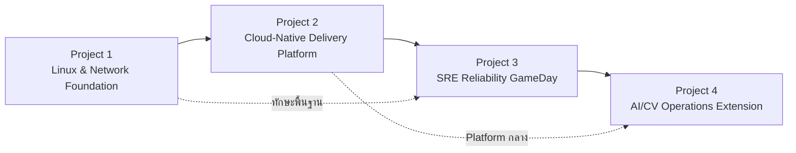

## ผลลัพธ์สุดท้ายที่ต้องการ

เมื่อทำ Core Portfolio เสร็จ ผู้พัฒนาต้องสามารถเปิด GitHub และแสดงหลักฐานได้ว่า

- มี Architecture Diagram และอธิบาย Trade-off ได้
- มี Terraform สร้างและทำลาย AWS Environment ได้
- มี Secure Container Image และ Kubernetes Manifests/Helm Chart
- มี CI Pipeline ที่ Test, Scan และ Build
- มี GitOps Deployment ผ่าน Argo CD
- มี Prometheus/Grafana/Loki/Tempo/OpenTelemetry
- มี SLI/SLO, Alert Rules และ Error Budget
- มี Load Test, Failure Injection, Runbook, Incident Timeline และ Postmortem
- มี Backup/Restore Evidence
- มี Cost Report และ Teardown Evidence
- มี Demo Video 5–7 นาทีที่เล่าเรื่องได้ตั้งแต่ Commit จนถึง Recovery

---

# 2. เหตุผลที่เลือกทำโปรเจกต์นี้

## 2.1 ปัญหาของ Portfolio แบบทั่วไป

Portfolio นักศึกษาสาย Software จำนวนมากหยุดอยู่ที่

```text
เขียนโค้ด → Build → Deploy ให้เปิดเว็บได้ → จบ
```

แต่บทบาท DevOps/Cloud/SRE ต้องรับผิดชอบวงจรที่ยาวกว่า

```text
Design
  → Provision
  → Configure
  → Build
  → Test
  → Secure
  → Release
  → Observe
  → Alert
  → Respond
  → Recover
  → Learn
  → Improve
  → Control Cost
```

ดังนั้น Project นี้จะไม่ให้ความสำคัญกับจำนวน Feature ของ Application มากเกินไป แต่ให้ความสำคัญกับ **คุณภาพของ Platform และหลักฐานการปฏิบัติการ**

## 2.2 เหตุผลที่ใช้ Vision Event เป็น Workload

เลือก Workload ที่เกี่ยวกับ AI/Computer Vision เพราะผู้พัฒนามีพื้นฐานเดิมและสามารถอธิบาย Domain ได้ดี แต่จะจำกัดความซับซ้อนของ Model เพื่อไม่ให้เป้าหมาย DevOps ถูกกลบ

ข้อดีของ Vision Event Workload คือ

- มี API traffic สำหรับทดสอบ Web Service
- มี Queue และ Worker สำหรับทดสอบ Asynchronous Processing
- มี Object Storage สำหรับเก็บไฟล์หรือผลลัพธ์
- มี Database สำหรับสถานะและ Metadata
- มี Failure Mode ที่สมจริง เช่น Model load fail, queue backlog, poison message และ timeout
- มี Metric เชิงธุรกิจ เช่น จำนวน Event ที่รับ ประมวลผลสำเร็จ ล่าช้า หรือสูญหาย
- สามารถต่อยอดสู่ MLOps โดยไม่ต้องเปลี่ยน Platform หลัก

## 2.3 เหตุผลที่ใช้ระบบเดียวตลอด Portfolio

การใช้ระบบเดียวทำให้เห็นวิวัฒนาการที่ชัดเจน

```text
Manual VM
  → Automated VM
  → Containerized Service
  → Local Kubernetes
  → AWS EKS
  → GitOps
  → Observable Platform
  → SRE GameDay
  → Optional AI Model Release
```

Recruiter จะเห็นว่าเครื่องมือแต่ละตัวถูกนำมาใช้เพื่อแก้ปัญหาอะไร ไม่ใช่เพียงเห็นรายชื่อ Logo จำนวนมาก

---

# 3. โครงสร้าง Portfolio และชื่อแต่ละโปรเจกต์

## 3.1 Master Project

### ชื่อภาษาไทย

**วิชันออปส์: แพลตฟอร์มคลาวด์เนทีฟเพื่อการส่งมอบ การสังเกตการณ์ และความเชื่อถือได้ของระบบ**

### ชื่อภาษาอังกฤษ

**VisionOps Reliability Platform**

### คำอธิบาย

ระบบต้นแบบแบบ Production-Oriented สำหรับรับ Vision Event ผ่าน API ส่งงานเข้า Queue ให้ Worker ประมวลผล เก็บ Metadata ใน PostgreSQL และ Object ใน S3 พร้อมระบบ Deployment, Security, Monitoring, Alerting, Incident Response และ Recovery ที่ตรวจสอบได้

---

## 3.2 Project 1

### ชื่อภาษาไทย

**ฐานรากปฏิบัติการ Linux และเครือข่าย**

### ชื่อภาษาอังกฤษ

**Linux & Network Operations Foundation Lab**

### คำอธิบาย

สร้างความเข้าใจตั้งแต่ระดับ Operating System และ Packet Path โดยติดตั้ง Application บน Linux VM แบบ Manual ก่อน แล้วพัฒนาเป็น Bash Automation, systemd Service, Nginx Reverse Proxy, TLS, Firewall, Log Rotation, Backup/Restore และ Ansible Configuration Management

### คำถามที่โปรเจกต์นี้ต้องตอบได้

> “ก่อนจะใช้ Container และ Kubernetes ฉันสามารถดูแล Server จริง วิเคราะห์ Process, Port, DNS, TLS, File Permission, Resource Usage และแก้ปัญหา Service ที่พังได้หรือไม่?”

---

## 3.3 Project 2

### ชื่อภาษาไทย

**โรงงานส่งมอบซอฟต์แวร์บนคลาวด์เนทีฟ**

### ชื่อภาษาอังกฤษ

**Cloud-Native Delivery & Platform Engineering Lab**

### คำอธิบาย

สร้าง Platform ที่ Infrastructure สามารถสร้างซ้ำได้ด้วย Terraform, Application ถูก Package เป็น Container, รันบน Kubernetes, Deploy ผ่าน GitHub Actions และ Argo CD, ใช้ Helm สำหรับ Packaging และใช้ AWS EKS เป็น Cloud Lab แบบเปิดเฉพาะช่วงทดลอง

### คำถามที่โปรเจกต์นี้ต้องตอบได้

> “ฉันสามารถเปลี่ยน Source Code หนึ่ง Commit ให้กลายเป็น Release ที่ตรวจสอบย้อนกลับได้ ปลอดภัย ทำซ้ำได้ และ Rollback ได้ โดยไม่ต้องแก้ Production ด้วยมือหรือไม่?”

---

## 3.4 Project 3

### ชื่อภาษาไทย

**สนามทดสอบความเชื่อถือได้และการรับมือเหตุขัดข้องแบบ SRE**

### ชื่อภาษาอังกฤษ

**SRE Reliability, Observability & Incident GameDay Lab**

### คำอธิบาย

กำหนด SLI/SLO และ Error Budget, เก็บ Metrics/Logs/Traces, สร้าง Dashboard และ Alert จากนั้นจงใจทำให้ระบบล้มเหลวในสถานการณ์ควบคุมเพื่อวัด MTTD, MTTA, MTTR, ทดสอบ Runbook, Rollback, Queue Recovery, Backup/Restore และเขียน Blameless Postmortem

### คำถามที่โปรเจกต์นี้ต้องตอบได้

> “เมื่อระบบมีปัญหา ฉันรู้ได้อย่างไรว่าใครได้รับผลกระทบ ตรวจพบเร็วแค่ไหน กู้คืนอย่างไร และป้องกันไม่ให้เกิดซ้ำอย่างไร?”

---

## 3.5 Project 4 — Optional Differentiator

### ชื่อภาษาไทย

**ส่วนต่อขยายปฏิบัติการ AI และ Computer Vision**

### ชื่อภาษาอังกฤษ

**AI/Computer Vision Operations Extension**

### คำอธิบาย

เพิ่ม Model Artifact Versioning, AI Inference Worker, Queue-based Autoscaling, Canary Model Release, Model-specific Metrics และ Rollback เพื่อเชื่อมความสามารถ AI เดิมเข้ากับ Cloud/DevOps/SRE โดยไม่เปลี่ยนโปรเจกต์ให้กลายเป็นงานวิจัยโมเดล

### คำถามที่โปรเจกต์นี้ต้องตอบได้

> “Platform เดิมสามารถรับ Workload AI ที่มี Model Version, Latency, Resource และ Release Risk แตกต่างจาก Web Application ทั่วไปได้หรือไม่?”

---

# 4. วิสัยทัศน์ พันธกิจ และคุณค่าที่ต้องการพิสูจน์

## 4.1 Vision

สร้าง Portfolio ที่แสดงให้เห็นว่าเจ้าของโปรเจกต์สามารถคิดและทำงานแบบ **End-to-End System Owner** ไม่ใช่เพียงผู้ใช้เครื่องมือ DevOps ตาม Tutorial

## 4.2 Mission

1. เรียนรู้จากพื้นฐานก่อน Abstraction
2. ตัดสินใจเทคโนโลยีจาก Requirement และ Trade-off
3. ทำทุก Environment ให้ Reproducible
4. วัดผลทุก Claim ด้วย Evidence
5. สร้าง Failure อย่างปลอดภัยเพื่อเรียนรู้ Recovery
6. ใช้งบ Cloud อย่างมีวินัย
7. จัดทำเอกสารให้ผู้อื่นสามารถทำซ้ำและประเมินผลงานได้

## 4.3 Value Proposition ต่อ Recruiter

Portfolio นี้ต้องทำให้ Recruiter เห็นหลักฐาน 5 ด้าน

| ด้าน | หลักฐานที่ต้องเห็น |
|---|---|
| Cloud Engineering | VPC, IAM, ECR, EKS, S3, SQS, ALB, CloudWatch และ Terraform |
| DevOps | CI/CD, GitOps, Helm, Secure Build, Release และ Rollback |
| Platform Engineering | Reusable Modules, Golden Path, Environment Contract และ Developer Experience |
| SRE | SLI/SLO, Alert, Incident, Runbook, Postmortem, Capacity และ Recovery |
| Engineering Judgment | ADR, Trade-off, Cost, Scope Control และ Honest Limitations |

---

# 5. นิยาม Production-Oriented

โปรเจกต์นี้ใช้คำว่า **Production-Oriented** ไม่ใช้คำว่า **Production-Grade**

## 5.1 Production-Oriented หมายถึง

- ออกแบบตามหลักที่ใช้กับ Production
- มี Automation และ Reproducibility
- มี Security Boundary
- มี Observability
- มี Reliability Target
- มี Backup/Restore Test
- มี Incident Response
- มี Cost Guardrail
- มี Documentation และ Audit Trail

## 5.2 เหตุผลที่ไม่เรียก Production-Grade

ระบบทำโดยบุคคลเดียว ภายใต้งบ $100 และไม่ได้ให้บริการผู้ใช้จริงตลอด 24/7 จึงยังไม่มีหลักฐานเรื่อง

- การทำงานระยะยาวหลายเดือน
- On-call Rotation หลายคน
- Compliance Audit
- Multi-account Organization Governance
- Multi-region Disaster Recovery
- Load ระดับองค์กร
- SLA ทางกฎหมาย
- Security Assessment จากบุคคลภายนอก

## 5.3 วิธีสื่อสารอย่างซื่อสัตย์

ให้แยกทุกเอกสารเป็นสองระดับ

1. **Lab Implementation** — สิ่งที่สร้างและทดสอบจริง
2. **Production Reference Architecture** — สิ่งที่ควรเพิ่มเมื่อมีผู้ใช้จริง งบจริง และทีมจริง

การระบุข้อจำกัดตรงไปตรงมาเป็นสัญญาณของ Engineering Maturity มากกว่าการอ้างเกินหลักฐาน

---

# 6. ผู้มีส่วนเกี่ยวข้องและบทบาท

| Stakeholder | บทบาท | ความต้องการ |
|---|---|---|
| Suphanat Chanlek | Project Owner, Developer, Platform Engineer, SRE และ Incident Commander | เรียนรู้และสร้าง Portfolio ที่ทำซ้ำได้ |
| Recruiter / Hiring Manager | ผู้ประเมินผลงาน | เข้าใจคุณค่าได้เร็ว เห็น Evidence จริง |
| Technical Interviewer | ผู้ตรวจสอบความลึก | ถาม Architecture, Failure, Security และ Trade-off ได้ |
| GitHub Visitor | ผู้ทดลอง Repository | Setup ตาม README และรัน Local Environment ได้ |
| AWS Account Owner | ผู้รับผิดชอบค่าใช้จ่ายและ Security | ไม่มี Credential รั่ว ไม่มี Resource ค้าง |
| Simulated Application User | ผู้ส่งและดู Vision Event | API ตอบได้ เสถียร และตรวจสอบสถานะได้ |

## RACI สำหรับทีมหนึ่งคน

| งาน | Responsible | Accountable | Consulted | Informed |
|---|---|---|---|---|
| Architecture | Owner | Owner | Official docs / instructor | GitHub audience |
| Implementation | Owner | Owner | Open-source community docs | GitHub audience |
| Security Review | Owner | Owner | Automated scanners | GitHub audience |
| Incident Command | Owner | Owner | Runbook | Postmortem reader |
| Cost Control | Owner | Owner | AWS Billing data | Owner |

แม้ทำคนเดียว ให้แยก “หมวก” ของแต่ละบทบาทในเอกสาร เพื่อฝึกวินัยแบบทีมจริง

---

# 7. สมมติฐาน ข้อจำกัด และ Guardrails

## 7.1 สมมติฐาน

- มี AWS Account พร้อม Credit ประมาณ $100
- ใช้ Region หลัก `ap-southeast-1`
- มีเครื่อง Development ที่รัน Docker และ Local Kubernetes ได้
- มี GitHub Account และสามารถใช้ GitHub Actions ได้
- ใช้เวลาประมาณ 8–12 ชั่วโมงต่อสัปดาห์
- ทำงานคนเดียว
- Application ใช้ข้อมูลสังเคราะห์ ไม่มีข้อมูลส่วนบุคคลจริง
- ไม่ใช้ Source Code, Dataset หรือความลับของบริษัทที่เคยฝึกงาน

## 7.2 ข้อจำกัด

- งบ Cloud จำกัด
- ไม่เปิด EKS 24/7
- ไม่มี Dedicated Domain เป็นข้อบังคับ แต่มีได้ถ้าเจ้าของมีอยู่แล้ว
- ไม่มี GPU Cloud ใน Core Scope
- ไม่มี Multi-region Implementation จริง
- ไม่มีทีม Reviewer จริงทุก Pull Request จึงใช้ Self-review Checklist และ Automated Gates

## 7.3 Hard Guardrails

1. ค่าใช้จ่ายรวมต้องไม่เกิน `$100`
2. เป้าหมายการใช้จริงไม่เกิน `$90` เพื่อเหลือ Safety Margin
3. ห้ามใช้ Root User สำหรับงานประจำ
4. Root Account ต้องเปิด MFA
5. ห้ามเก็บ Long-lived AWS Access Key ใน GitHub
6. ห้าม Commit Secret, `.env`, kubeconfig หรือ Terraform State
7. S3 ทุก Bucket ต้องเปิด Block Public Access เว้นแต่มี ADR อนุมัติอย่างชัดเจน
8. Database ห้ามเปิด Public Internet โดยไม่จำเป็น
9. EKS, ALB, NAT Gateway, RDS และ Public IPv4 ต้องมี Owner/Expiry Tag
10. Cloud Lab ต้องมี Teardown Checklist ทุกครั้ง
11. ทุก Claim ใน README ต้องมี Evidence หรือระบุว่าเป็น Design Target
12. ห้ามเรียกระบบว่า Production-Grade

## 7.4 Tagging Standard

```text
Project=visionops
Environment=local|lab|staging|demo
Owner=suphanat
ManagedBy=terraform
CostCenter=portfolio
ExpiresAt=YYYY-MM-DD
DataClassification=synthetic
```

---

# 8. หลักการออกแบบ

## P-01: Fundamentals Before Abstractions

ต้องเข้าใจ Linux Process, Port, DNS, TCP/TLS, File Permission และ Service Management ก่อนใช้ Kubernetes

## P-02: Everything Reproducible

Infrastructure, Configuration, Deployment, Dashboard, Alert และ Test Scenario ต้องอยู่ใน Version Control เท่าที่เหมาะสม

## P-03: Git Is the Source of Truth

การเปลี่ยนแปลงปกติต้องเกิดจาก Commit/PR ไม่ใช่แก้ Live Environment ด้วยมือ

## P-04: Secure by Default

- Least Privilege
- Temporary Credentials
- Non-root Containers
- No Public Data Store
- Secret Scanning
- Dependency/Container/IaC Scanning

## P-05: Observable by Design

Feature ที่ไม่มี Metric, Log หรือ Trace ที่จำเป็นต่อการดูแลระบบ ถือว่ายังไม่สมบูรณ์

## P-06: Reliability Is Measured, Not Claimed

คำว่า Reliable ต้องมี SLI, SLO, Test Window, Failure Scenario และ Recovery Evidence

## P-07: Automate Repetition, Not Understanding

ทำ Manual ครั้งแรกเพื่อเข้าใจ แล้วจึงเขียน Bash, Ansible, Terraform หรือ Pipeline ให้ทำซ้ำ

## P-08: Local First, Cloud to Validate

เรียนและทดลอง 70–80% บน Local เพื่อประหยัดงบ ใช้ AWS เพื่อพิสูจน์ Integration และ Cloud-specific Operations

## P-09: Prefer Boring, Explainable Technology

เลือกเครื่องมือที่ตอบ Requirement และอธิบายได้ มากกว่าการใส่เทคโนโลยีใหม่จำนวนมากเพื่อให้ดูทันสมัย

## P-10: Failure Is a Test Input

จงใจสร้างความล้มเหลวใน Environment ที่ควบคุมได้ และบันทึกผลทุกครั้ง

## P-11: Cost Is a Non-functional Requirement

ค่าใช้จ่ายเป็นส่วนหนึ่งของ Architecture ไม่ใช่เรื่องที่ตรวจทีหลัง

## P-12: Separate Lab Reality from Production Reference

ทุก Diagram และ README ต้องบอกว่าส่วนใดรันจริง ส่วนใดเป็นแนวทางขยาย

---

# 9. เป้าหมายและตัวชี้วัดความสำเร็จ

## 9.1 Learning Objectives

เมื่อจบ Core Portfolio ต้องอธิบายและลงมือทำได้ในหัวข้อต่อไปนี้

- Linux Administration และ Troubleshooting
- Bash Scripting และ Automation Safety
- Networking, DNS, TCP, TLS, Routing และ Firewall
- Docker Image Design และ Container Security
- Infrastructure as Code ด้วย Terraform
- AWS IAM, VPC, ECR, EKS, S3, SQS, ALB และ CloudWatch
- Kubernetes Workload, Networking, Storage, Scheduling และ Reliability
- CI/CD และ GitOps
- Observability ด้วย Metrics, Logs และ Traces
- SLI, SLO, Error Budget และ Alert Design
- Incident Response, Runbook และ Postmortem
- Backup, Restore และ Environment Rebuild
- Cloud Cost Governance

## 9.2 Portfolio Success Criteria

| รหัส | เกณฑ์ | หลักฐาน |
|---|---|---|
| SC-01 | Local Environment เริ่มได้ด้วยคำสั่งหลักไม่เกิน 3 คำสั่ง | README + screen recording |
| SC-02 | AWS Infrastructure สร้างด้วย Terraform | Plan/Apply log + state design |
| SC-03 | AWS Environment ลบได้ครบ | Destroy log + zero-resource checklist |
| SC-04 | Image ทุก Release มี immutable tag จาก Git SHA | ECR screenshot/API output |
| SC-05 | CI ป้องกัน Build ที่ Test หรือ Security Gate ไม่ผ่าน | Failed PR evidence |
| SC-06 | GitOps ตรวจพบและแก้ Drift ได้ | Argo CD evidence |
| SC-07 | Failed Deployment ไม่รับ Traffic และ Rollback ได้ | Incident/game-day report |
| SC-08 | Dashboard ครอบคลุม RED, USE และ Business Metrics | Grafana export + screenshot |
| SC-09 | Alert ส่งถึงช่องทางที่กำหนดและมี Runbook | Alert evidence |
| SC-10 | Backup ถูก Restore และตรวจ Data Integrity | restore report |
| SC-11 | มี GameDay อย่างน้อย 8 Scenario | incident reports |
| SC-12 | มี SLO Report และ Error Budget Calculation | SLO report |
| SC-13 | ไม่มี Secret หรือ Terraform State ใน Git history | scanner report |
| SC-14 | ค่าใช้จ่ายอยู่ใน Hard Cap | AWS cost report |
| SC-15 | Recruiter Demo จบใน 5–7 นาที | demo video |

## 9.3 Initial Reliability Targets

ตัวเลขต่อไปนี้เป็น **Design Targets สำหรับ Lab** และต้องปรับจากผล Baseline จริง

| SLI | Initial SLO | Measurement Window |
|---|---:|---|
| API Availability | ≥ 99.5% | Controlled observation 60 นาที |
| API Successful Request Latency | p95 < 500 ms | Expected load |
| Event Processing Latency | p95 < 10 วินาที | Accepted → terminal success |
| Accepted Event Accounting | 100% มีสถานะตรวจสอบได้ | ทุก Test Batch |
| Bad Release Recovery | < 10 นาที | GameDay |
| Pod Failure Detection | < 2 นาที | GameDay |
| Full Lab Environment Rebuild | < 60 นาที | DR Exercise |
| Database Restore | < 30 นาที | Restore Exercise |
| Critical Security Finding at Release | 0 รายการที่ไม่มี Exception | Release Gate |
| AWS Spend | ≤ $90 target, ≤ $100 hard cap | Project lifetime |

---

# 10. Workload กลางของระบบ

## 10.1 แนวคิด

ระบบรับ **Synthetic Vision Event** เช่น

- PPE compliance event
- vehicle detection event
- anomaly event
- generic image-processing event

ไฟล์ภาพอาจเป็นภาพสังเคราะห์ ภาพที่สร้างขึ้นเอง หรือ object placeholder ขนาดเล็ก ไม่มีข้อมูลบริษัทและไม่มีข้อมูลส่วนบุคคลจริง

## 10.2 Minimal Components

| Component | หน้าที่ | Technology Baseline |
|---|---|---|
| Web Dashboard | ส่ง Event และดูสถานะ | Next.js แบบบาง |
| Event API | Validation, idempotency, persistence, enqueue | Go |
| Worker | Consume queue และจำลอง processing | Go; Python เฉพาะ AI Extension |
| Event Generator | สร้าง load และ failure payload | Go หรือ Python + k6 |
| Database | Event metadata และ state | PostgreSQL |
| Queue | Buffer, retry และ decoupling | Amazon SQS Standard + DLQ |
| Object Storage | เก็บ input/result/model artifact | Amazon S3 |
| Cache | ไม่อยู่ใน Core; เพิ่มเมื่อมี metric รองรับ | Redis optional |

## 10.3 API Contract ขั้นต้น

```text
POST   /api/v1/events
GET    /api/v1/events
GET    /api/v1/events/{eventId}
POST   /api/v1/events/{eventId}/retry       # จำกัดเฉพาะ admin/lab mode
GET    /health/live
GET    /health/ready
GET    /metrics
GET    /version
```

## 10.4 Event Lifecycle

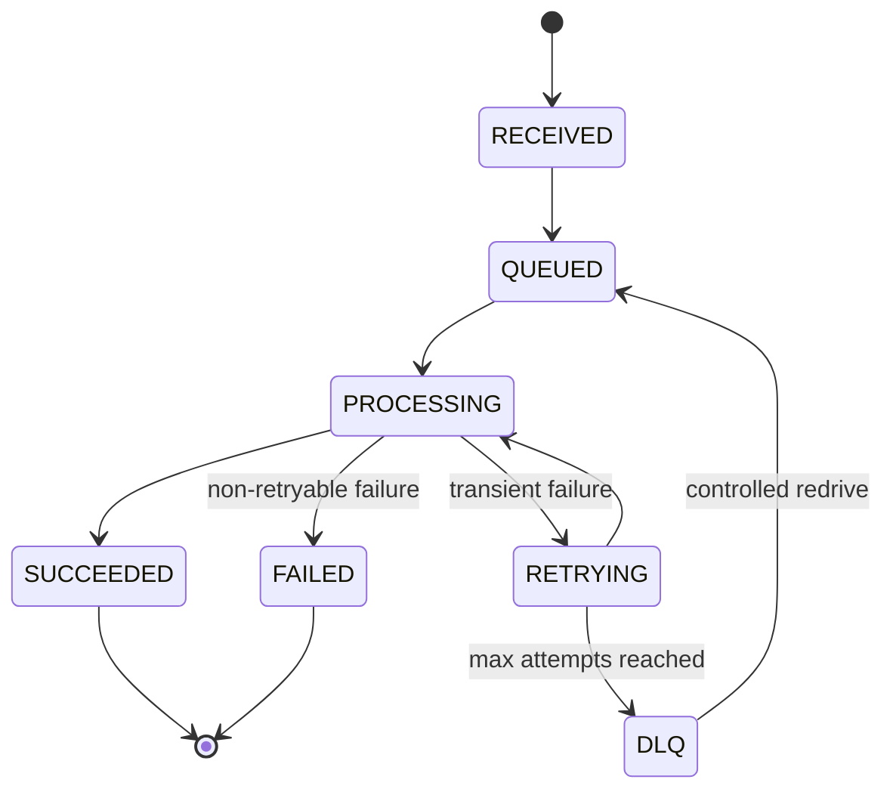

## 10.5 Event Envelope ขั้นต้น

```json
{
  "event_id": "uuid",
  "idempotency_key": "client-generated-key",
  "event_type": "ppe_compliance",
  "source": "synthetic-camera-01",
  "object_uri": "s3://bucket/key-or-local-placeholder",
  "captured_at": "RFC3339 timestamp",
  "received_at": "RFC3339 timestamp",
  "correlation_id": "uuid",
  "trace_id": "otel-trace-id",
  "model_version": "simulator-v1",
  "status": "RECEIVED",
  "attempt": 0,
  "result": null,
  "error_code": null
}
```

## 10.6 Functional Requirements

| รหัส | Requirement |
|---|---|
| FR-001 | Client ส่ง Event ใหม่พร้อม idempotency key ได้ |
| FR-002 | API Validate schema และปฏิเสธ payload ที่ไม่ถูกต้อง |
| FR-003 | Event ที่รับสำเร็จต้องมี `event_id` และตรวจสอบสถานะได้ |
| FR-004 | API ส่งงานเข้า Queue โดยไม่รอการประมวลผลทั้งหมด |
| FR-005 | Worker Consume, update state และบันทึกผลได้ |
| FR-006 | Transient failure ต้อง Retry แบบมีขอบเขต |
| FR-007 | Poison message ต้องไป DLQ หลังเกินจำนวนครั้งที่กำหนด |
| FR-008 | Operator สามารถ Redrive DLQ แบบควบคุมได้ |
| FR-009 | Dashboard แสดงสถานะและเวลาแต่ละขั้นได้ |
| FR-010 | ทุก Request/Job สำคัญมี correlation/trace context |
| FR-011 | Health endpoints แยก Liveness และ Readiness |
| FR-012 | Metrics endpoint เปิดเฉพาะเส้นทางภายในตาม Environment |
| FR-013 | System แสดง Application Version และ Git SHA ได้ |
| FR-014 | Event Generator สร้าง normal, spike และ invalid traffic ได้ |
| FR-015 | Admin-only failure toggle ใช้เฉพาะ Lab เพื่อ GameDay ได้ |

## 10.7 Non-functional Requirements

| หมวด | Requirement |
|---|---|
| Security | ไม่มีข้อมูลจริง, ไม่มี public database, ไม่มี static cloud key ใน repository |
| Reliability | Queue decoupling, bounded retry, DLQ, probes, resource limits และ rollback |
| Performance | วัด p50/p95/p99 และ throughput ก่อนตั้ง claim |
| Operability | Structured logs, metrics, traces, dashboards, alerts และ runbooks |
| Maintainability | Modular code, documented interfaces, immutable artifacts และ versioned config |
| Portability | Core app รันได้ทั้ง Docker Compose, kind และ EKS |
| Reproducibility | Local และ Cloud Setup มี automation |
| Cost | Local-first และ short-lived cloud resources |
| Auditability | Commit SHA เชื่อม Source → Image → Manifest → Deployment |
| Accessibility | Dashboard พื้นฐานใช้งานด้วย keyboard และมี readable status text |

---

# 11. ขอบเขตรวมของ Portfolio

## 11.1 In Scope

- Linux server operations
- Network troubleshooting
- Bash and Ansible automation
- Container build and security
- Local Kubernetes
- AWS infrastructure with Terraform
- EKS deployment
- GitHub Actions CI
- Argo CD GitOps
- Helm packaging
- Gateway API traffic routing
- Metrics, logs, traces and alerting
- SLI/SLO and error budget
- Load, failure and recovery tests
- Backup/restore
- Cloud cost controls
- Optional AI workload operations

## 11.2 Out of Scope

- Feature-rich consumer application
- Payment system
- Complex user/tenant management
- Real biometric or CCTV data
- Multi-region active-active implementation
- Enterprise compliance certification
- 24/7 public production service
- Full service mesh in Core
- Kafka cluster in Core
- Custom Kubernetes Operator
- GPU inference in Cloud Core
- Multi-cloud deployment
- Self-hosted secrets platform such as Vault in Core
- Building a complete internal developer portal

## 11.3 Deferred Scope

สิ่งต่อไปนี้อาจเพิ่มหลัง Core ผ่าน Definition of Done เท่านั้น

- KEDA queue-based scaling
- Argo Rollouts canary
- Kyverno policy enforcement
- Cosign image signing and SBOM attestation
- External Secrets Operator
- Velero
- Chaos Mesh หรือ LitmusChaos
- MLflow
- Service mesh
- FinOps dashboard ที่ละเอียดขึ้น

---
# 12. Project 1 — ฐานรากปฏิบัติการ Linux และเครือข่าย

## 12.1 Project Identity

| รายการ | ค่า |
|---|---|
| ชื่อไทย | ฐานรากปฏิบัติการ Linux และเครือข่าย |
| ชื่ออังกฤษ | Linux & Network Operations Foundation Lab |
| รหัสภายใน | `visionops-foundation` |
| ระยะเวลาแนะนำ | 3 สัปดาห์ |
| Cloud ที่ใช้ | Local VM เป็นหลัก, EC2 แบบเปิดช่วงสั้น |
| เป้าหมายหลัก | เข้าใจระบบก่อน Container/Kubernetes และสร้าง Automation ขั้นพื้นฐาน |

## 12.2 Problem Statement

Kubernetes และ Managed Cloud Services ซ่อนรายละเอียดจำนวนมาก หากผู้เรียนเริ่มจากการ Deploy บน EKS ทันที อาจทำให้รู้คำสั่งแต่ไม่เข้าใจว่า

- Application process เริ่มและหยุดอย่างไร
- Port ถูก bind โดย process ใด
- DNS resolution ล้มเหลวตรงไหน
- TCP connection ต่างจาก HTTP response อย่างไร
- TLS certificate ถูกตรวจสอบอย่างไร
- Reverse proxy ส่ง request ต่ออย่างไร
- File permission ทำให้ service start ไม่ได้อย่างไร
- Memory, disk, file descriptor และ log ส่งผลต่อ service อย่างไร

Project 1 จึงจงใจเริ่มจาก Server แบบธรรมดา และค่อยเพิ่ม Automation ทีละชั้น

```text
Manual Installation
    ↓ เข้าใจทุกขั้นตอน
Bash Bootstrap
    ↓ ลดงานซ้ำ
systemd + journald + logrotate
    ↓ ทำให้บริการดูแลได้
Nginx + TLS + Firewall
    ↓ ทำให้เข้าถึงอย่างปลอดภัย
Ansible
    ↓ ทำ Configuration ซ้ำและตรวจ Drift ขั้นพื้นฐาน
Docker
    ↓ ส่งต่อไป Project 2
```

## 12.3 Outcomes ที่ต้องได้

เมื่อจบ Project 1 ต้องสามารถ

1. Provision Ubuntu VM และเชื่อมต่อด้วย SSH key
2. สร้าง user/group สำหรับ application โดยไม่รันเป็น root
3. ติดตั้งและรัน API เป็น systemd service
4. ใช้ journald และ logrotate เพื่อดูแล log
5. วาง Nginx เป็น reverse proxy
6. อธิบาย DNS → TCP → TLS → HTTP → Application ได้
7. จำกัด traffic ด้วย host firewall และ AWS Security Group
8. ตรวจ process, socket, memory, disk และ network packet ได้
9. Deploy, health check, rollback, backup และ restore ด้วย script
10. ใช้ Ansible ทำ configuration ที่ idempotent
11. วิเคราะห์ failure อย่างน้อย 8 สถานการณ์

## 12.4 Technology Stack และเหตุผล

| Area | Technology ที่เลือก | เหตุผลที่เลือก | ทางเลือกและเมื่อควรใช้ |
|---|---|---|---|
| Operating System | Ubuntu Server LTS | เอกสารและ package ecosystem กว้าง เหมาะกับผู้เรียนและใช้ทั่วไปใน VM/Container | Amazon Linux เหมาะเมื่อเน้น AWS-native EC2; Debian เหมาะเมื่ออยากได้ฐานที่เล็กและ conservative |
| Local VM | WSL2 หรือ Multipass/VirtualBox | ทดลองได้โดยไม่เสีย Cloud Credit และ reset ง่าย | EC2 ใช้ยืนยัน Cloud networking; bare metal ไม่จำเป็น |
| Cloud VM | Amazon EC2 แบบ short-lived | เรียน Security Group, key pair, public/private IP และ cloud-init | Lightsail ง่ายกว่าแต่ซ่อน VPC/IAM บางส่วน |
| Shell | Bash | เป็นภาษากาวของ Linux/CI และเหมาะกับงานระบบสั้น ๆ | Python เหมาะเมื่อมี data structure, API, concurrency หรือ logic ซับซ้อน |
| Shell Quality | ShellCheck + shfmt | ตรวจ bug/pitfall และจัดรูปแบบ script | ไม่มีเหตุผลควรข้ามใน Portfolio |
| Service Manager | systemd | มาตรฐานหลักบน Linux distribution สมัยใหม่ รองรับ restart, dependency, sandboxing และ journald | Supervisor/PM2 เหมาะกับ app-specific use case แต่ไม่ได้สอน OS service lifecycle เท่า systemd |
| Logging | journald + logrotate | เข้าใจ log จาก OS และควบคุม retention | Fluent Bit/Vector อยู่ใน Project 2–3 เมื่อรวม log จากหลาย container |
| Reverse Proxy | Nginx | เป็นพื้นฐานที่พบแพร่หลาย เข้าใจ upstream, header, timeout, TLS และ static serving | Caddy ง่ายต่อ automatic TLS; Envoy เหมาะกับ advanced L7; Traefik เหมาะกับ dynamic container/Kubernetes routing |
| TLS Tooling | OpenSSL; Let's Encrypt เฉพาะมี domain | ทำความเข้าใจ certificate chain และ handshake | Self-signed certificate ใช้ใน Lab; ACM ใช้บน AWS ALB ใน Project 2 |
| Firewall | UFW เป็น interface + nftables concepts | UFW เริ่มง่าย แต่ยังเรียน underlying rule model | iptables legacy ใช้เพื่ออ่านระบบเก่า; nftables เหมาะกับ configuration โดยตรงขั้นสูง |
| Config Management | Ansible | Agentless ผ่าน SSH, YAML-readable และเหมาะกับทีม/โปรเจกต์ขนาดเล็ก | Chef/Puppet เหมาะกับ fleet ใหญ่และ policy model; Terraform ไม่ควรใช้แทน OS configuration |
| Diagnostics | `ss`, `lsof`, `curl`, `dig`, `traceroute`, `tcpdump`, `openssl s_client` | ครอบคลุม process-to-packet troubleshooting | Wireshark ใช้เมื่อต้องการ GUI วิเคราะห์ packet ลึกขึ้น |
| Backup | `pg_dump`, `tar`, checksum และ S3 optional | เข้าใจ logical backup, integrity และ restore | Snapshot เหมาะกับ block-level recovery แต่ไม่แทน application-consistent backup เสมอไป |

## 12.5 Linux Topics ที่ต้องลงมือจริง

### Identity และ Permission

- root เทียบกับ non-root
- user, group และ supplementary groups
- owner/group/other permission
- `chmod`, `chown`, `umask`
- setuid/setgid concept
- SSH authorized keys
- `sudoers` แบบ least privilege
- application service account ที่ login ไม่ได้

### Process และ Service

- PID, parent/child process
- foreground/background
- signals: `SIGTERM`, `SIGKILL`, `SIGHUP`
- graceful shutdown
- zombie/orphan concept
- systemd unit lifecycle
- restart policy และ restart storm
- environment file
- resource limit
- service dependency

### CPU, Memory, Disk และ Filesystem

- load average
- process CPU/memory
- page cache และ swap concept
- disk usage เทียบกับ inode exhaustion
- mount point
- file descriptor
- open/deleted file ที่ยังใช้พื้นที่
- log growth

### Logs

- stdout/stderr
- journal unit filtering
- boot-specific logs
- severity
- structured JSON application log
- log retention
- rotation/compression
- sensitive-data redaction

### Commands ที่ต้องใช้ได้

```text
ps, top, htop, pstree, kill, pkill
free, vmstat, uptime
lsblk, df, du, findmnt, mount
systemctl, journalctl, loginctl
ss, ip, lsof, curl, wget, dig, traceroute, tcpdump
openssl, nc
chmod, chown, id, useradd, groupadd, sudo
find, grep, awk, sed, cut, sort, uniq, xargs, jq
sha256sum, tar, gzip, rsync
```

## 12.6 Network Learning Scope

### Concepts

- MAC, IP, subnet และ default gateway
- CIDR calculation
- private/public address
- DNS recursion และ caching
- TCP three-way handshake
- connection timeout เทียบกับ connection refused
- HTTP status code เทียบกับ transport failure
- TLS certificate, SNI และ hostname validation
- reverse proxy และ forwarded headers
- stateful firewall
- Security Group เทียบกับ NACL
- route table และ Internet Gateway
- NAT concept และเหตุผลที่มีค่าใช้จ่ายใน Cloud
- MTU และ packet fragmentation concept
- latency, packet loss, throughput และ saturation

### Packet Path ที่ต้องอธิบายได้

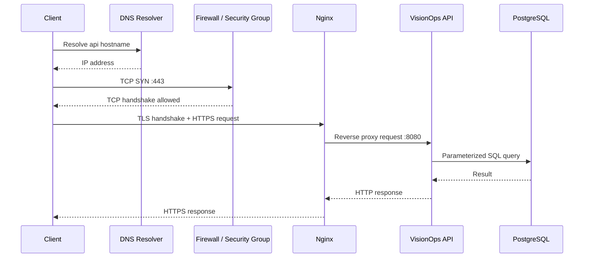

### Network Failure Labs

| Scenario | วิธีสร้าง | สิ่งที่ต้องสังเกต | เครื่องมือหลัก |
|---|---|---|---|
| DNS failure | ใช้ hostname ผิดหรือ resolver config ทดลอง | `NXDOMAIN`, timeout หรือ resolution path | `dig`, `resolvectl` |
| Port closed | หยุด service | connection refused | `ss`, `curl`, `lsof` |
| Firewall drop | ปิด rule ชั่วคราว | timeout ต่างจาก refused | UFW/nftables, `tcpdump` |
| Wrong upstream | ตั้ง Nginx port ผิด | 502 Bad Gateway | Nginx error log, `ss` |
| TLS hostname mismatch | ใช้ cert คนละชื่อ | certificate verify error | `openssl s_client`, `curl -v` |
| Slow backend | เพิ่ม artificial delay | proxy timeout/latency | access log, timing |
| Packet path issue | route ผิดใน isolated lab | unreachable | `ip route`, `traceroute` |
| Header issue | ไม่ส่ง `X-Forwarded-*` | source/scheme ผิดใน app | Nginx config, app log |

## 12.7 Bash Automation Standard

สร้าง scripts ต่อไปนี้

```text
scripts/
├── lib/
│   ├── logging.sh
│   ├── validation.sh
│   └── common.sh
├── bootstrap-server.sh
├── create-service-user.sh
├── install-app.sh
├── deploy.sh
├── rollback.sh
├── health-check.sh
├── backup.sh
├── restore.sh
├── rotate-logs.sh
├── collect-diagnostics.sh
└── cleanup.sh
```

ทุก script ต้องมีมาตรฐาน

```bash
#!/usr/bin/env bash
set -Eeuo pipefail
IFS=$'\n\t'
```

และต้องมี

- `--help`
- validation ของ argument และ environment
- log พร้อม timestamp และ severity
- explicit exit code
- trap สำหรับ error/cleanup
- quote variable ทุกจุดที่ควร quote
- temporary directory ผ่าน `mktemp`
- idempotency เท่าที่ทำได้
- `--dry-run` สำหรับ destructive action
- confirmation หรือ `--force` สำหรับ restore/cleanup
- checksum ก่อน restore
- ห้ามพิมพ์ secret ลง log
- ผ่าน ShellCheck
- มี automated test อย่างน้อยสำหรับ helper function; ใช้ `bats-core` ได้ถ้ามีเวลา

## 12.8 systemd Service Design

Unit file ต้องฝึกหัวข้อต่อไปนี้

- `User=` และ `Group=` เป็น non-root
- `WorkingDirectory=`
- `EnvironmentFile=` โดย permission จำกัด
- `ExecStart=`
- `Restart=on-failure`
- `RestartSec=` เพื่อป้องกัน loop เร็วเกินไป
- `TimeoutStopSec=` และ graceful termination
- `NoNewPrivileges=true`
- `PrivateTmp=true`
- `ProtectSystem=` เท่าที่ application รองรับ
- `ReadWritePaths=` เฉพาะที่จำเป็น
- resource limits ที่เหมาะสม

ต้องบันทึกว่า hardening option ใดเปิดไม่ได้และเพราะเหตุใด

## 12.9 Nginx Baseline

- HTTP → HTTPS redirect เมื่อมี certificate
- upstream timeout แยก connect/read/send
- request body limit
- security headers ขั้นพื้นฐาน
- access log มี request ID, status, latency และ upstream latency
- ไม่เปิด server version โดยไม่จำเป็น
- `/health/ready` ใช้ health check
- rate limiting เป็น optional lab
- static dashboard optional

## 12.10 Ansible Scope

### Roles

```text
ansible/
├── inventories/
│   ├── local.ini
│   └── aws-lab.ini
├── group_vars/
├── roles/
│   ├── base/
│   ├── users/
│   ├── nginx/
│   ├── visionops_api/
│   ├── postgresql_client/
│   └── observability_agent/
└── site.yml
```

### สิ่งที่ต้องพิสูจน์

1. Run ครั้งแรกทำให้เครื่องเข้าสู่ desired configuration
2. Run ครั้งที่สองไม่เปลี่ยนสิ่งที่ถูกต้องแล้วอย่างไม่จำเป็น
3. Handler restart service เฉพาะเมื่อ config เปลี่ยน
4. Secret ไม่อยู่ใน plain text repository
5. Inventory แยก Environment
6. `--check` และ `--diff` ใช้ตรวจการเปลี่ยนแปลง

### เหตุผลที่ไม่ใช้ Ansible แทน Terraform

- Terraform จัดการ lifecycle ของ Cloud Resource
- Ansible จัดการ configuration ภายในเครื่อง
- ทั้งสองมี overlap ได้ แต่ใน Portfolio นี้แยก responsibility เพื่อให้ design ชัด

## 12.11 Project 1 Failure Scenarios

อย่างน้อยต้องทำ 8 จาก 12 รายการ

1. service binary ไม่มี execute permission
2. port ถูก process อื่นจับอยู่
3. environment variable หาย
4. database unreachable
5. Nginx upstream port ผิด
6. disk เต็มจาก log
7. file descriptor limit ต่ำ
8. process ถูก kill
9. TLS certificate ผิด hostname
10. firewall ปิด port
11. deploy binary เสีย
12. backup file เสีย checksum

ทุก Scenario ต้องมีไฟล์

```text
failure-labs/<scenario>/
├── hypothesis.md
├── reproduce.md
├── observations.md
├── diagnosis.md
├── fix.md
└── evidence/
```

## 12.12 Acceptance Criteria — Project 1

- [ ] VM ใหม่ติดตั้งได้จาก README
- [ ] Application รันด้วย non-root systemd service
- [ ] Nginx reverse proxy ทำงาน
- [ ] TLS lab ทำงานหรือมีเหตุผลชัดเจนหากไม่มี public domain
- [ ] Host firewall เปิดเฉพาะ port จำเป็น
- [ ] Bash scripts ผ่าน ShellCheck
- [ ] Deploy และ rollback ทำงาน
- [ ] Backup และ restore ผ่าน integrity check
- [ ] Ansible second run แสดง idempotent result
- [ ] มี network packet path diagram
- [ ] มี failure lab อย่างน้อย 8 รายการ
- [ ] มี troubleshooting cheat sheet ที่อธิบาย “อาการ → layer → command”

## 12.13 Deliverables — Project 1

- Linux setup guide
- Network fundamentals notes
- Packet flow diagram
- Bash automation suite
- systemd unit files
- Nginx configuration
- Ansible roles/playbook
- Security hardening checklist
- 8+ failure lab reports
- Backup/restore report
- 2–3 minute demo video

---

# 13. Project 2 — โรงงานส่งมอบซอฟต์แวร์บน Cloud-Native

## 13.1 Project Identity

| รายการ | ค่า |
|---|---|
| ชื่อไทย | โรงงานส่งมอบซอฟต์แวร์บนคลาวด์เนทีฟ |
| ชื่ออังกฤษ | Cloud-Native Delivery & Platform Engineering Lab |
| รหัสภายใน | `visionops-platform` |
| ระยะเวลาแนะนำ | 7 สัปดาห์ |
| Cloud | AWS |
| Local Cluster | kind |
| Cloud Cluster | Amazon EKS แบบ short-lived |
| เป้าหมายหลัก | Reproducible infrastructure, secure delivery, Kubernetes operations และ GitOps |

## 13.2 Problem Statement

การ Deploy ที่ทำงานเพียงครั้งเดียวไม่เพียงพอสำหรับ DevOps Portfolio ระบบต้องตอบได้ว่า

- สร้าง Environment ใหม่เหมือนเดิมได้หรือไม่
- Artifact ที่รันมาจาก Commit ใด
- ใครหรือ workflow ใดมีสิทธิ์ Deploy
- Secret ถูกเก็บอย่างไร
- Config และ Application version เปลี่ยนอย่างไร
- Deployment ที่เสียถูกตรวจและ rollback อย่างไร
- Live state ต่างจาก Git หรือไม่
- Resource request/limit เหมาะสมหรือไม่
- Scaling และ disruption behavior เป็นอย่างไร
- Cloud Resource ถูกลบได้ครบหรือไม่

## 13.3 Outcomes ที่ต้องได้

1. Docker image แบบ secure และ reproducible
2. Local stack ด้วย Docker Compose
3. Local Kubernetes ด้วย kind
4. AWS foundation ด้วย Terraform
5. ECR repository และ immutable image flow
6. EKS cluster แบบ short-lived
7. Helm chart สำหรับ application
8. Gateway API routing
9. GitHub Actions CI
10. AWS authentication ผ่าน OIDC
11. Argo CD GitOps
12. Kubernetes probes, resources, HPA และ PDB
13. EKS Pod Identity หรือ IRSA สำหรับ workload permission
14. Security scanning และ policy gates
15. Full create → deploy → test → destroy evidence

## 13.4 Application Technology Baseline

| Component | Technology | เหตุผล |
|---|---|---|
| API | Go | ผู้พัฒนามีพื้นฐาน, compile เป็น static binary, startup เร็ว, memory ต่ำ และเหมาะกับ concurrency |
| Core Worker | Go | ลดจำนวน runtime และ image, เหมาะกับ queue consumer และ graceful shutdown |
| Optional AI Worker | Python + FastAPI/worker library | AI ecosystem แข็งและเชื่อม model ง่าย แต่ไม่ใช้เป็น Core เพื่อไม่เพิ่ม dependency |
| Dashboard | Next.js + TypeScript | ใช้ skill เดิมและทำ UI น้อยที่สุดเพื่อแสดง operational state |
| Database | PostgreSQL | relational state, transaction, indexing และ SQL observability ชัด |
| Queue | Amazon SQS Standard + DLQ | managed, ลด operational overhead และเหมาะกับ at-least-once processing |
| Object Storage | Amazon S3 | durable object storage, versioning/lifecycle และเหมาะกับ artifact/image/result |

## 13.5 เหตุผลที่เลือก Go เป็น Core Application

### ข้อดีต่อ DevOps Lab

- build เป็น binary เดียว
- multi-stage Docker image เล็กได้
- health/metrics endpoint ทำได้ตรงไปตรงมา
- graceful shutdown และ context cancellation ชัด
- concurrency เหมาะกับ load test
- memory/CPU profile เรียนรู้ได้
- ลดเวลาติดตั้ง runtime บน Project 1

### เหตุผลที่ไม่ใช้หลายภาษาใน Core

Polyglot microservices จะเพิ่ม package manager, scanner, base image, build cache และ troubleshooting โดยไม่ได้เพิ่ม learning value ด้าน DevOps มากพอ จึงใช้ Go เป็น baseline และเพิ่ม Python เฉพาะเมื่อเข้าสู่ AI Extension ที่มีเหตุผลเชิง Domain

## 13.6 Containerization Design

### Dockerfile Requirements

- multi-stage build
- pin base image version/digest ตามความเหมาะสม
- non-root runtime user
- ไม่มี compiler/build tool ใน runtime stage
- `.dockerignore`
- HEALTHCHECK ใช้เฉพาะเมื่อมีประโยชน์ใน Docker; Kubernetes ใช้ probes
- read-only root filesystem compatible
- writable path เป็น explicit volume/tmp
- OCI labels: source, revision, version, created
- image tag ด้วย Git SHA
- graceful `SIGTERM`
- no secret in build args/layers
- Trivy scan
- SBOM เป็น optional advanced gate

### Image Variants

| Image | หน้าที่ |
|---|---|
| `visionops-api` | HTTP API |
| `visionops-worker` | queue consumer |
| `visionops-dashboard` | minimal UI |
| `visionops-event-generator` | synthetic load/failure generation |

## 13.7 Docker Compose Environment

Docker Compose ใช้ก่อน Kubernetes เพื่อแยกปัญหา Application/Container ออกจาก Cluster

```text
compose services:
- api
- worker
- dashboard
- postgres
- local queue emulator หรือ lightweight broker adapter
- prometheus
- grafana
- loki
- tempo
- otel-collector
```

### Compose Acceptance

- start ด้วย `make local-up`
- health check ทุก service
- seed data ได้
- stop และ clean volume แบบแยก command
- logs ดูรวมได้
- test job รันใน container ได้
- README ระบุ memory requirement

## 13.8 Local Kubernetes — kind

### เหตุผลที่เลือก kind

- สร้าง Kubernetes node เป็น Docker container
- cluster create/delete เร็ว
- config อยู่ใน repository
- เหมาะกับ local CI และทดลองหลาย node
- ใกล้ upstream Kubernetes behavior

### เหตุผลที่ไม่เลือกเป็น Baseline

- `minikube`: ดีสำหรับ beginner และมี addons/UI มาก แต่ cluster lifecycle ใน CI หนักกว่า baseline นี้
- `k3d`: เร็วและเบามาก แต่ใช้ K3s distribution จึงมี component/default ต่างจาก upstream บางส่วน
- Docker Desktop Kubernetes: เริ่มง่าย แต่ automation และ multi-cluster reproducibility ต่ำกว่า kind

### Local Gateway

ใช้ **Gateway API + Envoy Gateway** แทน ingress-nginx

เหตุผล

- Gateway API เป็นทิศทางสมัยใหม่ของ Kubernetes networking
- Config แยก Gateway และ Route ตามบทบาทได้
- Envoy Gateway เป็น implementation ที่เหมาะกับ local lab
- ลดการผูกกับ annotation เฉพาะ controller

> หมายเหตุ: Local ใช้ Envoy Gateway ส่วน AWS ใช้ AWS Load Balancer Controller แต่พยายามรักษา standard Gateway API objects ให้มากที่สุด ส่วน extension เฉพาะ provider ต้องแยก values/config ชัดเจน

## 13.9 AWS Services และ Responsibility

| AWS Service | หน้าที่ใน Lab | เหตุผล | Cost Control |
|---|---|---|---|
| IAM | human/workload/pipeline permissions | ฝึก least privilege และ federation | ไม่มี IAM user key สำหรับ CI |
| VPC | network boundary | ฝึก subnet, route, SG และ ENI | lab architecture ลด NAT usage |
| EC2 | EKS worker nodes และ VM lab | เข้าใจ compute/storage/network | short-lived, right-sized |
| ECR | container registry | integration กับ IAM/EKS และ image scanning | lifecycle policy ลบ image เก่า |
| EKS | managed Kubernetes control plane | ตรงเป้าหมาย Kubernetes/Cloud roles | เปิดเฉพาะ session |
| S3 | object, backup, Terraform state | durable storage และ lifecycle | versioning/lifecycle/cleanup |
| SQS | async queue | managed decoupling/retry/DLQ | low-volume synthetic traffic |
| ALB | public L7 access | Gateway API/HTTP routing และ health checks | เปิดเฉพาะ demo/session |
| CloudWatch | AWS metrics/logs/audit integration | ดู cloud-level signal | retention สั้น |
| RDS PostgreSQL | optional cloud DB validation | เรียน managed DB | เปิดช่วงสั้นเท่านั้น |
| AWS Budgets | spending alerts | cost guardrail | alerts หลาย threshold |
| CloudTrail | audit trail baseline | ตรวจ API action | ใช้ account baseline ที่เหมาะสม |
| ACM | TLS certificate เมื่อมี domain | managed certificate | optional |

## 13.10 EKS Lab Architecture Decision

### Baseline

- EKS standard cluster
- Managed Node Group
- Kubernetes version ที่ยังอยู่ใน standard support
- 1–2 small worker nodes ตาม test
- 2 Availability Zones ใน VPC design
- Lab อาจใช้ public subnets/controlled public node access เพื่อลด NAT cost โดย Security Group ปิด inbound โดยตรง
- Public ALB เฉพาะช่วงทดสอบ
- Database in-cluster เป็น default lab; RDS เปิดเพื่อเรียนเฉพาะ milestone

### Honest Trade-off

การใช้ worker nodes ใน public subnet สำหรับ Lab ไม่ใช่ Production Reference ที่ต้องการ แต่ช่วยลด NAT Gateway cost ภายใต้งบจำกัด ต้องบันทึกข้อจำกัดและใช้

- restrictive Security Group
- no direct application NodePort exposure
- no SSH inbound ถ้าไม่จำเป็น
- SSM หรือ controlled access ถ้าต้องเข้า node
- short lifetime

### Production Reference

- private worker subnets อย่างน้อย 2 AZ
- public subnets สำหรับ ALB/NAT เท่านั้น
- NAT per AZ หรือ VPC endpoints ตาม availability/cost requirement
- managed database ใน private DB subnets
- separate accounts/environments
- WAF/rate protection ตาม threat model
- centralized logging/audit
- multi-replica and disruption design

## 13.11 Kubernetes Resource Baseline

```text
Namespaces:
- visionops-system
- visionops-app
- visionops-observability
- argocd
```

### Application Resources

- Deployment: API
- Deployment: Worker
- Deployment: Dashboard
- Service: ClusterIP ต่อ component
- Gateway + HTTPRoute
- ConfigMap สำหรับ non-secret config
- Secret reference; ไม่เก็บ raw secret ใน Git
- ServiceAccount แยก component
- HorizontalPodAutoscaler
- PodDisruptionBudget
- NetworkPolicy เมื่อ CNI/Environment รองรับ
- CronJob สำหรับ maintenance/backup lab

### Pod Baseline

- liveness probe
- readiness probe
- startup probe เมื่อ startup อาจช้า
- CPU/memory requests
- CPU/memory limits ที่ได้จาก measurement
- non-root security context
- read-only root filesystem หากรองรับ
- drop Linux capabilities
- seccomp RuntimeDefault
- graceful termination
- topology spread/anti-affinity เมื่อมีหลาย node
- labels/annotations มาตรฐาน

## 13.12 Probe Design

### `/health/live`

ตอบเพียงว่า process ยังทำงานและ event loop ไม่ deadlock ห้ามพึ่ง external database มากเกินไป เพราะ dependency failure ไม่ควรทำให้ container restart loop เสมอไป

### `/health/ready`

ตรวจว่ารับ traffic ได้จริง เช่น

- initialization เสร็จ
- database connection ที่จำเป็นพร้อม
- critical configuration ถูกต้อง
- service ไม่อยู่ใน drain mode

### `/startup`

ใช้กับ AI worker หรือ service ที่โหลด resource นาน เพื่อป้องกัน liveness ฆ่า process ระหว่าง startup

## 13.13 Resource Management

เริ่มจาก conservative estimate แล้วปรับจาก observation

```text
measure → set requests → load test → inspect throttling/OOM → adjust → document
```

ห้ามตั้ง requests/limits จากการเดาแล้วอ้างว่า optimized

### Metrics ที่ใช้ตัดสิน

- CPU usage และ throttling
- working set memory
- OOMKill
- GC behavior
- request latency
- queue throughput
- pod startup time

## 13.14 Autoscaling

### Core

ใช้ HPA จาก CPU และ/หรือ application metric ที่พร้อมใช้งาน

### Optional

ใช้ KEDA scale worker จาก SQS queue depth/age ใน Project 4

### เหตุผลที่ไม่ใช้ VPA เป็น Core

VPA เหมาะกับ recommendation/vertical adjustment แต่สามารถชนกับ HPA หรือทำให้ pod restart ได้ จึงศึกษาผลและใช้ recommendation mode เป็น optional ไม่เพิ่มหลาย autoscaler พร้อมกันโดยไม่มีเหตุผล

## 13.15 PodDisruptionBudget

PDB ใช้ป้องกัน voluntary disruption เช่น node drain ไม่ให้ replica หายเกินที่กำหนด แต่ไม่ใช่กลไกป้องกัน hardware crash, OOM หรือทุก failure จึงต้องทดสอบร่วมกับ replica count, scheduling และ readiness

## 13.16 Helm Packaging

### Chart Structure

```text
charts/visionops/
├── Chart.yaml
├── values.yaml
├── values.schema.json
├── templates/
│   ├── api-deployment.yaml
│   ├── worker-deployment.yaml
│   ├── dashboard-deployment.yaml
│   ├── services.yaml
│   ├── serviceaccounts.yaml
│   ├── httproute.yaml
│   ├── hpa.yaml
│   ├── pdb.yaml
│   └── _helpers.tpl
└── tests/
```

### เหตุผลที่เลือก Helm

- Package Kubernetes resources ที่เกี่ยวข้องกัน
- parameterize environment-specific values
- version chart ได้
- รองรับ release metadata
- ecosystem กว้าง

### ข้อเสียและการควบคุม

- template ซับซ้อนและ debug ยาก
- YAML indentation ผิดได้
- conditional มากเกินไปทำให้ chart อ่านยาก

จึงต้องมี `helm lint`, schema validation, template snapshot และหลีกเลี่ยง logic ซับซ้อนใน template

## 13.17 Argo CD GitOps

### Desired Flow

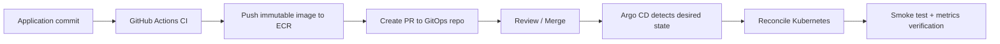

### Rules

- Source repo build artifact
- GitOps repo ระบุ desired image digest/tag
- Argo CD เป็นผู้ apply ปกติ
- ห้าม pipeline ใช้ `kubectl apply` โดยตรงใน standard path
- self-heal เปิดหลังเข้าใจ behavior
- prune เปิดแบบระมัดระวังและมี protection สำหรับ critical resource
- manual sync ใช้ในช่วงเรียนก่อน แล้วค่อยเปิด automated sync
- break-glass action ต้องบันทึกและ reconcile กลับเข้า Git

### เหตุผลที่เลือก Argo CD แทน Flux เป็น Baseline

- UI ช่วยสาธิต desired/live state และ drift ให้ Recruiter เห็นง่าย
- Application abstraction และ sync status ชัด
- ecosystem เหมาะกับ demo

Flux เป็นทางเลือกที่ดีเมื่อทีมชอบ CLI/Git-native controllers ที่ composable และไม่ต้องการ UI กลาง การไม่เลือก Flux ไม่ได้หมายความว่า Flux ด้อยกว่า แต่ Argo CD เหมาะกับ learning evidence และ demo story นี้มากกว่า

## 13.18 GitHub Actions CI/CD

### Pull Request Pipeline

```text
1. Validate commit/changed paths
2. Go format, lint and unit test
3. Frontend lint, type-check and test
4. ShellCheck and shfmt check
5. Dockerfile lint
6. Build container images
7. Secret scan
8. Dependency/filesystem scan
9. Terraform fmt, validate and lint
10. IaC security scan
11. Helm lint and schema validation
12. Render manifest and validate Kubernetes schema
13. Integration tests
14. Publish test/security summaries
```

### Main Branch / Release Pipeline

```text
1. Re-run required gates
2. Build immutable image
3. Attach OCI metadata
4. Push to ECR with Git SHA
5. Capture image digest
6. Generate/update GitOps change through PR
7. Merge after checks
8. Argo CD reconcile
9. Smoke test
10. Observe deployment metrics
11. Record release evidence
```

### AWS Authentication

ใช้ GitHub Actions OIDC → AWS IAM Role → short-lived credentials

ห้ามใช้ long-lived IAM user access key เป็น baseline

Trust policy ต้องจำกัดอย่างน้อย

- repository
- organization/user owner
- branch หรือ GitHub environment
- audience

IAM permission แยก role ตามหน้าที่ เช่น

- `ci-ecr-push-role`
- `terraform-plan-role`
- `terraform-apply-role`
- `gitops-read-role` ถ้าจำเป็น

## 13.19 Pipeline Security Gates

| Tool | หน้าที่ | Gate Policy ขั้นต้น |
|---|---|---|
| Gitleaks | secret scanning | พบ verified secret → fail |
| Trivy | filesystem/image vulnerability | Critical/High ไม่มี exception → fail release |
| Hadolint | Dockerfile lint | error-level finding → fail |
| ShellCheck | shell analysis | configured severity → fail |
| TFLint | Terraform lint/provider issue | error → fail |
| Checkov | IaC misconfiguration | critical policy violation → fail |
| kubeconform | manifest schema | invalid resource → fail |
| Helm lint | chart validation | error → fail |
| Dependabot/Renovate | dependency update | create controlled PR |

ทุก exception ต้องมี

- finding ID
- reason
- compensating control
- owner
- expiry date

## 13.20 Workload IAM

### Baseline บน EKS

ใช้ **EKS Pod Identity** เมื่อ environment/version รองรับ เพื่อ map Kubernetes ServiceAccount กับ IAM role และให้ temporary credentials แก่ Pod

### Alternative

IRSA ยังเป็นแนวทางที่พบมากและควรศึกษาเพื่อสัมภาษณ์ โดยใช้ OIDC provider ของ cluster

### ห้าม

- ฝัง AWS keys ใน image
- share broad node IAM role ให้ทุก pod ใช้โดยไม่จำเป็น
- ใช้ wildcard permission กว้างโดยไม่มีเหตุผล

### Role Separation

| Workload | Permission |
|---|---|
| API | SendMessage เฉพาะ queue, read/write metadata ตาม design |
| Worker | Receive/Delete/ChangeVisibility เฉพาะ queue, write result prefix ใน S3 |
| Backup Job | write เฉพาะ backup prefix |
| Observability | read metrics APIs ที่จำเป็น |

## 13.21 Queue Design

เลือก SQS Standard เพราะต้องการ managed at-least-once delivery และ throughput ยืดหยุ่น

ดังนั้น Application ต้องออกแบบให้

- consumer idempotent
- delete message หลัง persistence สำเร็จ
- visibility timeout มากกว่า normal processing time พร้อม margin
- bounded retry
- DLQ redrive policy
- message age metric
- poison message handling
- correlation ID preserved

### เหตุผลที่ไม่ใช้ FIFO เป็น Core

FIFO เหมาะเมื่อ ordering/deduplication เป็น business requirement จริง แต่เพิ่มข้อจำกัด throughput/grouping และอาจทำให้ผู้เรียนไม่เผชิญ at-least-once duplicate behavior ที่สำคัญต่อ distributed systems

### เหตุผลที่ไม่ใช้ Kafka

Kafka เหมาะกับ high-throughput event streaming, replay และหลาย consumer groups แต่ operational complexity สูงเกิน requirement และงบ จึงเป็น over-engineering สำหรับ event lab นี้

## 13.22 Database Strategy

### Local

PostgreSQL container + persistent volume

### AWS Lab Default

PostgreSQL in-cluster สำหรับเรียน StatefulSet/PV/backup โดยระบุชัดว่าไม่ใช่ production database design

### AWS Validation Milestone

เปิด RDS PostgreSQL แบบ short-lived เพื่อเรียน

- subnet group
- security group
- encryption
- credentials
- backup configuration
- connection monitoring

### Production Reference

RDS/Aurora แบบ private, Multi-AZ ตาม availability requirement, automated backup, point-in-time recovery และ connection pooling

## 13.23 Project 2 Acceptance Criteria

- [ ] Docker Compose environment ทำงานจาก clean machine ตามเอกสาร
- [ ] Image ใช้ non-root และผ่าน configured scan gate
- [ ] kind cluster สร้าง/ลบด้วย automation
- [ ] Gateway API route ทำงานบน local cluster
- [ ] Helm chart lint/render/validate ผ่าน
- [ ] Terraform สร้าง VPC, IAM, ECR, EKS, S3, SQS และ related resources ได้
- [ ] Terraform state ถูกเก็บ remote อย่างปลอดภัย
- [ ] GitHub Actions ใช้ OIDC ไม่ใช้ static AWS key
- [ ] Image เชื่อมโยงกับ Git SHA และ digest
- [ ] Argo CD deploy จาก GitOps repository
- [ ] Manual drift ถูกตรวจและ reconcile
- [ ] Probes, requests/limits, HPA และ PDB ผ่าน test
- [ ] Workload ใช้ dedicated AWS permission
- [ ] Broken release ถูก block หรือ rollback
- [ ] Full environment destroy สำเร็จและตรวจ resource ค้าง

## 13.24 Deliverables — Project 2

- Application source และ minimal UI
- Secure Dockerfiles
- Docker Compose stack
- kind cluster config
- Terraform modules/environments
- Helm chart
- GitHub Actions workflows
- GitOps repository
- Argo CD configuration
- IAM diagrams/policies
- Gateway API manifests
- CI security reports
- deployment and rollback evidence
- drift detection evidence
- cost and destroy evidence
- 3–4 minute delivery demo

---
# 14. Project 3 — สนามทดสอบ SRE และการรับมือเหตุขัดข้อง

## 14.1 Project Identity

| รายการ | ค่า |
|---|---|
| ชื่อไทย | สนามทดสอบความเชื่อถือได้และการรับมือเหตุขัดข้องแบบ SRE |
| ชื่ออังกฤษ | SRE Reliability, Observability & Incident GameDay Lab |
| รหัสภายใน | `visionops-sre` |
| ระยะเวลาแนะนำ | 4 สัปดาห์ โดยทับซ้อนกับปลาย Project 2 ได้ |
| เป้าหมายหลัก | วัดสุขภาพ ตรวจพบปัญหา กู้คืน และเรียนรู้จากความล้มเหลว |

## 14.2 Problem Statement

การติดตั้ง Grafana หรือมี Dashboard ไม่ได้แปลว่าระบบ Observable และการมี Replica มากกว่าหนึ่งตัวไม่ได้แปลว่าระบบ Reliable โปรเจกต์นี้ต้องเปลี่ยนจาก “มีเครื่องมือ” เป็น “ตอบคำถามการปฏิบัติการได้” เช่น

- ผู้ใช้กำลังได้รับผลกระทบหรือไม่
- ปัญหาอยู่ที่ API, Queue, Worker, Database, Node หรือ Network
- ปัญหาเริ่มเมื่อไรและสัมพันธ์กับ Release ใด
- Alert มี action ที่ชัดเจนหรือเป็น noise
- ระบบ recover อัตโนมัติหรือ operator ต้องทำอะไร
- ข้อมูลสูญหายหรือไม่
- Error Budget ถูกใช้ไปเท่าไร
- หลัง Incident มี preventive action หรือไม่

## 14.3 Reliability Lifecycle

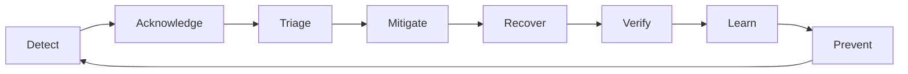

## 14.4 Outcomes ที่ต้องได้

1. Telemetry ครบ Metrics, Logs และ Traces
2. Dashboard ตอบคำถามผู้ใช้และ operator
3. SLI/SLO พร้อม measurement method
4. Error Budget report
5. Alert ที่มี severity, owner และ runbook
6. Load/stress/spike/soak test
7. GameDay อย่างน้อย 8 scenario
8. MTTD, MTTA, MTTR และ rollback time
9. Backup/restore test
10. Full environment rebuild exercise
11. Blameless postmortem
12. Reliability improvement ที่พิสูจน์ before/after

## 14.5 Observability Stack

| Signal/Function | Technology | เหตุผลที่เลือก | ทางเลือก |
|---|---|---|---|
| Instrumentation | OpenTelemetry SDK | vendor-neutral context, metrics และ traces | vendor-specific agent ง่ายกว่าแต่ lock-in มากกว่า |
| Telemetry Pipeline | OpenTelemetry Collector | รับ/ประมวลผล/ส่ง telemetry แบบแยกจาก app | ส่งตรงจาก app ง่ายแต่เปลี่ยน backend และ buffering ยากขึ้น |
| Metrics | Prometheus | Kubernetes ecosystem และ PromQL เหมาะกับ SLI | CloudWatch เหมาะกับ AWS-native operational metrics |
| Visualization | Grafana | รวมหลาย data source และ export dashboard as code | CloudWatch Dashboards ลด component แต่ portability ต่ำกว่า |
| Logs | Loki | label-based logs และ integration กับ Grafana | OpenSearch เหมาะกับ full-text analytics หนักกว่า; CloudWatch Logs เหมาะ AWS-native |
| Traces | Tempo | เข้ากับ Grafana/OTel และ stack เบากว่า APM บางตัว | AWS X-Ray เหมาะ AWS-native; Jaeger เหมาะ tracing lab ทั่วไป |
| Alert Evaluation | Prometheus rules | เชื่อมกับ SLI metrics โดยตรง | Grafana alerting ใช้ได้แต่ baseline แยก responsibility ชัดกว่า |
| Alert Routing | Alertmanager | grouping, inhibition, deduplication และ routing | PagerDuty/Opsgenie เหมาะทีม on-call จริงแต่ไม่จำเป็นต่อ budget |
| Cloud Metrics | CloudWatch | สัญญาณจาก AWS services เช่น SQS, EKS, ALB | ไม่ควรแทน application instrumentation ทั้งหมด |
| Load Test | k6 | test-as-code, CI-friendly, load/stress/spike/soak | Locust เหมาะ Python/custom behavior; JMeter ecosystem ใหญ่แต่ file/UI หนักกว่า |

## 14.6 Telemetry Design Principles

- ทุก request มี request/correlation ID
- Trace context ต้องส่งผ่าน API → Queue message → Worker
- Log เป็น structured JSON
- ห้ามใช้ high-cardinality field เช่น raw event ID เป็น Prometheus label
- Sensitive data ห้ามอยู่ใน log
- Metric name/unit/description ต้องสม่ำเสมอ
- Dashboard ไม่แทน Alert
- Alert ไม่เกิดจากทุก anomaly แต่เกิดเมื่อมี action หรือ user impact
- Telemetry pipeline failure ต้องมี self-monitoring
- Retention ต้องสัมพันธ์กับงบและ use case

## 14.7 Metrics Catalog

### API — RED Method

| Metric | ความหมาย |
|---|---|
| `http_server_requests_total` | Request rate แยก method/route/status class |
| `http_server_request_duration_seconds` | latency histogram |
| `http_server_errors_total` | error count |
| `http_in_flight_requests` | current load |
| `api_dependency_duration_seconds` | DB/SQS/S3 latency |
| `api_build_info` | version, revision, build time |

### Worker/Queue

| Metric | ความหมาย |
|---|---|
| `worker_jobs_total` | jobs by outcome |
| `worker_job_duration_seconds` | processing latency |
| `worker_retries_total` | retry count |
| `worker_active_jobs` | concurrent work |
| `queue_messages_visible` | backlog |
| `queue_oldest_message_age_seconds` | delay/user impact signal |
| `queue_dlq_messages` | unrecoverable/poison jobs |
| `event_end_to_end_duration_seconds` | accepted to terminal state |

### Kubernetes — USE/Health

- CPU usage and throttling
- memory working set
- OOMKilled/restarts
- requested vs available resources
- pending pods
- desired/current/available replicas
- HPA current/desired replicas
- node pressure
- pod readiness
- deployment generation mismatch

### Database

- connection utilization
- query duration
- error/timeout count
- lock/wait signal
- storage growth
- backup age
- restore validation result

### Business/System Outcome

- events accepted
- events rejected by validation
- events succeeded
- events delayed over objective
- events failed/DLQ
- events unaccounted for
- duplicate events suppressed

## 14.8 Logs Standard

ตัวอย่าง field

```json
{
  "timestamp": "2026-09-07T10:00:00Z",
  "level": "INFO",
  "service": "visionops-api",
  "environment": "aws-lab",
  "version": "git-sha",
  "message": "event accepted",
  "request_id": "uuid",
  "correlation_id": "uuid",
  "trace_id": "otel-trace-id",
  "event_id": "uuid",
  "duration_ms": 18,
  "error_code": null
}
```

### ห้าม Log

- AWS credentials
- database password
- authorization header
- raw secret
- full personal payload
- unbounded image/base64 body

## 14.9 Trace Design

ตัวอย่าง span tree

```text
POST /api/v1/events
├── validate_event
├── db.insert_event
└── sqs.send_message

worker.consume
├── sqs.receive
├── db.mark_processing
├── synthetic_inference
├── s3.put_result
└── db.mark_succeeded
```

Queue propagation ต้องใช้ trace/correlation attributes โดยระวังว่า asynchronous trace อาจต้องใช้ span links ตาม implementation

## 14.10 Dashboard Set

### Dashboard A — User Experience Overview

- availability
- request rate
- p95/p99 latency
- error rate
- event success rate
- end-to-end processing latency
- delayed event count

### Dashboard B — API Operations

- route breakdown
- status code
- dependency latency/error
- in-flight requests
- replica/restart
- CPU/memory/throttling
- current deployed version

### Dashboard C — Queue & Worker

- queue depth
- oldest message age
- receive/delete/retry
- worker throughput
- active jobs
- processing duration
- DLQ count

### Dashboard D — Kubernetes Capacity

- node/pod capacity
- requests vs usage
- pending pods
- HPA behavior
- OOM/restart
- PDB state

### Dashboard E — Release Health

- deployment annotation/timestamp
- version distribution
- pre/post release error rate
- pre/post release latency
- rollback marker

### Dashboard F — Cost/Resource Hygiene

- active cloud components from inventory export
- log volume
- storage growth
- environment expiry
- budget thresholds; ใช้ AWS Cost data/report ตามที่เข้าถึงได้

## 14.11 SLI และ SLO

### SLI-01 API Availability

```text
good requests / eligible requests
```

ต้องกำหนดว่า status ใดเป็น server failure และ status ใดเป็น valid client rejection เช่น validation `4xx` บางประเภทไม่ควรนับเป็น downtime

### SLI-02 API Latency

```text
percentage of successful eligible requests completed below 500 ms
```

### SLI-03 Event Processing Timeliness

```text
percentage of accepted events reaching SUCCEEDED within 10 seconds
```

### SLI-04 Event Accounting/Durability

```text
accepted events with a terminal or actively traceable state / all accepted events
```

### SLI-05 Correctness

สำหรับ synthetic workload ใช้ expected result/checksum เทียบกับ actual result

## 14.12 Error Budget

ตัวอย่าง SLO 99.5% ใน observation window 60 นาที

```text
Allowed bad time = 0.5% × 60 minutes = 0.3 minute = 18 seconds
```

สำหรับ Lab ไม่ควรตีความ 60 นาทีเทียบเท่า monthly production SLA แต่ใช้ฝึก calculation และ policy

### Error Budget Policy ขั้นต้น

- ใช้ < 25%: ทำ feature/release ตามปกติ
- ใช้ 25–50%: เพิ่ม review ของ risky change
- ใช้ 50–100%: prioritize reliability improvement
- ใช้ > 100%: freeze non-essential release จน root cause/mitigation ชัด

## 14.13 Alert Design

ทุก Alert ต้องมี

- name
- severity
- symptom
- likely user impact
- owner
- runbook URL/path
- dashboard link
- summary ที่ actionable
- `for` duration เพื่อป้องกัน transient noise เมื่อเหมาะสม

### Initial Alerts

| Alert | Trigger แนวคิด | Severity | Action |
|---|---|---|---|
| APIHighErrorRate | error ratio สูงต่อเนื่อง | critical | ตรวจ release/dependency/rollback |
| APIHighLatency | p95 เกิน objective | warning/critical | ตรวจ saturation/dependency |
| QueueBacklogGrowing | depth และ age เพิ่ม | warning | ตรวจ worker/throughput |
| QueueOldestMessageTooOld | oldest age กระทบ SLO | critical | scale/recover worker |
| DLQNotEmpty | message เข้า DLQ | warning | inspect poison message |
| PodCrashLooping | restart rate สูง | critical | inspect logs/events/config |
| PodOOMKilled | OOM event | critical | mitigate memory/resource |
| DeploymentReplicasUnavailable | available < desired | critical | rollback/scheduling check |
| DatabaseConnectionSaturation | connection use สูง | warning | pool/query investigation |
| TelemetryPipelineDown | collector/scrape failure | warning | restore observability |
| BackupTooOld | last successful backup เกิน target | critical | run/repair backup |

## 14.14 Alert Quality Test

Alert ถือว่าผ่านเมื่อ

1. Trigger ได้ด้วย controlled failure
2. ส่ง notification ถึง channel ที่กำหนด
3. ข้อความชี้ไปยัง runbook
4. Operator เข้าใจ impact โดยไม่ต้องเปิด source code
5. Recover แล้ว resolve
6. ไม่ flap อย่างไม่สมเหตุผล
7. ไม่มี duplicate storm จากหลาย replica

## 14.15 Load Testing Plan

### Baseline Test

- low constant traffic
- หา latency/throughput/resource baseline

### Load Test

- expected load เช่น 10 RPS เป็น starting assumption
- duration 10–15 นาที
- verify SLO

### Stress Test

- เพิ่ม load ทีละขั้นจนเห็น saturation
- ระบุ bottleneck ไม่ใช่เพียงจุดที่ล้ม

### Spike Test

- traffic กระโดดอย่างรวดเร็ว
- สังเกต HPA delay, queue buffer และ latency

### Soak Test

- รันระดับปานกลางนานขึ้นบน Local
- ค้น memory leak, connection leak, log/storage growth

### Test Output

- test configuration
- environment specification
- application version
- before/during/after metrics
- bottleneck hypothesis
- findings
- action items
- retest result

## 14.16 GameDay Scenarios

ทำอย่างน้อย 8 รายการ โดย Core แนะนำ 12 รายการ

| ID | Scenario | Failure Injection | Expected Protection | Evidence |
|---|---|---|---|---|
| GD-01 | API pod deleted | `kubectl delete pod` | Replica/Service รักษา traffic | availability graph |
| GD-02 | Broken image/release | deploy version ที่ readiness fail | ไม่ส่ง trafficและ rollback | rollout timeline |
| GD-03 | Wrong configuration | invalid env/config | startup/readiness fail ชัด | events/logs |
| GD-04 | Worker terminated | kill worker pods | queue เก็บงานและ recover | queue age graph |
| GD-05 | Poison message | payload ที่ fail ซ้ำ | bounded retry → DLQ | DLQ evidence |
| GD-06 | Traffic spike | k6 spike | queue/HPA absorb และ recover | HPA/latency graph |
| GD-07 | Memory leak | lab-only leak mode | alert, OOM/restart, diagnosis | memory graph |
| GD-08 | Database unavailable | block/stop DB | timeout bounded, no retry storm | error/trace |
| GD-09 | GitOps drift | manual edit replica/image | Argo CD detects OutOfSync/self-heal | Argo evidence |
| GD-10 | Node drain | cordon/drain | PDB/scheduling preserve service | disruption evidence |
| GD-11 | Data loss simulation | remove lab record/volume copy | restore backup and verify | restore report |
| GD-12 | Full cluster deletion | destroy/recreate | Terraform + GitOps rebuild | RTO measurement |

## 14.17 Incident Severity

| Severity | นิยาม Lab | ตัวอย่าง |
|---|---|---|
| SEV-1 | Core service unavailableหรือ accepted data at risk | API unavailable, data unaccounted |
| SEV-2 | Significant degradation/SLO breach | queue delay, high error rate |
| SEV-3 | Limited impact/non-critical component | dashboard issue, one replica fail |
| SEV-4 | No user impact, maintenance finding | scanner warning, cosmetic dashboard |

## 14.18 Incident Timeline Template

```text
T+00:00 Failure injected / incident begins
T+00:XX First user-impact signal
T+00:XX Alert fires (MTTD)
T+00:XX Incident acknowledged (MTTA)
T+00:XX Mitigation decision
T+00:XX Service restored (MTTR)
T+00:XX Data integrity verified
T+00:XX Incident closed
```

## 14.19 Runbook Template

```markdown
# Runbook: <Alert/Failure>

## Purpose
## User impact
## Preconditions and access
## Quick diagnosis
## Dashboards and queries
## Safe mitigation
## Rollback
## Verification
## Escalation condition
## Risks of each action
## Cleanup
## Related incidents
```

## 14.20 Blameless Postmortem Template

- Executive summary
- Impact
- Detection
- Timeline
- Root cause
- Contributing factors
- What worked
- What did not work
- Where luck helped
- Resolution
- Corrective actions with owner/date
- Lessons learned
- Evidence links

หลีกเลี่ยงภาษาตำหนิคน เช่น “ลืมตรวจ” แล้วเปลี่ยนเป็นคำถามเชิงระบบ เช่น “เหตุใด pipeline จึงอนุญาตให้ config นี้ผ่านได้”

## 14.21 Backup and Restore Strategy

### Database

- logical backup ด้วย `pg_dump`
- compress และ checksum
- encrypt at rest
- store in S3 backup prefix เมื่อใช้ AWS
- retention/lifecycle ตาม budget
- restore ลง clean database
- verify row counts, checksum/known records และ application query

### Object Storage

- S3 versioning สำหรับ bucket/prefix ที่เหมาะสม
- lifecycle ลบ noncurrent/temporary object ตาม Lab policy
- test restore previous version

### Kubernetes State

- Application manifests อยู่ใน GitOps repository
- Infrastructure อยู่ใน Terraform
- Cluster ไม่ถือเป็นสิ่งที่ backup แล้วคาดว่าจะอยู่ตลอด; rebuild เป็นหลัก
- Velero เป็น optional เพื่อเรียน cluster-resource/volume backup แต่ไม่แทน database-aware backup

## 14.22 Recovery Objectives

| Failure Class | RTO Target | RPO Target | กลไก |
|---|---:|---:|---|
| Single Pod Failure | 2 นาที | 0 accepted events | Kubernetes reconciliation + queue |
| Bad Application Release | 10 นาที | 0 accepted events | readiness + rollback |
| Worker Outage | 10 นาที | 0; delay allowed | SQS buffer + worker recovery |
| Database Logical Restore | 30 นาที | ≤ 24 ชั่วโมงใน Lab | scheduled backup; ระบุจริงตาม test |
| Full Environment Rebuild | 60 นาที | ตาม external data backup | Terraform + Argo CD + restore |

## 14.23 Reliability Improvement Experiment

ต้องมีอย่างน้อยหนึ่ง before/after experiment เช่น

```text
Before: Worker crash causes message retry storm and p95 processing 45 s
Change: exponential backoff + bounded retry + tuned visibility timeout
After: p95 processing 8 s and poison messages reach DLQ predictably
```

หรือ

```text
Before: bad version receives traffic for 90 s
Change: readiness/startup probe + deployment progress deadline
After: bad version receives no production traffic and rollback in 4 min
```

## 14.24 Acceptance Criteria — Project 3

- [ ] Metrics, logs และ traces เชื่อมกันด้วย correlation/trace context
- [ ] มี dashboards อย่างน้อย 5 ชุด
- [ ] มี SLI/SLO document และ query/measurement method
- [ ] มี error budget report
- [ ] alert อย่างน้อย 8 rules ถูก test จริง
- [ ] มี load/stress/spike test; soak อย่างน้อยบน local
- [ ] มี GameDay อย่างน้อย 8 scenario
- [ ] วัด MTTD, MTTA และ MTTR
- [ ] runbook อย่างน้อย 6 รายการ
- [ ] postmortem อย่างน้อย 3 รายการ
- [ ] database backup/restore ผ่าน validation
- [ ] full environment rebuild exercise ผ่าน
- [ ] มี before/after reliability improvement อย่างน้อย 1 รายการ

## 14.25 Deliverables — Project 3

- OTel instrumentation/configuration
- Prometheus rules
- Grafana dashboards as code
- Loki/Tempo configuration
- Alertmanager routes/templates
- SLO specification and reports
- k6 scenarios/results
- GameDay plans and reports
- runbooks
- postmortems
- backup/restore report
- full rebuild report
- reliability improvement report
- 3–4 minute incident demo

---

# 15. Project 4 — ส่วนต่อขยาย AI/Computer Vision Operations

## 15.1 Project Identity

| รายการ | ค่า |
|---|---|
| ชื่อไทย | ส่วนต่อขยายปฏิบัติการ AI และ Computer Vision |
| ชื่ออังกฤษ | AI/Computer Vision Operations Extension |
| รหัสภายใน | `visionops-ai-extension` |
| ระยะเวลาแนะนำ | 2 สัปดาห์หลัง Core เสร็จ |
| สถานะ | Optional — ห้ามเริ่มก่อน Core Definition of Done |

## 15.2 เหตุผลที่เป็น Optional

ความได้เปรียบของผู้พัฒนาคือ AI/CV แต่เป้าหมายรอบนี้คือ DevOps/Cloud/SRE หากเริ่ม train model หรือ optimize accuracy ก่อน Platform เสร็จ จะทำให้ Scope เบี่ยง ดังนั้น Model ต้องเล็ก ใช้ CPU และมีหน้าที่เป็น **operational workload** เท่านั้น

## 15.3 Scope

- lightweight pretrained model หรือ deterministic simulator
- model artifact stored/versioned in S3
- Python AI worker image
- model version in result/telemetry
- cold-start/model-load metric
- inference latency and error metric
- queue-based scaling
- canary model release
- rollback
- synthetic drift/distribution monitoring

## 15.4 Technology Stack

| Technology | หน้าที่ | เหตุผล |
|---|---|---|
| Python | AI worker | ecosystem ด้าน model inference |
| ONNX Runtime หรือ lightweight framework | CPU inference | ลด image/resource และไม่ต้องใช้ GPU |
| S3 | model artifact | versioning, checksum และ IAM access |
| KEDA | scale worker จาก SQS | event-driven scaling ตรงกับ backlog |
| Argo Rollouts | canary/progressive delivery | ควบคุม traffic/version rollout และ rollback |
| Prometheus/Grafana | model operational metrics | reuse stack เดิม |
| MLflow | optional experiment/model metadata | ใช้เมื่อมีหลาย run/versionจริง ไม่บังคับ |

## 15.5 เหตุผลที่เลือก ONNX Runtime เป็นตัวเลือกเริ่มต้น

- เหมาะกับ portable inference
- ใช้ CPU ได้
- ลดการผูกกับ training framework
- model artifact เป็นไฟล์ชัดเจน

PyTorch/TensorFlow runtime ใช้ได้เมื่อ model ต้องการ operator เฉพาะหรือ conversion มีความเสี่ยง แต่ต้องบันทึก image size, startup time และ resource trade-off

## 15.6 Model Artifact Contract

```text
models/<model-name>/<version>/
├── model.onnx
├── metadata.json
├── sha256.txt
└── validation-report.json
```

`metadata.json` ควรมี

- model name/version
- source/license
- input/output schema
- preprocessing version
- expected resource
- checksum
- created time
- compatibility

## 15.7 Model Release Flow

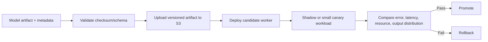

## 15.8 Operational Metrics

- model load duration
- model load failure
- inference duration p50/p95/p99
- inference error
- output class/distribution
- worker memory/CPU
- queue age by model version
- result count by model version
- canary vs stable error/latency

Metric labels ต้องหลีกเลี่ยง high cardinality และไม่ใช้ event ID เป็น label

## 15.9 KEDA Decision

KEDA ใช้ scale worker ตาม SQS queue length ซึ่งสอดคล้องกับ demand ของ asynchronous worker มากกว่า CPU ในบางกรณี

### เหตุผลที่ไม่ใช้ใน Core

- เพิ่ม controller และ IAM/config surface
- ต้องเข้าใจ HPA ก่อน
- ต้องมี queue metric และ scaling behavior ที่วัดได้

## 15.10 Argo Rollouts Decision

ใช้เมื่อมีสอง version และมี metric pass/fail ที่ชัด ไม่ใช้เพียงเพื่อให้มีคำว่า Canary

### Canary Criteria ตัวอย่าง

- error rate ไม่เกิน stable + threshold
- p95 latency ไม่เกิน objective
- memory ไม่เกิน limit safety margin
- no model-load failure
- synthetic correctness set ผ่าน

## 15.11 Out of Scope — Project 4

- training pipeline ขนาดใหญ่
- GPU node
- feature store
- real user image
- full data drift platform
- online model retraining
- complex model registry governance

## 15.12 Acceptance Criteria — Project 4

- [ ] model artifact มี version/checksum/metadata
- [ ] worker โหลด model จาก S3 ด้วย workload IAM
- [ ] ไม่มี cloud key ใน container
- [ ] inference metrics แยก model version
- [ ] KEDA scale from queue ผ่าน spike test
- [ ] candidate model canary ถูก promote หรือ rollback จาก metric
- [ ] model-load failure มี alert/runbook
- [ ] README แยก MLOps extension จาก Core Platform ชัดเจน

---

# 16. สถาปัตยกรรมรวม

## 16.1 Runtime Architecture — Lab Implementation

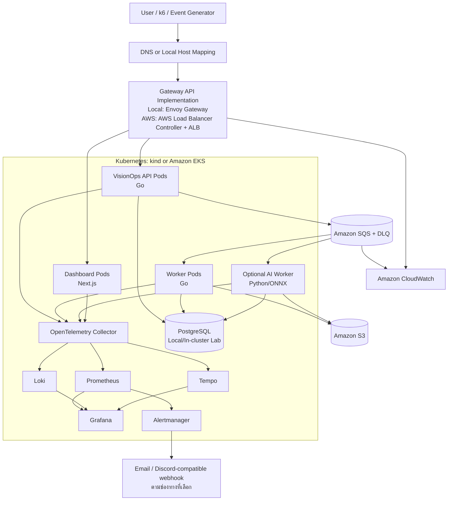

## 16.2 Delivery Architecture

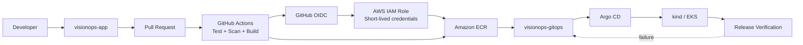

## 16.3 Infrastructure Architecture

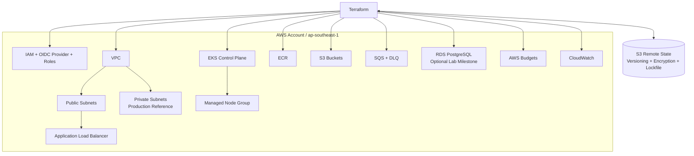

## 16.4 Observability Architecture

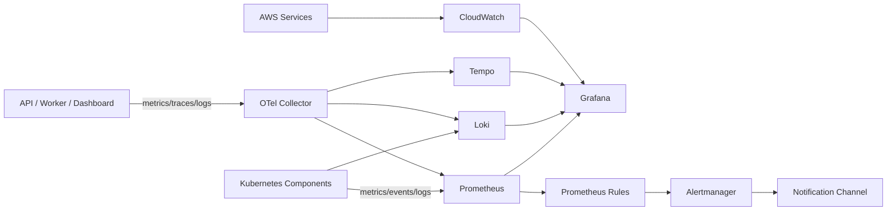

## 16.5 Production Reference Differences

| Area | Lab Implementation | Production Reference |
|---|---|---|
| Accounts | 1 AWS account | separate dev/staging/prod accounts + organization controls |
| Cluster | short-lived, small nodes | multi-AZ capacity, upgrade policy, autoscaling |
| Node network | cost-optimized lab compromise | private subnets, controlled egress/endpoints |
| Database | in-cluster or short-lived RDS | managed private Multi-AZ DB, PITR |
| Secrets | Kubernetes secret/local encrypted mechanism; optional ESO | managed secrets service + rotation + workload identity |
| Logging | short retention | centralized durable retention/access controls |
| On-call | solo simulated | rotation, escalation, paging platform |
| DR | rebuild exercise | tested regional strategy per business RTO/RPO |
| Security | automated baseline | independent review, compliance, WAF, org guardrails |
| Availability | controlled window | continuous operations and monthly SLO |

---

# 17. กลยุทธ์ Environment

## 17.1 Environment Ladder

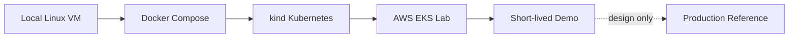

## 17.2 Environment Matrix

| Environment | จุดประสงค์ | อายุ | Data | Cost |
|---|---|---|---|---|
| `linux-local` | OS/network fundamentals | replaceable | synthetic | $0 |
| `compose-local` | app/container integration | persistent as needed | synthetic | $0 |
| `kind-local` | Kubernetes/GitOps/observability | create/delete daily | synthetic | $0 |
| `aws-lab` | AWS integration and EKS validation | 4–8 ชั่วโมง/session | synthetic | controlled |
| `demo` | recruiter recording/live demo | 1 session | synthetic | controlled |
| `production-reference` | architecture reasoning only | not deployed | none | estimated only |

## 17.3 Promotion Model

```text
Feature branch
  → PR checks
  → local compose
  → local kind
  → GitOps local/staging
  → scheduled AWS lab validation
  → tagged demo release
```

## 17.4 Configuration Separation

ห้ามใช้ไฟล์ values เดียวแก้ด้วยมือข้าม Environment

```text
environments/
├── local/
├── kind/
├── aws-lab/
└── demo/
```

สิ่งที่ต่างกันได้

- replica count
- resource requests/limits
- domain/hostname
- queue/storage endpoints
- telemetry retention
- autoscaling bounds
- log level

สิ่งที่ไม่ควรต่างโดยไม่มีเหตุผล

- application behavior หลัก
- security minimum
- health endpoint semantics
- event schema
- artifact identity

---

# 18. Network Architecture และ Packet Flow

## 18.1 Lab VPC Baseline

ตัวอย่าง CIDR ซึ่งต้องบันทึกใน ADR ก่อนใช้จริง

```text
VPC: 10.42.0.0/16

Availability Zone A
- Public subnet:  10.42.0.0/24
- Private subnet: 10.42.10.0/24   # reference/optional lab

Availability Zone B
- Public subnet:  10.42.1.0/24
- Private subnet: 10.42.11.0/24   # reference/optional lab
```

## 18.2 Lab Cost-Optimized Network

เพื่อประหยัดงบ EKS session อาจใช้ node ใน public subnet โดย

- public IP เปิดเฉพาะตามความจำเป็นของ bootstrap/egress
- node Security Group ไม่เปิด inbound application จาก Internet
- traffic เข้า app ผ่าน ALB เท่านั้น
- SSH ปิดหรือจำกัดอย่างเข้มงวด
- cluster endpoint access จำกัดตามความสามารถของ lab
- resources มี expiry tag และถูก destroy หลัง session

นี่เป็น **Budget Compromise** ไม่ใช่ Production Recommendation

## 18.3 Production Reference Network

```text
Internet
  → Route 53
  → WAF/CloudFront optional by requirement
  → Public ALB in public subnets
  → EKS pods/nodes in private subnets
  → RDS in isolated DB subnets

Private workloads
  → NAT Gateway per AZ or selected VPC endpoints
  → ECR/S3/CloudWatch/STS according to design
```

## 18.4 Security Group Intent

| Security Group | Inbound | Outbound |
|---|---|---|
| ALB SG | 80/443 จาก intended client range | app target port ไป node/pod SG |
| Node/Pod SG | เฉพาะ ALB/control-plane/cluster-required traffic | necessary AWS/dependency endpoints |
| RDS SG | PostgreSQL จาก API/worker SG เท่านั้น | response/stateful default |

ห้ามใช้ `0.0.0.0/0` สำหรับ database หรือ node admin port

## 18.5 Request Packet Flow — AWS

```text
Client
  1. Resolve DNS
  2. Establish TCP/TLS with ALB
  3. ALB listener selects HTTPRoute rule
  4. Target group routes to pod IP/service target
  5. Readiness/target health must be healthy
  6. API validates request
  7. API writes metadata to PostgreSQL
  8. API sends message to SQS using workload identity
  9. Response returns event_id
```

## 18.6 Worker Data Flow

```text
Worker
  1. Long-polls SQS
  2. Receives message and trace context
  3. Marks event PROCESSING
  4. Processes synthetic workload
  5. Writes result to S3
  6. Updates PostgreSQL to SUCCEEDED
  7. Deletes SQS message only after durable success

Failure
  → visibility timeout expires
  → message retried
  → max receive count reached
  → message moves to DLQ
```

## 18.7 DNS/TLS Strategy

### Local

- `/etc/hosts` หรือ local DNS ตาม setup
- self-signed certificate เฉพาะ TLS learning
- HTTP ยอมรับได้ใน isolated local lab

### AWS Lab

- ใช้ ALB DNS name ได้เพื่อ demo ขั้นต้น
- หากมี domain ให้ใช้ Route 53/external DNS record และ ACM certificate
- ห้ามซื้อ domain เพียงเพื่อให้โปรเจกต์ผ่านหากไม่จำเป็น

### Production Reference

- managed DNS
- automated certificate lifecycle
- HTTPS only
- HSTS เมื่อ domain/rollout พร้อม
- certificate expiration monitoring

---
# 19. Technology Selection และ Trade-off

## 19.1 หลักในการเลือก

คำว่า “ดีกว่า” ในเอกสารนี้หมายถึง **เหมาะกว่ากับเป้าหมาย ข้อจำกัด และหลักฐานที่ต้องการของโปรเจกต์นี้** ไม่ได้หมายความว่าเครื่องมืออื่นด้อยกว่าในทุกสถานการณ์

ใช้เกณฑ์ตัดสิน 8 ด้าน

| เกณฑ์ | คำถาม |
|---|---|
| Learning Value | เครื่องมือนี้ช่วยให้เข้าใจหลักการสำคัญหรือไม่ |
| Target-role Signal | สอดคล้องกับ Cloud/DevOps/SRE portfolio หรือไม่ |
| Operational Complexity | ภาระติดตั้ง/ดูแลเกินคุณค่าหรือไม่ |
| Cost | อยู่ในงบและปิดได้หรือไม่ |
| Portability | ผูกกับ provider มากเพียงใด |
| Security | มีแนวทาง identity, secret และ hardening ชัดหรือไม่ |
| Observability | ตรวจสอบ behavior ได้หรือไม่ |
| Solo Feasibility | คนเดียวทำให้ลึกและเสร็จได้หรือไม่ |

## 19.2 Cloud Provider — AWS

### เลือก AWS เพราะ

- มี account/credit อยู่แล้ว
- มีบริการที่ครอบคลุม Compute, Network, IAM, Container, Queue, Storage และ Observability
- สามารถแสดง managed Kubernetes ผ่าน EKS
- เชื่อมกับประสบการณ์ AWS เดิมใน CV
- มีบริการ managed ที่ทำให้คนเดียวเน้น platform/reliability ได้

### เปรียบเทียบ

| ตัวเลือก | จุดเด่น | เหตุผลที่ไม่เลือกเป็น Primary | เมื่อเหมาะกว่า |
|---|---|---|---|
| AWS | ecosystem กว้าง, EKS/IAM/SQS/S3 | complexity และค่าใช้จ่ายต้องคุม | โปรเจกต์นี้ |
| GCP | GKE และ cloud-native UX แข็ง | ไม่มี credit/context หลักในตอนนี้ | data/ML-centric หรือมี GCP target role |
| Azure | enterprise/identity integration แข็ง | เพิ่ม learning surface โดยไม่จำเป็น | Microsoft ecosystem/AKS target |
| Local only | ฟรีและเร็ว | ไม่พิสูจน์ cloud IAM/network/managed services | ช่วงเรียน 70–80% |
| Multi-cloud | แสดง portability | scope ใหญ่และตื้นสำหรับคนเดียว | หลังมี one-cloud depth แล้ว |

## 19.3 Infrastructure as Code — Terraform

### เลือก Terraform เพราะ

- declarative resource graph
- plan ก่อน apply
- provider ecosystem กว้าง
- module/reuse ชัด
- สอดคล้องกับ job signal ที่ต้องการ
- ใช้ได้ทั้ง AWS และ supporting providers

### เปรียบเทียบ

| ตัวเลือก | ข้อดี | ข้อเสียสำหรับโปรเจกต์นี้ | เมื่อเหมาะกว่า |
|---|---|---|---|
| Terraform | mature ecosystem, plan/state/module | ต้องดูแล state และ HCL | baseline |
| OpenTofu | open-source fork และ syntax ใกล้เคียง | เพิ่ม decision/compatibility surface | องค์กรที่เลือก governance ของ OpenTofu |
| CloudFormation | AWS-native และไม่มี external state backend แบบเดียวกัน | verbose, portability ต่ำ | AWS-only organization |
| AWS CDK | ใช้ programming language และ abstraction สูง | ซ่อน resource detailง่ายและ synth/debug เพิ่ม | ทีม developer-centric ที่มี construct standards |
| Pulumi | general-purpose language, testingดี | state/tool ecosystem เพิ่ม | ทีมต้องการ code abstractions หลาย cloud |
| Manual Console | เห็นบริการเร็ว | ไม่ reproducible/auditable | exploration ครั้งแรกเท่านั้น |

### Decision

ใช้ Terraform เป็น Source of Truth ของ AWS Infrastructure ส่วน Console ใช้ inspect/troubleshoot ไม่ใช้เป็น standard deployment path

## 19.4 Configuration Management — Ansible

| ตัวเลือก | ประเมิน |
|---|---|
| Ansible | เลือก เพราะ agentless, เรียนง่าย, เหมาะกับ VM ไม่กี่เครื่อง และแสดง idempotency |
| Bash only | ใช้ bootstrap/utility แต่ script ยาวจะจัด state/dependency ยาก |
| Chef/Puppet | แข็งสำหรับ fleet/policy ขนาดใหญ่ แต่หนักเกิน solo lab |
| Cloud-init only | ดีสำหรับ first boot แต่ไม่สะดวกสำหรับ repeated convergence |
| Docker | package app ได้ แต่ไม่แทน host configuration ทุกเรื่อง |

## 19.5 Container Runtime/Build — Docker

### เลือก Docker เพราะ

- user familiarity และ ecosystem ใหญ่
- Compose ใช้ local integration ได้
- image compatible กับ Kubernetes registries/runtime
- tooling/scanners รองรับกว้าง

### ทางเลือก

- Podman เหมาะกับ daemonless/rootless workflow และควรศึกษา concept แต่ไม่ต้องทำสอง toolchain
- Buildah เหมาะกับ image build แบบ modular
- Kaniko/BuildKit remote builders เหมาะ CI/cluster use case ขั้นสูง

ใช้ Docker/BuildKit เป็น baseline และออกแบบ image ตาม OCI principles เพื่อลด lock-in

## 19.6 Local Kubernetes — kind

| ตัวเลือก | เหตุผล |
|---|---|
| kind | เลือก: fast disposable upstream-style clusters และเหมาะ automation/CI |
| k3d | เบากว่าและเร็ว แต่ใช้ K3s distribution ซึ่งมี defaults ต่าง |
| minikube | learning UX/addons ดี แต่ workflow automation หนักกว่า baseline |
| Docker Desktop K8s | ง่าย แต่ version/config/reproducibility ของทีมควบคุมได้น้อยกว่า |
| kubeadm VM | เรียน control plane ลึก แต่ใช้เวลามากเกินเป้าหมาย Portfolio แรก |

> เพิ่ม kubeadm lab ภายหลังได้หากต้องการสาย Kubernetes Administrator โดยเฉพาะ แต่ไม่ควรขัดขวาง Core Project

## 19.7 Cloud Orchestrator — Amazon EKS

### เลือก EKS เพราะ

- เป้าหมายการเรียนรู้ระบุ Kubernetes โดยตรง
- ได้เรียน managed control plane + AWS integration
- แสดง Helm, GitOps, probes, HPA, PDB, Gateway API และ workload identity ได้
- ให้ signal ต่อ Cloud/Platform/SRE roles สูง

### เปรียบเทียบ EKS กับ ECS/Fargate

| ด้าน | EKS | ECS/Fargate |
|---|---|---|
| Learning target | Kubernetes ecosystem เต็ม | AWS container orchestration |
| Operational complexity | สูงกว่า | ต่ำกว่า |
| Cost baseline | control plane + nodes/resources | pay per task/resource ตาม model |
| Portability | Kubernetes API portable กว่า | AWS-specific |
| Time to deploy app | ช้ากว่า | เร็วกว่า |
| เหมาะกับ project นี้ | ใช่ เพราะ Kubernetes เป็น explicit objective | ควรทำ ADR comparison หรือ small optional lab |

### เมื่อ ECS/Fargate ดีกว่า

หาก business goal คือ deploy service เล็กบน AWS ด้วยทีมเล็กและไม่ต้องการ Kubernetes ecosystem, ECS/Fargate อาจ simple และ cost/operation efficient กว่า การเลือก EKS ในโปรเจกต์นี้เป็นการเลือกเพื่อ **learning objective** ไม่ใช่อ้างว่า EKS เหมาะกับทุก workload

## 19.8 EKS Compute — Managed Node Group

| ตัวเลือก | เหตุผล |
|---|---|
| Managed Node Group | เลือก: ได้เรียน node, scheduling, daemonset, capacity และ drain โดย AWS ช่วย lifecycle บางส่วน |
| EKS Fargate | ลด node operation แต่จำกัด daemon/observability/network patterns บางอย่างและ cost model ต่าง |
| EKS Auto Mode | ลด operational overhead มากขึ้น แต่ซ่อน infrastructure decisions ที่ต้องการเรียนและมี pricing layerเพิ่มเติม |
| Self-managed nodes | control สูงแต่ lifecycle/upgrade burden มากเกิน Core |
| Karpenter | ดีสำหรับ dynamic provisioning แต่เพิ่ม controller/complexity; optional หลังเข้าใจ MNG |

## 19.9 Container Registry — Amazon ECR

### เลือก ECR เพราะ

- IAM integration
- EKS proximity
- lifecycle policy
- vulnerability scanning integration
- private registry within AWS account

### ทางเลือก

- GHCR เหมาะกับ open-source/GitHub-centric project และ setup ง่าย
- Docker Hub เหมาะ public distribution แต่ rate/security/governanceต่าง
- Harbor เหมาะ self-hosted enterprise registry แต่ operational overhead สูง

สำหรับ Portfolio อาจ publish non-sensitive demo image ใน GHCR เพิ่ม แต่ ECR เป็น release path หลักเพื่อพิสูจน์ AWS IAM

## 19.10 Application Language — Go

| ตัวเลือก | เหตุผล |
|---|---|
| Go | เลือก: static binary, concurrency, low runtime overhead, existing skill, cloud tooling ecosystem |
| Node.js/TypeScript | productivity สูงและ skillเดิม แต่เพิ่ม runtime/package footprint; ใช้ dashboardได้ |
| Java/Spring Boot | enterprise signal สูงและ robust ecosystem แต่ memory/startupมากกว่าสำหรับ budget lab |
| Python/FastAPI | เร็วและ AI integrationดี แต่ core worker performance/runtime dependencyมากกว่า Go; ใช้ AI extension |
| Rust | performance/securityดีแต่ learning scopeเพิ่มเกินจำเป็น |

## 19.11 Frontend — Next.js แบบ Minimal

เลือกเพราะผู้พัฒนาทำได้เร็วและใช้สร้าง operational UI โดยไม่เสียเวลาเรียน frontend ใหม่

ไม่ใช้ Microfrontend, SSR complexity หรือ design system ใหญ่ เพราะ UI ไม่ใช่ learning objective หลัก

Grafana เป็น dashboard สำหรับ operator ส่วน Next.js เป็น interface ของ simulated user ทั้งสองไม่แทนกัน

## 19.12 Database — PostgreSQL

### เลือก PostgreSQL เพราะ

- transaction และ relational state เหมาะ event lifecycle
- SQL query/index/lock/connection monitoring เป็น SRE learning opportunity
- local/in-cluster/RDS ใช้ engine เดียวกันได้

### เปรียบเทียบ

| ตัวเลือก | เหตุผลที่ไม่เลือก Core | เมื่อเหมาะกว่า |
|---|---|---|
| MySQL | ทำได้เทียบเคียงหลายกรณี แต่ไม่มีเหตุผลเปลี่ยนจาก PostgreSQL | organization standard |
| DynamoDB | serverless scale/IAMดี แต่ data model/consistencyต่างและลด DB ops บางบทเรียน | key-value access pattern, high scale, low ops |
| MongoDB | schema flexibility | event status/transactionไม่ต้องการ document flexibilityมาก | document-centric domain |
| SQLite | ง่ายมากแต่ concurrency/distributed deploymentจำกัด | Project 1 prototype |
| Redis | ไม่ใช่ source of truth baseline | caching/ephemeral stateเมื่อมี metricรองรับ |

## 19.13 Messaging — Amazon SQS Standard + DLQ

### เลือกเพราะ

- fully managed
- at-least-once behavior สอน idempotency
- queue buffering ช่วย decouple API/worker
- DLQ/retry/visibility timeout มี failure mode ที่เหมาะ SRE
- cost/operationต่ำสำหรับ lab

### เปรียบเทียบ

| ตัวเลือก | เหตุผล |
|---|---|
| SQS Standard | baseline |
| SQS FIFO | ใช้เมื่อ strict ordering/dedupเป็น requirementจริง |
| RabbitMQ | routing/ack modelยืดหยุ่น แต่ต้องดูแล brokerหรือ managed cost |
| Kafka/MSK | event streaming/replay/consumer groupsแข็ง แต่ overkill และแพง |
| Redis Streams | local/simpleได้ แต่ durability/ops semanticsต่าง |

## 19.14 Kubernetes Packaging — Helm

### เลือกเพราะ

- application package เดียวหลาย environment
- chart versioning
- values schema
- ecosystem และ recruiter signal

### เปรียบเทียบ Kustomize

Kustomize อ่าน YAML patch ง่ายและไม่ใช้ template language เหมาะเมื่อ resource set ไม่ต้อง parameterize มาก ส่วน Helm เหมาะกับ reusable application package ที่มี environment values และ external chart dependencies

โปรเจกต์นี้ใช้ Helm เป็นหลัก และสามารถใช้ Kustomize เฉพาะ bootstrap/add-on overlay หากมีเหตุผล แต่ไม่ควรซ้อนสองเครื่องมือโดยไม่จำเป็น

## 19.15 GitOps — Argo CD

| ตัวเลือก | เหตุผล |
|---|---|
| Argo CD | เลือก: UI และ desired/live diff ชัด สาธิต drift/reconciliationได้ดี |
| Flux | lean/composable/Git-nativeมาก เหมาะทีม CLI/controller-centric |
| GitHub Actions `kubectl apply` | simple แต่ pipelineถือ cluster credentialและ drift visibilityต่ำกว่า |
| Manual kubectl | ใช้ learning/break-glass ไม่ใช่ release path |

## 19.16 Traffic API — Gateway API

### เลือก Gateway API เพราะ

- Ingress API ถูก freeze และทิศทางของ Kubernetes คือ Gateway API
- role-oriented resources เช่น GatewayClass, Gateway และ HTTPRoute
- routing model expressive กว่า annotation-heavy Ingress
- Local และ AWS มี implementation รองรับ

### Implementation

- Local: Envoy Gateway
- AWS: AWS Load Balancer Controller → ALB สำหรับ L7 HTTPRoute

### เหตุผลที่ไม่ใช้ ingress-nginx

Ingress-NGINX ถูกประกาศ retirement ในปี 2026 จึงไม่เหมาะเป็น baseline ใหม่ แม้ Nginx reverse proxy บน Project 1 ยังเหมาะและเป็นคนละโครงการกับ ingress-nginx controller

### เมื่อ Ingress ยังพบได้

ระบบองค์กรเดิมจำนวนมากยังใช้ Ingress และ candidate ควรอ่าน/แก้ manifest ได้ แต่ Portfolio ใหม่ควรแสดง migration-aware decision

## 19.17 CI Platform — GitHub Actions

### เลือกเพราะ

- source อยู่ GitHub
- public portfolio ดู workflow/evidence ได้
- OIDC กับ AWS
- matrix/cache/artifact/checks รองรับเพียงพอ
- ไม่มี infrastructure ของ CI server ให้ดูแล

### เปรียบเทียบ Jenkins

Jenkins มี plugin/ecosystem และองค์กรจำนวนมากใช้ โดยเฉพาะ on-prem/legacy แต่ต้องดูแล controller/agents/plugins/credentials การใช้ Jenkins เป็น main pipeline จะเพิ่มงาน operation ของ CI เองและเบี่ยงจาก objective

อาจสร้าง `jenkins-comparison-lab.md` หรือ pipeline เล็กเพื่อแสดงความเข้าใจ แต่ไม่ทำสอง production paths

### GitLab CI

เหมาะเมื่อ source/groupอยู่ GitLab และ integrated DevSecOps featuresสำคัญ แต่ไม่มีเหตุผลเพิ่ม platformที่สองในโปรเจกต์นี้

## 19.18 Cloud Authentication — GitHub OIDC

เลือก OIDC เพราะ workflow แลก short-lived credentials จาก AWS โดยไม่ต้องเก็บ access key ระยะยาว

### เหนือกว่า Static Keys ในบริบทนี้

- ลด secret rotation burden
- token อายุสั้น
- trust condition จำกัด repo/branch/environmentได้
- revoke/permissionผ่าน role
- audit sessionได้ชัดกว่า

Static key อาจยังพบใน legacy setup แต่ไม่ควรเป็น baseline ใหม่

## 19.19 Workload Identity — EKS Pod Identity

เลือกเป็น baseline เมื่อ EKS version/environment รองรับ เพราะแยก IAM permission ตาม Kubernetes ServiceAccount และไม่พึ่ง credential ใน secret

IRSA ต้องศึกษาและบันทึกเป็น alternative เพราะใช้อย่างแพร่หลายและอาจจำเป็นใน environment/tool compatibility บางกรณี

Node role กว้างสำหรับทุก pod เป็น anti-pattern ของ baseline นี้

## 19.20 Metrics — Prometheus

### เลือกเพราะ

- pull/scrape model เข้ากับ Kubernetes
- PromQL เหมาะกับ SLI/alert
- exporters/ecosystem กว้าง
- dashboard integration

### CloudWatch-only ไม่พอเพราะ

CloudWatch ดีมากสำหรับ AWS service metrics/logs แต่ application-level histogram, portable SLI และ Kubernetes-native ecosystemจะเรียนได้ชัดกว่าด้วย Prometheus

ใช้ทั้งสองโดยแบ่ง responsibility ไม่ใช่เลือกอย่างใดอย่างหนึ่งทั้งหมด

## 19.21 Logs — Loki

เลือกเพราะ integration กับ Grafana และ operational footprint เหมาะกับ lab เมื่อใช้ label อย่างระมัดระวัง

OpenSearch เหมาะกับ full-text search/analytics และ log volume/complex query สูงกว่า แต่ resource/cost/operationมากกว่า

CloudWatch Logs ยังใช้สำหรับ AWS-native sources และ backup pathบางส่วนได้

## 19.22 Traces — Tempo

เลือกเพราะ reuse Grafana/OTel stack และช่วยเชื่อม metric → exemplar/trace → log

Jaeger เป็น alternative ที่ดีและมี UI เฉพาะ tracing ส่วน AWS X-Ray เหมาะ AWS-native tracing การเลือก Tempo เน้น stack integration ไม่ใช่เพราะเหนือกว่าทุกด้าน

## 19.23 Instrumentation — OpenTelemetry

เลือกเพราะแยก instrumentation จาก backend vendor และส่ง traces/metrics/logs ผ่าน Collector ได้

ไม่จำเป็นต้องเปิดทุก signal ผ่าน OTel ตั้งแต่วันแรก ให้เริ่ม trace + application metrics ที่มีคุณค่า แล้วเพิ่ม log pipelineอย่างมีวินัย

## 19.24 Alerting — Prometheus Rules + Alertmanager

เลือกเพราะ

- rule-as-code
- ผูกกับ SLI metric
- grouping/dedup/inhibition/routing
- test ruleได้

Grafana Alerting ใช้ได้และ UIสะดวก แต่ baseline นี้แยก visualization กับ rule/routing เพื่อเข้าใจ pipeline อย่างชัดเจน

## 19.25 Load Testing — k6

เลือกเพราะ JavaScript-like script, CLI/CI-friendly และทำ threshold/result exportได้

- Locust เหมาะผู้ถนัด Python และ user behaviorซับซ้อน
- JMeter เหมาะ existing enterprise test ecosystem/GUI แต่ repository diffและscript maintainabilityต่ำกว่าสำหรับ projectนี้

## 19.26 Security Scanners

| Tool | เลือกเพื่อ | Alternative/ข้อสังเกต |
|---|---|---|
| Gitleaks | secrets in Git | TruffleHog เหมาะ verified/entropy workflows; เลือกหนึ่งเป็น gateหลัก |
| Trivy | image/fs/config scanning แบบรวม | Grype/Syft ดีสำหรับ vuln/SBOM; เพิ่มเมื่อมีเหตุผล |
| Checkov | Terraform/K8s policy scan | tfsec functionalityถูกผนวกใน ecosystemบางส่วน; OPA policy customภายหลัง |
| Hadolint | Dockerfile quality | custom policyเพิ่มได้ |
| ShellCheck | Bash correctness | baselineบังคับ |
| TFLint | Terraform lint/provider rules | ไม่แทน security scan |
| kubeconform | Kubernetes schema validation | kubevalเก่ากว่า; admission policyเป็นอีก layer |

## 19.27 Policy Engine — Deferred Kyverno

Kyverno เหมาะ Kubernetes-native policy และตรวจ resource เช่น non-root, resource limits, allowed registries ได้ แต่ไม่ใช้ใน Core แรกเพื่อให้เข้าใจ native Pod Security Admission และ CI checks ก่อน

OPA Gatekeeper เหมาะองค์กรที่ใช้ Rego/cross-domain policy ecosystem แต่ learning curveสูงกว่า

## 19.28 Secret Management

### Core

- local `.env.example` เท่านั้น; real `.env` ignored
- GitHub OIDC สำหรับ cloud authentication
- Kubernetes secret created through controlled environment mechanism
- no plaintext secret in GitOps

### Recommended Extension

External Secrets Operator + AWS Secrets Manager/Parameter Store เมื่อพร้อม

### เหตุผลที่ไม่ใช้ Vault ใน Core

Vault มีคุณค่ากับ dynamic secrets, PKI และ multi-platform governance แต่ต้องดูแล unseal/HA/storage/auth/policy ซึ่งหนักเกินงบและ scope ของ solo project

## 19.29 Progressive Delivery — Deferred Argo Rollouts

Core ใช้ RollingUpdate + readiness + rollback ก่อน

Argo Rollouts เพิ่มเมื่อ

- มี stable/candidate version
- มี metric analysis ที่เชื่อถือได้
- มี traffic routing support
- มีเหตุผลว่าความเสี่ยงของ release ต้อง gradual exposure

การติดตั้ง canary controller โดยไม่มี analysis/decision rule ไม่ถือว่าเรียน progressive deliveryครบ

## 19.30 Event-driven Autoscaling — Deferred KEDA

Core ใช้ HPA เพื่อเข้าใจ Kubernetes autoscaling fundamentals

KEDA เพิ่มใน AI extension เพื่อ scale workerจาก SQS queue metric ซึ่งตรง demandกว่า CPU ใน asynchronous workloads

## 19.31 Service Mesh — ไม่อยู่ใน Core

Istio/Linkerd สามารถเพิ่ม mTLS, traffic policy, telemetry และ service identity แต่

- เพิ่ม control/data plane
- resource overhead
- troubleshooting layer
- certificate/policy complexity

ระบบมี serviceน้อยและ Gateway/OTelเพียงพอ จึงไม่ใช้ mesh เพียงเพื่อเพิ่มชื่อเครื่องมือ

## 19.32 Tool Admission Rule

ก่อนเพิ่ม tool ใหม่ ต้องตอบ 6 ข้อใน ADR

1. Requirement ใดที่ยังตอบไม่ได้
2. Tool แก้ปัญหาอย่างไร
3. Native/simple alternative คืออะไร
4. ค่าใช้จ่ายด้าน compute, operation และ learning เท่าไร
5. จะวัดได้อย่างไรว่า tool เพิ่มคุณค่า
6. จะถอน tool ออกอย่างไรหากไม่คุ้ม

---

# 20. Infrastructure as Code

## 20.1 Terraform Scope

Terraform จัดการ

- state bootstrap resources แยกขั้น
- VPC, subnets, route tables, gateways
- security groups
- IAM OIDC provider/roles/policies
- ECR repositories/lifecycle
- S3 buckets/versioning/encryption/lifecycle
- SQS main queue/DLQ/redrive policy
- EKS cluster/node group/add-on prerequisites
- optional RDS
- CloudWatch log groups/retentionที่เหมาะสม
- budget resourcesเท่าที่ provider/accountรองรับ
- tags

Terraform ไม่จัดการ application release ที่ Argo CD รับผิดชอบ ยกเว้น bootstrap Argo CD/cluster add-onตาม ADR

## 20.2 State Bootstrap

State backend ต้องสร้างก่อน stack หลัก จึงมี bootstrap procedure แยก

### S3 Backend Baseline

- dedicated bucket name unique
- block public access
- server-side encryption
- versioning
- least-privilege IAM
- native S3 state locking ด้วย `use_lockfile` ตาม Terraform versionที่รองรับ
- backup/recovery procedure

> ไม่ใช้ DynamoDB locking เป็น baseline ใหม่ เพราะ S3 backend รองรับ native lockfile และ DynamoDB-based locking ถูกประกาศ deprecated ใน Terraform documentation ปัจจุบัน

## 20.3 Terraform Layout

```text
terraform/
├── bootstrap/
│   └── state-backend/
├── modules/
│   ├── networking/
│   ├── iam-github-oidc/
│   ├── ecr/
│   ├── storage/
│   ├── messaging/
│   ├── eks/
│   ├── database/
│   ├── observability-aws/
│   └── budgets/
└── environments/
    ├── aws-lab/
    └── demo/
```

## 20.4 Module Rules

- module ต้องมี purpose ชัด
- input/output มี description/type
- หลีกเลี่ยง mega-module
- ไม่ abstract resource ที่ใช้ครั้งเดียวจนอ่านยาก
- tag ผ่าน common variable
- provider/version constraints
- examples หรือ environment usage
- validation block สำหรับ dangerous input
- sensitive outputs marked

## 20.5 Plan/Apply Workflow

### Pull Request

- `terraform fmt -check`
- `terraform validate`
- TFLint
- Checkov
- plan สำหรับ environmentที่ปลอดภัย
- plan artifact/comment โดย redact sensitive output

### Apply

- protected GitHub environment/manual approval
- OIDC role แยกจาก plan role
- apply saved plan เมื่อ practical
- capture output/evidence
- post-apply smoke/inventory

### Destroy

- explicit manual approval
- backup checkก่อน destroy
- capture destroy log
- run orphan resource audit
- verify billing/resource consoles/API

## 20.6 Drift

- scheduled `terraform plan -detailed-exitcode` สำหรับ AWS labเมื่อเปิดอยู่
- manual change ใช้เฉพาะ failure lab
- drift report ต้องระบุ resource, cause และ remediation
- หลัง lab ต้อง reconcileด้วย code ไม่ใช่ปล่อย manual fix

## 20.7 Terraform Security

- state ถือเป็น sensitive asset
- ห้าม commit state/planที่มี secret
- backend accessจำกัด
- encryption/versioning
- CI logsไม่พิมพ์ sensitive output
- IAM apply roleใช้ least privilegeเท่าที่ทำได้
- production referenceควรแยก plan/apply rolesและ account

---

# 21. Container และ Kubernetes Design

## 21.1 Kubernetes Learning Checklist

ต้องอธิบายได้ว่าแต่ละ resourceแก้ปัญหาอะไร

- Pod
- ReplicaSet
- Deployment
- StatefulSet
- DaemonSet
- Job/CronJob
- Service
- Gateway/HTTPRoute
- ConfigMap/Secret
- ServiceAccount
- PersistentVolume/PersistentVolumeClaim
- Namespace
- ResourceQuota/LimitRange concept
- NetworkPolicy
- HPA
- PDB

## 21.2 Workload Design

### API Deployment

- minimum 2 replicasเมื่อทดสอบ availability
- RollingUpdate
- readiness/liveness
- maxUnavailable/maxSurge documented
- graceful shutdown/drain
- HPA
- PDB

### Worker Deployment

- at-least-one replica baseline
- graceful stopไม่รับ jobใหม่และจัดการ in-flight job
- visibility timeoutสัมพันธ์กับ termination grace
- HPA/KEDAตาม phase

### Dashboard

- 1 replicaใน labพอ
- ไม่เป็น dependencyของ API
- failureไม่ควรทำให้ event processingหยุด

### PostgreSQL Lab

- StatefulSet/PVCเพื่อเรียนเท่านั้น
- backupก่อน destructive test
- anti-claim: ไม่เรียก HA DB

## 21.3 Namespace and RBAC

- service accountต่อ component
- Role/RoleBindingเฉพาะ namespaceเมื่อพอ
- cluster-adminใช้เฉพาะ bootstrap/admin session
- Argo CD projectจำกัด destination/sourceเท่าที่ทำได้
- GitHub pipelineไม่ถือ cluster-admin credential

## 21.4 Config and Secret

| Data | เก็บที่ไหน |
|---|---|
| non-sensitive app config | ConfigMap/Helm values |
| local secret | ignored local file / generated secret |
| cloud secret | AWS secret service + ESO optional หรือ controlled injection |
| cloud identity | Pod Identity/IRSA |
| image credential | EKS/ECR integration ไม่ฝังใน app |

## 21.5 Deployment Safety

- readinessก่อน traffic
- `progressDeadlineSeconds`
- revision historyจำกัดแต่พอ rollback
- immutable image tag/digest
- pre-deploy database migration strategyต้องบันทึก
- backward-compatible schema changeเป็น baseline
- post-deploy smoke test
- release annotation/version metric

## 21.6 Database Migration Principle

ใช้ expand-and-contract สำหรับ changeที่กระทบ compatibility

```text
1. Expand schema แบบ backward compatible
2. Deploy app ที่อ่าน/เขียนได้ทั้งเก่าและใหม่
3. Backfill/verify
4. Switch traffic/behavior
5. Contract old schema ภายหลัง
```

Core applicationอาจมี migrationน้อย แต่ต้องมี scenarioหนึ่งเพื่อแสดง safe migration reasoning

## 21.7 NetworkPolicy

เมื่อ local CNI/environmentรองรับ ให้กำหนด intent

- default denyใน app namespace
- Gateway → API/Dashboard
- API → PostgreSQL, SQS endpoint/egressที่จำเป็น
- Worker → PostgreSQL/S3/SQS
- observability → scrape endpoints

หาก AWS CNI/network policy setupเพิ่ม scopeมาก ให้ทำ local enforcementและ production reference พร้อม limitationชัดเจน

## 21.8 Kubernetes Upgrade Awareness

ไม่จำเป็นต้องทำ version upgradeหลายรอบ แต่ต้องบันทึก

- cluster version/support status
- add-on compatibility
- deprecated API scan
- upgrade order
- rollback/backup assumptions

เลือก EKS versionที่อยู่ standard supportเพื่อหลีกเลี่ยง extended support cost

---
# 22. CI/CD และ GitOps

## 22.1 เป้าหมายของ Delivery System

Delivery System ต้องทำให้ทุก Release มีคุณสมบัติ

- **Repeatable** — ทำซ้ำได้
- **Traceable** — ย้อนจาก Deployment ไปยัง Image และ Commit ได้
- **Reviewable** — มี diff และ checks ก่อนเปลี่ยน desired state
- **Secure** — ไม่ใช้ credential อายุยาวและมี security gates
- **Recoverable** — rollback ได้
- **Observable** — เห็นผลกระทบของ release

## 22.2 Repository and Branch Model

### Branch Model

- `main` เป็น releasable branch
- feature branch อายุสั้น
- merge ผ่าน Pull Request
- protected branch
- required status checks
- no force push to main
- squash merge หรือ conventional merge strategy เลือกหนึ่งและบันทึก

### Commit Convention

แนะนำ Conventional Commits แบบไม่บังคับให้ซับซ้อน

```text
feat(api): add idempotent event creation
fix(worker): bound message retry on timeout
infra(eks): configure managed node group
ops(alerts): add queue age SLO alert
docs(adr): record Gateway API decision
test(gameday): add database outage scenario
```

## 22.3 Pull Request Template

ทุก PR ควรตอบ

- เปลี่ยนอะไร
- ทำไมต้องเปลี่ยน
- Risk ระดับใด
- Test อะไรแล้ว
- Security impact
- Observability impact
- Rollback plan
- Related ADR/Issue
- Screenshot/evidenceเมื่อเกี่ยวข้อง

## 22.4 Pipeline Separation

### CI

ตรวจคุณภาพ source และสร้าง artifact

### CD Artifact Promotion

นำ immutable artifact ไปยัง registry/environment

### GitOps Reconciliation

Argo CD ทำให้ live clusterตรงกับ Git desired state

แยกสามส่วนเพื่อให้ permissionและ failure boundaryชัด

## 22.5 Detailed CI Stages

| Stage | Input | Action | Output/Gate |
|---|---|---|---|
| Change detection | Git diff | เลือก jobที่เกี่ยวข้อง | ลดเวลารัน |
| Formatting | source | gofmt/prettier/shfmt/terraform fmt | failหากไม่ตรง |
| Static analysis | source | linters/type check | quality report |
| Unit test | source | isolated tests | coverage/report |
| Integration test | compose services | API/DB/queue contract | pass/fail |
| Secret scan | Git content/history scope | Gitleaks | no secret |
| Dependency scan | lock files/source | Trivy/SCA | policy result |
| Container build | Dockerfile | BuildKit | local image |
| Image scan | built image | Trivy | severity gate |
| IaC validation | Terraform | fmt/validate/TFLint/Checkov | plan-ready |
| K8s validation | rendered Helm | lint/schema/policy | deployable manifest |
| Test summary | all | GitHub summary/artifacts | review evidence |

## 22.6 Build Artifact Identity

Image ต้องมี

- tag: fullหรือshort Git SHA
- optional semantic release tag
- digest: source of exact deployed artifact
- OCI labels
  - source repository
  - revision
  - version
  - creation time
- SBOM optional advanced

ห้าม deploy ด้วย mutable tag `latest` เป็น desired state

## 22.7 Build Reproducibility

- pin dependencyผ่าน lock file
- pin base image version/digestตาม policy
- separate build/runtime stage
- cacheไม่เปลี่ยน output semantics
- record builder version
- deterministic buildเท่าที่ practical
- rebuildแล้วเปรียบเทียบ digestหรือบันทึก nondeterministic source

## 22.8 GitOps Repository Model

```text
visionops-gitops/
├── applications/
│   ├── app-of-apps.yaml
│   └── projects.yaml
├── charts/
│   └── visionops/
├── environments/
│   ├── local/
│   │   └── values.yaml
│   ├── aws-lab/
│   │   └── values.yaml
│   └── demo/
│       └── values.yaml
├── platform-addons/
│   ├── envoy-gateway/
│   ├── aws-load-balancer-controller/
│   ├── observability/
│   └── argocd/
└── policies/
```

## 22.9 Image Update Strategy

Baseline ที่โปร่งใสสำหรับ Portfolio

1. CI build/push image
2. CI เปิด PR ไป GitOps repo เปลี่ยน image digest/tag
3. PR checks render/validate manifest
4. merge PR
5. Argo CD reconcile
6. post-deploy smoke/SLO watch

ไม่ใช้ automated image updaterใน Core เพื่อให้เห็น promotion decisionชัด เมื่อเข้าใจ flowแล้วจึงพิจารณา Argo CD Image Updaterหรือ Renovate

## 22.10 Argo CD Project Boundaries

- จำกัด source repositories
- จำกัด destination cluster/namespace
- จำกัด resourceชนิดอันตรายถ้าทำได้
- separate applicationสำหรับ platform/addonsกับ app
- sync windows optional
- orphaned resource monitoring
- resource health customizationเฉพาะเมื่อจำเป็น

## 22.11 Sync Policy Progression

### Phase A — Manual Sync

ใช้เพื่อเรียน diff, health, hook, prune และ failure

### Phase B — Automated Sync

เปิดเมื่อ

- PR validationเชื่อถือได้
- rollback/runbookพร้อม
- resource ownershipชัด

### Phase C — Self-heal/Prune

เปิดทีละความสามารถและทดสอบ drift/deletion guard

## 22.12 Rollback Strategies

### Application Code

- revert GitOps commitไป digestเดิม
- Argo CD reconcile

### Configuration

- revert config commit
- หลีกเลี่ยงแก้ ConfigMap live

### Database

Application rollbackอาจไม่ทำงานหาก schemaไม่ backward compatible จึงใช้ expand-and-contractและ migration evidence

### Infrastructure

Terraform change rollbackไม่ใช่การ “ย้อน state” เสมอไป ต้องแก้ configurationเป็น desired previous stateและ plan impact การ restore stateใช้เฉพาะ state corruption procedure

## 22.13 Release Verification

หลัง deploy ตรวจ

- rollout status
- readiness/replica availability
- smoke endpoints
- error rate
- p95 latency
- dependency errors
- queue age/backlog
- deployed version metric

Verification windowต้องกำหนดตาม failure mode เช่น 5–10 นาทีใน Lab

## 22.14 Break-glass Procedure

Manual cluster changeอนุญาตเฉพาะเมื่อ

- เป็น GameDay
- GitOps controllerเสีย
- mitigationเร่งด่วนใน simulated incident

ทุกครั้งต้อง

1. บันทึกเวลา/ผู้ทำ/เหตุผล
2. ใช้ permissionชั่วคราวเท่าที่ทำได้
3. capture command/diff
4. เปิด PR ทำให้ Gitตรงกับ intended stateหรือให้ Argo reconcileกลับ
5. บันทึก post-incident action

## 22.15 Delivery Metrics

เก็บอย่างน้อย

- deployment frequencyในช่วง project
- lead timeจาก mergeถึง healthy deployment
- change failure rate
- failed pipeline rate
- rollback/recovery time
- mean pipeline duration

ตัวเลขเหล่านี้ใช้เรียนรู้และเขียน report ไม่ควรเปรียบเทียบกับองค์กรจริงโดยไม่มีบริบท

---

# 23. Security และ DevSecOps

## 23.1 Security Objective

ปกป้อง

- AWS Account และ Credit
- source codeและGitHub workflow
- CI/CD trust boundary
- container artifacts
- Kubernetes cluster
- database/object/queue data
- telemetryและbackup

โดยเน้น preventive control, detective control และ recovery control

## 23.2 Data Classification

| Class | ตัวอย่าง | Policy |
|---|---|---|
| Public | README, diagrams, synthetic schema | commit/publishได้ |
| Internal Lab | internal endpoint/configที่ไม่ secret | repositoryได้ตามความเหมาะสม |
| Sensitive | account IDบางบริบท, internal inventory, state metadata | redactเมื่อ publish |
| Secret | password, token, private key, kubeconfig, AWS credential | ห้าม commit; controlled storeเท่านั้น |

ทุก Runtime Data เป็น synthetic แต่ credentialยังเป็น secretจริง

## 23.3 Assets

- root account
- IAM identities/roles
- GitHub repository and Actions permissions
- Terraform state
- container registry
- cluster API/kubeconfig
- application database
- S3 objects/backups
- SQS messages
- alert/webhook credentials
- DNS/certificateถ้ามี

## 23.4 Trust Boundaries

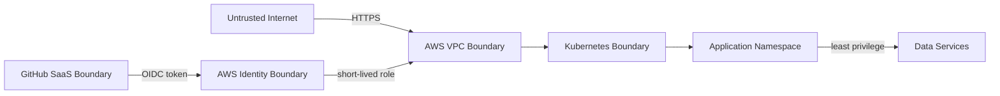

## 23.5 Threat Model Summary

| Threat | Example | Prevent | Detect | Recover |
|---|---|---|---|---|
| Credential theft | key committed | OIDC, MFA, no long-lived key | Gitleaks, audit logs | revoke role/session, rotate secret |
| Over-privileged IAM | `Action:* Resource:*` | least privilege, role separation | policy scan/review | tighten policy |
| Public data exposure | S3/RDS open | block public, SG rules | config scan/inventory | close access, assess data |
| Supply-chain compromise | malicious dependency/action | pin versions, review, scan | SCA/image scan | rebuild from known commit |
| Container escape risk | root/capabilities | non-root, drop caps, seccomp | runtime events/logs | isolate/redeploy |
| Injection | SQL/command injection | validation, parameterized query | app errors/security tests | patch/release |
| SSRF | arbitrary external URI | allowlist/object key contract | unusual egress/log | block/patch |
| Queue poisoning | repeated bad payload | schema, bounded retry, DLQ | DLQ alert | inspect/redrive safely |
| DoS/resource exhaustion | spike/large payload | limits, timeout, scaling | RED/USE alerts | throttle/scale |
| GitOps unauthorized change | malicious manifest PR | branch protection/checks | audit/diff | revert/reconcile |
| State exposure | Terraform state leak | encrypted private backend | access logs/scans | rotate referenced secrets |
| Log data leak | token in log | redaction/log contract | log review/scanner | purge/rotate |

## 23.6 AWS Account Security

- root MFA
- rootไม่สร้าง access key
- daily workผ่าน IAM Identity Centerหรือ IAM role/userที่จำกัดตาม account capability
- separate adminและread-only usage
- no shared credentials
- CloudTrail/account audit baseline
- contact/billing emailตรวจได้
- budget alerts
- revoke unused keys/users
- access analyzer/checksเมื่อ practical

## 23.7 GitHub Security

- branch protection
- required checks
- least `GITHUB_TOKEN` permissions
- workflow `permissions:` ระบุ explicit
- third-party actions pin version; critical workflowพิจารณา pin commit SHA
- Dependabot/Renovate controlled updates
- environment approvalสำหรับ apply/demo
- OIDC trust conditionจำกัด repo/ref/environment
- no untrusted PR executes privileged AWS job
- fork PRไม่มี cloud credential

## 23.8 IAM Design

### Human Roles

- `VisionOpsReadOnly`
- `VisionOpsOperatorLab`
- `VisionOpsAdminBootstrap` ใช้เฉพาะจำเป็น

### Pipeline Roles

- `VisionOpsCIRegistryPush`
- `VisionOpsTerraformPlan`
- `VisionOpsTerraformApply`
- `VisionOpsTerraformDestroy`

อาจรวมบาง roleใน Labเพื่อความเป็นไปได้ แต่ต้องบันทึก trade-off

### Workload Roles

- API queue publisher
- worker queue consumer/result writer
- backup writer
- optional model reader

### Policy Rules

- scope resource ARN
- condition tags/prefixเมื่อเหมาะสม
- deny dangerous actionบางประเภทถ้าทำได้
- no wildcardโดยไม่มี ADR
- session durationสั้นพอ

## 23.9 Container Security Baseline

- trusted minimal base image
- patched dependencies
- non-root user
- no package manager/build toolsใน runtimeถ้าไม่จำเป็น
- read-only root filesystem
- no privileged container
- no hostPath/hostNetworkใน app
- drop all capabilitiesแล้วเพิ่มเฉพาะจำเป็น
- seccomp RuntimeDefault
- resource requests/limits
- scan imageก่อน release
- do not expose debug port

## 23.10 Kubernetes Security Baseline

- namespace separation
- Pod Security Admissionระดับที่เข้ากันได้
- RBAC least privilege
- dedicated service accounts
- disable automount service account tokenเมื่อไม่ใช้
- NetworkPolicy intent
- no plaintext secretใน Git
- admission policy optional Kyverno
- control plane endpoint/accessจำกัดตาม Lab feasibility
- audit relevant changeผ่าน Git/CloudTrail/Argo

## 23.11 Application Security Baseline

- strict schema validation
- request body size limit
- timeout
- idempotency
- parameterized SQL
- no arbitrary shell execution
- no arbitrary URL fetch
- generic external error, detailed internal logโดยไม่ leak secret
- dependency pinning
- authenticationไม่อยู่ใน Core public synthetic API; admin/failure endpointต้อง disabledหรือ protectedนอก Lab

## 23.12 Secret Lifecycle

```text
Create → Store → Grant → Use → Observe without logging → Rotate → Revoke → Audit
```

Secret inventoryต้องระบุ

- owner
- system
- storage location
- consumers
- rotation method
- expiry
- emergency revoke

## 23.13 Software Supply Chain

### Core Controls

- lock files
- image scan
- source/dependency scan
- immutable digest
- protected release workflow
- provenance metadata

### Advanced

- SBOM with Syft/Trivy
- Cosign signature
- keyless signingผ่าน OIDC
- policy verify signatureก่อน deploy

Advanced controlเพิ่มหลัง release pathหลักเสถียร

## 23.14 Security Exception Process

```markdown
Finding:
Severity:
Affected artifact:
Reason not fixed now:
Exploitability in this environment:
Compensating control:
Owner:
Expiry date:
Review result:
```

Exceptionไม่มี expiryไม่ถือว่าอนุมัติ

## 23.15 Security Acceptance Criteria

- [ ] root MFA และไม่มี root access key
- [ ] GitHub → AWS ผ่าน OIDC
- [ ] CI permissions explicit
- [ ] no secret/state/kubeconfigใน repository/historyที่ตรวจ
- [ ] public S3 access blocked
- [ ] databaseไม่ public
- [ ] workload IAMแยกอย่างน้อย API/worker
- [ ] containers non-rootและไม่ privileged
- [ ] critical/high findingsถูกแก้หรือมี time-bound exception
- [ ] threat modelและtrust boundary diagram
- [ ] security failure scenarioอย่างน้อย credential leak simulationแบบไม่ใช้ secretจริง, public config prevention และ malicious payload

---

# 24. Observability

## 24.1 คำถามที่ระบบต้องตอบ

### User Questions

- ส่ง Event สำเร็จหรือไม่
- สถานะปัจจุบันคืออะไร
- ใช้เวลานานเท่าไร
- มี Event สูญหายหรือไม่

### Operator Questions

- serviceใดผิดปกติ
- เริ่มเมื่อไร
- releaseใดเกี่ยวข้อง
- impactเท่าไร
- bottleneckอยู่ที่ไหน
- mitigationใดปลอดภัย

### Capacity Questions

- CPU/memory/nodeเพียงพอหรือไม่
- queueกำลังโตหรือหด
- autoscalingตามทันหรือไม่
- log/telemetry costกำลังเพิ่มหรือไม่

## 24.2 Instrumentation Order

1. structured application logs
2. HTTP and worker metrics
3. correlation IDs
4. distributed traces
5. infrastructure/exporter metrics
6. SLI recording rules
7. alerts
8. cost/cardinality optimization

ไม่ติดตั้ง stackทั้งหมดแล้วค่อยคิดว่าจะวัดอะไร

## 24.3 OpenTelemetry Collector Pipeline

### Receivers

- OTLP gRPC/HTTP
- Prometheus receiverตาม design

### Processors

- batch
- memory limiter
- resource attributes
- filtering/redactionเมื่อจำเป็น
- samplingสำหรับ tracesเมื่อมี volume

### Exporters

- Prometheus-compatible endpoint/remote writeตาม deployment
- Loki-compatible log exporter/pathตาม chosen integration
- Tempo OTLP
- debug exporterเฉพาะ local

## 24.4 Telemetry Resource Attributes

อย่างน้อย

- `service.name`
- `service.version`
- `deployment.environment.name`
- `cloud.provider`
- `cloud.region`
- `k8s.namespace.name`
- `k8s.pod.name` เฉพาะ logs/traces; ไม่ใช้เป็น long-term high-cardinality business labelโดยไม่จำเป็น

## 24.5 Cardinality Budget

Prometheus labelsต้องใช้ bounded dimensions เช่น

- route template ไม่ใช่ raw URL
- status classหรือcodeจำนวนจำกัด
- event typeจำนวนจำกัด
- environment/service/version

ห้ามใช้

- event ID
- request ID
- user-provided text
- timestamp
- arbitrary error message

สิ่งเหล่านี้อยู่ใน log/traceแทน

## 24.6 Retention Strategy

| Environment | Metrics | Logs | Traces |
|---|---:|---:|---:|
| Local | 1–3 วันหรือ ephemeral | 1–3 วัน | 1 วัน |
| AWS Lab | session + สั้นมาก | 3–7 วัน | 1–3 วัน |
| Demo | พอเก็บ evidence | 3–7 วัน | 1–3 วัน |
| Production Reference | ตาม compliance/SLO/cost | ตาม data policy | sampledตาม need |

ตัวเลขจริงต้องปรับตาม disk/log volume

## 24.7 Dashboard-as-Code

- export JSON/provisioning filesเข้า Git
- datasource UIDไม่ hardcodeแบบแตก environmentถ้าเลี่ยงได้
- dashboardมี owner/version/description
- panelมี unitและlegendชัด
- dashboard linkจาก alert/runbook
- screenshotเป็น evidenceแต่ JSONคือ source

## 24.8 Observability Self-monitoring

Monitor

- Prometheus target down
- scrape errors
- OTel Collector dropped spans/metrics/logs
- Loki ingestion failure
- disk/storage saturation
- Alertmanager notification failure

หาก monitoringเสีย ระบบอาจดู “ปกติ” เพราะไม่มีข้อมูล จึงต้องแยก no-dataจาก healthy

## 24.9 Telemetry Cost Controls

- log level `INFO` baseline; `DEBUG` time-bound
- sample noisy traces
- drop unnecessary attributes
- bound labels
- short retention
- avoid duplicate log shipping
- measure bytes/events
- lifecycle old objects

## 24.10 Correlation Workflow

```text
Alert: APIHighLatency
  → Grafana latency panel
  → exemplar/trace
  → slow dependency span
  → correlated structured log
  → release/version check
  → runbook mitigation
```

นี่คือหลักฐานว่า Observability เชื่อมกัน ไม่ใช่สามระบบแยกกัน

---

# 25. SRE, SLI, SLO และ Error Budget

## 25.1 Service Definition

### Service

VisionOps Event Processing Service

### User Journey หลัก

1. submit event
2. receive event ID
3. observe progress
4. receive successful resultภายใน objective

### Critical Dependencies

- Gateway/ALB
- API
- PostgreSQL
- SQS
- Worker
- S3สำหรับ result

Dashboardไม่ใช่ critical pathของ processing แต่เป็น user access pathหนึ่ง

## 25.2 SLO Specification Template

แต่ละ SLOต้องมี

- user journey
- indicator
- good event
- valid event
- data source
- query/recording rule
- target
- window
- exclusions
- owner
- response policy

## 25.3 Initial SLO Set

### SLO-A Availability

- Target: 99.5%
- Window: controlled 60-minute test และ aggregate project report
- Good: eligible API requestได้ expected non-5xx response
- Exclusion: invalid client payloadที่ระบบ rejectถูกต้อง

### SLO-B Latency

- Target: 95% successful create/status requestsต่ำกว่า 500 ms
- Expected load: กำหนดใน test report

### SLO-C Event Timeliness

- Target: 95% accepted synthetic eventsสำเร็จภายใน 10 s

### SLO-D Event Accounting

- Target: 100% accepted eventต้องมี traceable active/terminal status
- ไม่ได้แปลว่าทุก eventต้อง success แต่ห้ามหายเงียบ

## 25.4 Multi-window Burn-rate Concept

เป็น Advanced Learning: สร้าง alertที่มองทั้งช่วงสั้นและยาวเพื่อแยก incidentรุนแรงเร็วจาก slow burn

Coreอาจเริ่ม thresholdง่ายก่อน แล้วเขียน ADR/experimentเพื่อพัฒนาเป็น burn-rate alert

## 25.5 Error Budget Policy

Error budgetไม่ใช่คะแนนสวยงาม แต่ใช้ตัดสินใจ

| Budget Consumption | Action |
|---:|---|
| 0–25% | normal change velocity |
| 25–50% | review risky changeและเพิ่ม observation |
| 50–100% | prioritize reliability work |
| >100% | freeze non-essential release; execute corrective plan |

## 25.6 Toil Tracking

บันทึกงาน manualที่

- ซ้ำ
- deterministic
- automationได้
- ไม่มี enduring value
- scaleตามจำนวน service/environment

ตัวอย่าง

- manual image tag update
- manual dashboard import
- manual resource cleanup
- manual health verification

เลือก automate toilที่เกิดซ้ำจริง ไม่เขียน automation speculativeทั้งหมด

## 25.7 Capacity Planning

### Baseline

- measure current usage
- define expected load
- find saturation point
- set headroom
- verify autoscaling

### Capacity Report

- environment spec
- pod/node resources
- max stable throughput
- bottleneck
- scaling delay
- cost implication
- next action

## 25.8 Reliability vs Cost Trade-off

ตัวอย่าง

| Decision | Reliability Gain | Cost/Complexity |
|---|---|---|
| 2 API replicas | tolerate one pod failure | more CPU/memory |
| 2 AZ | zone tolerance | cross-AZ/data/network cost |
| private nodes + NAT | security posture | NAT hourly/data cost |
| longer retention | better investigation | storage/ingestion cost |
| Multi-AZ RDS | DB availability | significant cost |

Labต้องเลือกอย่างซื่อสัตย์และแสดง production reference ไม่จำเป็นต้องเปิดทุก controlจริง

## 25.9 Reliability Review Gate

ก่อน Demo Release ต้องตอบ

- SLOมีข้อมูลจริงหรือไม่
- alerts testแล้วหรือไม่
- top 3 failure modesมี runbookหรือไม่
- backup restoreล่าสุดเมื่อไร
- current error budgetเท่าไร
- change rollbackอย่างไร
- dependency timeout/retry boundedหรือไม่
- cost/headroomพอหรือไม่

---

# 26. Testing Strategy

## 26.1 Test Layers

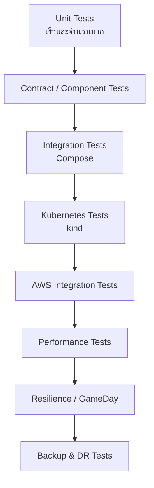

## 26.2 Application Tests

### Unit

- validation
- idempotency logic
- retry classification
- state transition
- config parsing

### Integration

- PostgreSQL repository
- queue adapter
- S3 adapter/local emulator
- transaction/error behavior

### Contract

- API schema
- event message schema
- backward compatibility

## 26.3 Infrastructure Tests

- Terraform validate
- lint/security policy
- plan review
- output assertions
- resource tag check
- public exposure check
- optional Terratestเฉพาะ high-value module; ไม่ต้องเขียน testทุก resource

## 26.4 Container Tests

- image builds
- runs as non-root
- expected port
- no secret file
- health endpoint
- graceful shutdown
- vulnerability gate
- image size tracked

## 26.5 Kubernetes Tests

- Helm lint/template/schema
- manifest policy
- rollout success
- readiness/liveness behavior
- HPA response
- PDB during drain
- service routing
- config/secret injection
- resource limit behavior

## 26.6 End-to-End Test

```text
submit event
  → receive ID
  → event queued
  → worker processes
  → result stored
  → status succeeds
  → metrics/log/trace exist
```

Assertทั้ง business resultและoperational evidence

## 26.7 Security Tests

- invalid/oversized payload
- SQL injection strings
- arbitrary URL rejection
- no public S3/RDS
- IAM negative test: API roleอ่าน model/resultที่ไม่อนุญาตไม่ได้
- secret scan
- image/IaC scan
- admin failure endpointdisabledนอก lab

## 26.8 Performance Tests

- baseline
- load
- stress
- spike
- soak local
- recovery after load

ทุก reportต้องระบุ environmentและversion ไม่เช่นนั้นเปรียบเทียบไม่ได้

## 26.9 Resilience Tests

Failure injectionต้องมี safety guard

- environment labelต้องเป็น local/lab
- destructive scriptตรวจ account/cluster name
- `--confirm-lab-destruction`
- backupก่อน data test
- max duration/automatic cleanup

## 26.10 Test Evidence Standard

Evidenceหนึ่งชุดต้องมี

- test ID/date
- commit/image digest
- environment spec
- command/config
- expected result
- actual result
- raw result file
- chart/screenshot
- conclusion
- follow-up issue

---
# 27. GameDay, Incident Response และ Disaster Recovery

## 27.1 จุดประสงค์ของ GameDay

GameDay ไม่ใช่การสุ่มทำระบบพังเพื่อความสนุก แต่เป็นการทดลองที่มีสมมติฐาน ขอบเขต และ Stop Condition เพื่อพิสูจน์ว่า

- Detection ทำงาน
- Alert มีคุณภาพ
- Runbook ใช้งานได้
- Automation recoverตามที่คาด
- Operatorไม่ทำให้ incidentแย่ลง
- Dataยังถูก account
- เอกสารและArchitecture assumptionถูกต้อง

## 27.2 GameDay Lifecycle

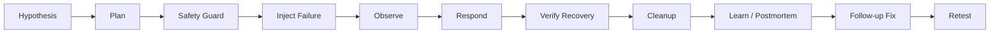

## 27.3 Preconditions

ก่อน GameDay ต้องตรวจ

- environment เป็น local/labเท่านั้น
- account/cluster nameถูกต้อง
- backupล่าสุดสำเร็จเมื่อเกี่ยวกับ data
- ownerอยู่หน้า dashboard
- alert channelพร้อม
- rollback commandผ่าน dry-run/review
- test trafficพร้อม
- stop conditionชัด
- teardown/cleanup ownerชัด
- ไม่มี resourceหรือข้อมูลบริษัทจริง

## 27.4 Safety Guardrails

- destructive script require `ENVIRONMENT=lab`
- require exact cluster/account confirmation
- timeoutอัตโนมัติ
- max load ceiling
- no uncontrolled Internet target
- no production credential
- kill switchหยุด load/faultได้
- one fault at a timeใน Core; compound faultsเป็น advanced

## 27.5 Hypothesis Template

```markdown
# GameDay Hypothesis

- Scenario ID:
- Date:
- Environment:
- Commit/Image Digest:
- Hypothesis:
- Expected user impact:
- Expected detection signal:
- Expected alert time:
- Expected automatic recovery:
- Manual action if needed:
- Stop conditions:
- Data risk:
- Cleanup:
```

## 27.6 Incident Command สำหรับทีมหนึ่งคน

แม้ทำคนเดียว ให้สลับบทบาทอย่างมีวินัย

| Phase | หมวกที่สวม | หน้าที่ |
|---|---|---|
| Detect | Monitoring Operator | ยืนยัน signal/impact |
| Triage | Incident Commander | ประกาศ severityและจัดลำดับ |
| Mitigate | Responder | ทำ actionจาก runbook |
| Verify | Service Owner | ตรวจ SLO/data integrity |
| Learn | Postmortem Facilitator | วิเคราะห์ระบบ ไม่โทษบุคคล |

ใช้ incident logเขียนตามเวลาเพื่อไม่แก้จากความจำภายหลัง

## 27.7 Standard Incident Process

1. **Acknowledge** — ระบุว่าเห็น alert
2. **Classify** — severity และ user impact
3. **Stabilize** — หยุดการเปลี่ยนแปลงเพิ่ม
4. **Diagnose** — dashboard → trace → log → dependency
5. **Mitigate** — rollback, scale, disable featureหรือrestore dependency
6. **Recover** — serviceกลับมา
7. **Verify** — SLI, queue drain, data integrity
8. **Close** — ไม่มี hidden backlog/cleanupค้าง
9. **Postmortem** — root cause/contributing factors
10. **Action** — preventive/detective/recovery improvements
11. **Retest** — พิสูจน์ว่า fixได้ผล

## 27.8 Incident Metrics

| Metric | นิยามในโปรเจกต์ |
|---|---|
| Time to Impact | failureเริ่มถึง user SLIกระทบ |
| MTTD | incidentเริ่ม/impactถึง alertหรือ detection |
| MTTA | alertถึง acknowledge |
| Time to Mitigate | acknowledgeถึงหยุด impactเพิ่ม |
| MTTR | incidentเริ่มถึง service recovered |
| Time to Verify | recoveredถึง data/SLO verificationจบ |
| Rollback Time | decision rollbackถึง healthy previous version |
| Change Failure Rate | releasesที่ต้อง rollback/hotfix ÷ releasesทั้งหมด |

## 27.9 Disaster Recovery Scenarios

### DR-01 — Rebuild Local Cluster

- delete kind cluster
- createจาก config
- bootstrap Argo CD/add-ons
- sync applications
- restore data fixture
- run E2E

### DR-02 — Rebuild AWS Lab

- backup/record required external data
- Terraform destroy
- Terraform applyใหม่
- bootstrap/reconnect GitOps
- restore database/object as applicable
- verify endpoints/SLO
- measure RTO

### DR-03 — Database Restore

- clean target database
- restore known backup
- run schema/version check
- verify known record counts/checksum
- application smoke

### DR-04 — S3 Previous Version Recovery

- overwrite/delete test object
- retrieve previous version
- verify checksum

## 27.10 Recovery Design Principle

แยกสิ่งที่ต้อง Backup กับสิ่งที่ควร Rebuild

| Asset | Strategy |
|---|---|
| Source code | Git remote/mirror |
| Infrastructure definition | Git + Terraform state protection |
| Kubernetes desired state | GitOps repository |
| Container image | ECR lifecycle with retained release versions |
| Database data | application-consistent backup + restore test |
| S3 object | versioning/lifecycleตาม class |
| Dashboard/alert | configuration as code |
| Cluster itself | rebuild, not treat as pet |
| Evidence | sanitized repository/release artifacts |

## 27.11 Exit Criteria ของ Incident

Incidentยังไม่ปิดจนกว่า

- user pathกลับปกติ
- SLIอยู่ใน expected range
- queueไม่สะสมผิดปกติ
- no unaccounted event
- temporary privilege/debug modeถูกปิด
- manual changeถูก reconcileเข้า Gitหรือย้อนกลับ
- cost-generating temporary resourceถูกลบ
- follow-up issuesถูกเปิด

---

# 28. Cloud Cost Management

## 28.1 Cost Objective

- Hard cap: `$100`
- Operating target: `$90`
- Reserve: อย่างน้อย `$10` ก่อนใช้ resourceใหม่
- Local-first: 70–80% ของเวลาทดลอง
- EKS/RDS/ALB: short-lived sessions

## 28.2 Cost Reality ของ EKS

ณวันที่จัดทำ Charter ค่า EKS clusterที่ใช้ Kubernetes versionใน standard supportมีค่าควบคุม clusterรายชั่วโมง และยังต้องจ่ายแยกสำหรับ worker nodes, EBS, public IPv4, load balancer, data transfer และบริการอื่น ดังนั้น **ห้ามเปิด clusterทิ้งไว้เพื่อรอทำต่อวันถัดไป**

ให้ตรวจ pricing page/regionอีกครั้งก่อนทุก milestone เพราะราคาสามารถเปลี่ยนได้

## 28.3 Spending Envelope

ตารางนี้เป็น Budget Allocation ไม่ใช่ใบเสนอราคาที่รับประกัน

| Category | Cap | ตัวอย่างค่าใช้จ่าย |
|---|---:|---|
| Project 1 EC2/Network Lab | $8 | EC2, EBS, public IPv4 ช่วงสั้น |
| EKS Control Plane Sessions | $18 | cluster hours + margin |
| Worker Nodes/EBS/IPv4 | $22 | managed node group |
| ALB/Network Experiments | $10 | ALB hours/LCU/data |
| RDS Short-lived Lab | $10 | database instance/storage/backup |
| ECR/S3/SQS/Logs/Data Transfer | $7 | image, object, queue, telemetry |
| Final Demo Sessions | $10 | end-to-end recording/retry |
| Emergency Reserve | $15 | error, cleanup delay, repeat test |
| **Total Hard Cap** | **$100** | |

เป้าหมายจริงคือใช้ต่ำกว่าตาราง ไม่จำเป็นต้องใช้ creditให้หมด

## 28.4 Budget Alerts

ตั้ง AWS Budgets อย่างน้อย

- $5 actual
- $20 actual
- $40 actual
- $70 actual
- $90 actual
- forecasted alertsเมื่อ accountมีข้อมูลเพียงพอ

> Budget dataไม่ได้ real-timeและ forecastอาจต้องมีประวัติ usage จึงห้ามใช้ Budget Alertเป็น safety mechanismเพียงอย่างเดียว ต้องตรวจ Billing/Cost Explorerและ active resourcesด้วยตนเอง

## 28.5 Cost Checklist ก่อน `apply`

- [ ] ตรวจ current spend
- [ ] ตรวจ credit expiry/coverage
- [ ] อ่าน Terraform planหา resourceคิดรายชั่วโมง
- [ ] ประเมิน session duration
- [ ] ตั้ง alarm/reminderเวลาปิด
- [ ] ตรวจ tags/expiry
- [ ] ตรวจ region
- [ ] เตรียม destroy command
- [ ] ระบุ dataที่ต้อง backupก่อน destroy
- [ ] ตรวจว่า NAT Gateway/RDS/ALBจำเป็นจริงหรือไม่

## 28.6 Cost Checklist หลัง Session

- [ ] Terraform destroyสำเร็จ
- [ ] EKS clusterหาย
- [ ] EC2 instancesหาย
- [ ] Load balancers/target groupsหาย
- [ ] NAT Gatewayหายถ้าสร้าง
- [ ] unattached EBS volumes/snapshotsตาม policy
- [ ] Elastic IP/Public IPv4 resourceไม่ค้าง
- [ ] RDS instance/snapshotที่ไม่ตั้งใจไม่ค้าง
- [ ] CloudWatch log retentionถูกต้อง
- [ ] ECR image lifecycleไม่สะสม
- [ ] S3 temporary objectลบ/expire
- [ ] Cost noteบันทึกเวลาและประมาณการ

## 28.7 Cost-saving Decisions

### ใช้ Local สำหรับ

- Helm iteration
- Argo CD behavior
- full observability stack
- load/soak testส่วนใหญ่
- failure injectionส่วนใหญ่
- dashboard tuning

### ใช้ AWS สำหรับ

- IAM/OIDC
- ECR
- EKS integration
- Pod Identity/IRSA
- SQS/S3 behavior
- ALB/Gateway
- short RDS validation
- final evidence

## 28.8 Expensive Components Watchlist

- EKS cluster hours
- NAT Gateway hourly/data processing
- ALB hours/LCU
- EC2 workers + public IPv4
- RDS instance/storage/snapshot
- high-volume CloudWatch logs
- cross-AZ/data transfer
- forgotten EBS volumes

## 28.9 Cost Report Template

```markdown
# Cost Report — Session <ID>

- Date/time opened:
- Date/time destroyed:
- Region:
- Resources:
- Purpose:
- Estimated cost before:
- Actual/observed cost after billing delay:
- Variance:
- Cost per test/demo:
- Waste identified:
- Follow-up optimization:
```

## 28.10 Optional Automated Cleanup

หลัง manual disciplineทำงานแล้ว อาจเพิ่ม scheduled inventory/cleanup notificationจาก tag `ExpiresAt` แต่ไม่ให้ automationลบ resourceอัตโนมัติโดยไม่มี protectionในช่วงแรก

---

# 29. โครงสร้าง Repository

## 29.1 Decision — Three Repositories

เลือก 3 repository เพื่อแยก responsibility และ permission boundary

1. `visionops-app`
2. `visionops-infra`
3. `visionops-gitops`

### เหตุผลที่ไม่ใช้ Monorepo เป็น Baseline

Monorepoง่ายสำหรับ solo developer แต่การแยก GitOps desired stateจาก source/build repoทำให้เห็น promotion/audit boundaryชัดกว่า และสาธิต patternที่องค์กรใช้ได้ดี

### เมื่อ Monorepo เหมาะกว่า

- projectเล็กมาก
- team/toolingรองรับ atomic changeสำคัญ
- permissionไม่ต้องแยก
- overheadหลาย repoสูงกว่าคุณค่า

## 29.2 `visionops-app`

```text
visionops-app/
├── README.md
├── Makefile
├── go.work / go.mod
├── api/
│   ├── cmd/
│   ├── internal/
│   ├── migrations/
│   └── tests/
├── worker/
│   ├── cmd/
│   ├── internal/
│   └── tests/
├── dashboard/
│   ├── app/
│   ├── components/
│   └── tests/
├── ai-worker/                 # optional Project 4
├── event-generator/
├── contracts/
│   ├── openapi/
│   └── event-schema/
├── docker/
│   ├── api.Dockerfile
│   ├── worker.Dockerfile
│   └── dashboard.Dockerfile
├── compose.yaml
├── observability/
│   └── instrumentation-docs/
├── scripts/
└── .github/workflows/
```

## 29.3 `visionops-infra`

```text
visionops-infra/
├── README.md
├── Makefile
├── terraform/
│   ├── bootstrap/
│   ├── modules/
│   └── environments/
├── ansible/
│   ├── inventories/
│   ├── roles/
│   └── site.yml
├── linux/
│   ├── systemd/
│   ├── nginx/
│   ├── logrotate/
│   └── hardening/
├── kind/
│   ├── cluster.yaml
│   └── bootstrap/
├── scripts/
│   ├── lib/
│   ├── bootstrap-server.sh
│   ├── create-kind.sh
│   ├── destroy-kind.sh
│   ├── aws-session-open.sh
│   ├── aws-session-close.sh
│   └── orphan-audit.sh
├── load-tests/
├── failure-labs/
├── docs/
│   ├── charter/
│   ├── requirements/
│   ├── architecture/
│   ├── network/
│   ├── adrs/
│   ├── threat-model/
│   ├── slos/
│   ├── runbooks/
│   ├── incidents/
│   ├── postmortems/
│   ├── backup-restore/
│   ├── cost/
│   └── evidence/
└── .github/workflows/
```

## 29.4 `visionops-gitops`

```text
visionops-gitops/
├── README.md
├── charts/
│   └── visionops/
├── environments/
│   ├── local/
│   ├── aws-lab/
│   └── demo/
├── applications/
├── projects/
├── platform-addons/
│   ├── envoy-gateway/
│   ├── aws-load-balancer-controller/
│   ├── observability/
│   └── argocd/
├── policies/
└── .github/workflows/
```

## 29.5 Documentation Navigation

Root READMEของแต่ละ repoควรมี

- project purpose
- architecture thumbnail/link
- prerequisites
- quick start
- common operations
- cost warning
- security warning
- troubleshooting
- evidence/demo
- limitations
- license

Master READMEควรเชื่อมทั้งสาม repoและบอกลำดับอ่าน

## 29.6 Makefile / Task Runner

ให้มีคำสั่งจำง่าย เช่น

```text
make check
make test
make compose-up
make compose-down
make kind-create
make kind-bootstrap
make kind-destroy
make tf-plan ENV=aws-lab
make tf-apply ENV=aws-lab
make tf-destroy ENV=aws-lab
make load-test SCENARIO=baseline
make gameday SCENARIO=pod-delete
```

Makefileเป็น interface ไม่ควรซ่อน destructive actionจนผู้ใช้ไม่รู้ว่าเกิดอะไร

## 29.7 Evidence Directory Policy

เก็บ

- sanitized logs
- command output
- JSON test result
- dashboard export
- screenshotsที่ไม่มี secret
- cost snapshot
- incident timeline

ไม่เก็บ

- kubeconfig
- account token
- unredacted state/plan
- private key
- database dumpที่มี secret
- oversized raw artifactsที่เหมาะกับ GitHub Release/S3มากกว่า

---

# 30. Deliverables และ Portfolio Evidence

## 30.1 Architecture Package

- Project Charter
- Functional/Non-functional Requirements
- Context Diagram
- Runtime Diagram
- Deployment Diagram
- Network Diagram
- Data Flow
- Trust Boundary Diagram
- Failure Model
- Cost Model
- Production Reference Architecture

## 30.2 Decision Package

- ADRs
- technology comparison tables
- rejected alternatives
- limitation register
- version/compatibility record

## 30.3 Build/Delivery Evidence

- CI successful run
- CI failed security/test run
- immutable ECR image
- GitOps promotion PR
- Argo sync/diff
- drift detection
- rollback

## 30.4 Operations Evidence

- dashboard exports/screenshots
- alert notifications
- trace correlatedกับ log
- load reports
- GameDay reports
- runbooks
- postmortems
- backup/restore
- full rebuild

## 30.5 Security Evidence

- Gitleaks report
- Trivy report
- Checkov/TFLint output
- IAM diagramและnegative test
- public access audit
- container runtime security check
- exception registerถ้ามี

## 30.6 Cost Evidence

- budget configuration
- session cost logs
- active resource inventory
- destroy evidence
- final cost total
- cost trade-off summary

## 30.7 Evidence Index

สร้าง `docs/evidence/README.md`

| Evidence ID | Claim | Environment | Commit | File/Link | Date |
|---|---|---|---|---|---|
| EV-001 | API deployผ่าน GitOps | aws-lab | SHA | path | date |
| EV-002 | Broken release rollback | kind | SHA | path | date |

ทุก Resume bulletต้อง mapกลับ Evidence IDได้

---

# 31. Definition of Done

## 31.1 Global Definition of Done

Portfolio Coreถือว่าเสร็จเมื่อ

### Design

- [ ] Charterได้รับ baseline approvalโดย owner
- [ ] Requirementsและscopeชัด
- [ ] Architecture diagramsตรงกับ implementationจริง
- [ ] ADRสำคัญครบ
- [ ] Lab vs production referenceแยกชัด

### Application

- [ ] Minimal API/worker/dashboard/event generatorทำงาน
- [ ] idempotency/retry/DLQ behaviorทดสอบ
- [ ] health/metrics/version endpointsครบ
- [ ] structured logsและtrace contextครบ

### Linux/Network

- [ ] Project 1 acceptanceครบ
- [ ] failure labsอย่างน้อย 8
- [ ] deploy/rollback/backup/restore scriptsผ่าน

### Cloud/IaC

- [ ] AWS resourcesสร้างด้วย Terraform
- [ ] remote state secure
- [ ] `plan/apply/destroy` documented
- [ ] ไม่มี intentional console-only resource
- [ ] orphan auditผ่าน

### Container/Kubernetes

- [ ] non-root images
- [ ] Helm/Gateway API
- [ ] probes/resources/HPA/PDB
- [ ] kindและEKS validation

### Delivery

- [ ] CI gatesครบ
- [ ] OIDC authentication
- [ ] immutable artifact
- [ ] GitOps promotion/reconcile
- [ ] rollback evidence

### Security

- [ ] threat model
- [ ] IAM least privilegeตาม lab feasibility
- [ ] no secret leak
- [ ] scansและexceptions
- [ ] no public database/storage

### Observability/SRE

- [ ] metrics/logs/traces
- [ ] dashboardsอย่างน้อย 5
- [ ] SLO/error budget
- [ ] alertsทดสอบอย่างน้อย 8
- [ ] GameDayอย่างน้อย 8
- [ ] postmortemอย่างน้อย 3

### Recovery

- [ ] DB restoreทดสอบ
- [ ] full environment rebuildทดสอบ
- [ ] RTO/RPO report

### Cost

- [ ] spend≤$100
- [ ] final resources audited
- [ ] cost reportเผยแพร่แบบ sanitized

### Portfolio Quality

- [ ] master README
- [ ] evidence index
- [ ] demo video 5–7 นาที
- [ ] diagrams renderบน GitHub
- [ ] setupจาก clean environmentตามเอกสารอย่างน้อยหนึ่งครั้ง
- [ ] limitationsและfuture workตรงไปตรงมา

## 31.2 Not Done Conditions

แม้เว็บเปิดได้ แต่ยังไม่ถือว่าเสร็จหาก

- deployด้วยมือเป็นหลัก
- Terraformสร้างไม่ได้จาก clean state
- ใช้ `latest`
- ไม่มี restore test
- มี dashboardแต่ไม่มี SLO/alert test
- มี Kubernetesแต่ไม่มี probes/resources
- มี CIแต่ใช้ long-lived AWS key
- มีชื่อเครื่องมือจำนวนมากแต่ไม่มี evidence
- architecture diagramไม่ตรงของจริง
- AWS resourceค้างโดยไม่ตั้งใจ

---
# 32. Roadmap

## 32.1 เวลาที่ใช้

- Core: 14 สัปดาห์
- Optional AI Extension: 2 สัปดาห์
- เวลาต่อสัปดาห์: 8–12 ชั่วโมง
- หลักการ: ทุกสัปดาห์ต้องมี **learning note + code/config + evidence + retrospective**

## 32.2 Milestones

| Milestone | ชื่อ | ผลลัพธ์หลัก |
|---|---|---|
| M0 | Safety & Design Baseline | account guardrails, charter, architecture, ADR |
| M1 | Linux/Network Foundation | manual service → automation → failure labs |
| M2 | Containerized Local System | app, Compose, contracts, secure images |
| M3 | Reproducible Cloud Foundation | Terraform, IAM, VPC, ECR, S3, SQS |
| M4 | Kubernetes Platform | kind, Helm, Gateway API, reliability controls |
| M5 | Secure Delivery & GitOps | CI, OIDC, ECR, Argo CD, rollback |
| M6 | AWS EKS Validation | short-lived EKS end-to-end |
| M7 | Observability & SRE | telemetry, dashboards, SLO, alerts |
| M8 | Reliability Evidence | load, GameDay, backup, DR, postmortem |
| M9 | Portfolio Release | docs, demo, cost, resume evidence |
| M10 | Optional AI Operations | model version, KEDA, canary |

## 32.3 Week 0 — Safety Setup

### Learning Goals

- เข้าใจ AWS account responsibility
- เข้าใจงบและ resourceที่มีค่าใช้จ่าย
- สร้าง working agreementสำหรับ solo project

### Tasks

- เปิด MFA
- ตรวจ root access key
- สร้าง working identity/role
- ตั้ง AWS Budgets
- สร้าง GitHub repositories/project board
- ตั้ง branch protection
- ติดตั้ง toolchainพร้อม version record
- สร้าง `COST-GUARDRAILS.md`

### Deliverables

- account security checklist
- budget screenshots/config note
- repositories
- version matrix

### Exit Criteria

ห้ามเริ่ม EKS/Terraform cloud applyจน budgetและidentity baselineผ่าน

## 32.4 Week 1 — Charter, Requirements และ Architecture v0

### Tasks

- approve charterฉบับนี้
- เขียน `requirements.md`
- วาด context/runtime/deployment/network diagrams
- สร้าง ADR-001 ถึง ADR-005
- ประเมิน cost envelope
- สร้าง risk register
- define minimal event contract

### Exit Criteria

อธิบายได้ว่าแต่ละ componentมีเหตุผลอะไรและอะไร out of scope

## 32.5 Week 2 — Linux Operations

### Tasks

- Ubuntu VM
- users/groups/permissions
- compile/install Go API manual
- systemd unit
- journald/logrotate
- process/resource exercises
- failure labs 1–4

### Exit Criteria

service start/restart/graceful stopได้ และวิเคราะห์ปัญหา process/file permissionได้

## 32.6 Week 3 — Network, Nginx, Bash และ Ansible

### Tasks

- packet path lab
- DNS/TCP/TLS exercises
- Nginx reverse proxy
- firewall/SG lab
- scripts deploy/rollback/health/backup/restore
- ShellCheck
- Ansible roles
- failure labs 5–8+

### Exit Criteria

bootstrapเครื่องใหม่และ deployโดย automationได้ พร้อมอธิบาย network failureแต่ละ layer

## 32.7 Week 4 — Minimal Application และ Containers

### Tasks

- event API/worker contract
- PostgreSQL schema/migrations
- queue adapter
- secure Dockerfiles
- Docker Compose
- unit/integration tests
- structured logging/version endpoint

### Exit Criteria

clean local environmentรัน E2E event flowได้ด้วย Compose

## 32.8 Week 5 — Terraform และ AWS Foundation

### Tasks

- state backend bootstrap
- networking module
- IAM GitHub OIDC
- ECR
- S3
- SQS + DLQ
- Terraform CI validation
- cost tagging

### Exit Criteria

foundation plan/apply/destroyได้และไม่มี state/secretใน Git

## 32.9 Week 6 — kind, Helm และ Gateway API

### Tasks

- kind multi-node config
- Envoy Gateway
- Helm chart
- services/Gateway/HTTPRoute
- ConfigMap/Secret pattern
- local E2E
- manifest validation

### Exit Criteria

applicationเข้าถึงผ่าน Gateway APIบน kindและติดตั้งด้วย Helmได้

## 32.10 Week 7 — Kubernetes Reliability and Security

### Tasks

- liveness/readiness/startup probes
- resources
- HPA
- PDB
- graceful termination
- pod security context
- RBAC
- network policyตาม local capability
- pod/node failure tests

### Exit Criteria

delete pod, bad readiness, load spike และ node drain behaviorมี evidence

## 32.11 Week 8 — CI/CD and Supply-chain Gates

### Tasks

- GitHub Actions PR pipeline
- BuildKit/cache
- Trivy/Gitleaks/Checkov/TFLint/Hadolint/ShellCheck
- immutable tag/digest
- ECR pushผ่าน OIDC
- failed-gate evidence

### Exit Criteria

PRที่ผิดถูก block และ release artifactเชื่อมถึง commitได้

## 32.12 Week 9 — Argo CD GitOps

### Tasks

- install/bootstrap Argo CD local
- GitOps repo
- AppProject/Application
- promotion PR
- automated syncตาม readiness
- drift lab
- rollback lab

### Exit Criteria

ไม่มี standard manual apply และ drift/rollbackมีหลักฐาน

## 32.13 Week 10 — Short-lived EKS Validation

### Tasks

- Terraform EKS/MNG
- EKS Pod IdentityหรือIRSA
- AWS Load Balancer Controller + Gateway API
- ALB route
- SQS/S3 integration
- optional short RDS lab
- end-to-end test
- destroy audit

### Exit Criteria

Create → Deploy → Test → Destroyใน sessionเดียว และ spendยังตาม plan

## 32.14 Week 11 — Observability

### Tasks

- OpenTelemetry
- Prometheus
- Grafana
- Loki
- Tempo
- CloudWatch integrationตาม need
- dashboards A–E
- correlation workflow

### Exit Criteria

จาก slow requestหนึ่งรายการสามารถเดิน metric → trace → log → dependencyได้

## 32.15 Week 12 — SLO, Alerts และ Performance

### Tasks

- SLI queries/recording rules
- SLO report
- error budget
- Alertmanager
- alerts 8+
- k6 baseline/load/stress/spike
- capacity report

### Exit Criteria

alertทุกตัวหลักถูก trigger/resolveและชี้ runbookได้

## 32.16 Week 13 — GameDay และ Recovery

### Tasks

- GameDay 8–12 scenarios
- incident timelines
- MTTD/MTTA/MTTR
- postmortems 3+
- DB restore
- S3 recovery
- full rebuild
- reliability before/after improvement

### Exit Criteria

Recovery claimsทั้งหมดมี measured evidence

## 32.17 Week 14 — Portfolio Release

### Tasks

- reconcile diagramsกับ implementation
- clean README
- evidence index
- sanitized screenshots/logs
- final cost report
- final security scan
- demo script/video
- release tag
- resume bulletsพร้อม evidence mapping

### Exit Criteria

บุคคลอื่นเข้า repositoryแล้วเข้าใจคุณค่า/วิธีรัน/ข้อจำกัดภายใน 5 นาที

## 32.18 Week 15 — Optional AI Worker and Model Artifact

- ONNX model/simulator
- S3 artifact contract
- model checksum/metadata
- model metrics
- model-load failure lab

## 32.19 Week 16 — Optional KEDA and Canary

- KEDA SQS scaling
- Argo Rollouts
- stable/candidate analysis
- promote/rollback
- final AI operations demo

## 32.20 Weekly Retrospective Template

```markdown
# Week <N> Retrospective

## Intended outcome
## Completed
## Evidence
## What I learned
## What failed
## Decisions made
## Cost incurred
## Security/reliability findings
## Scope removed
## Next week's highest-risk item
```

---

# 33. ความเสี่ยงและแผนรับมือ

## 33.1 Risk Scale

- Probability: Low / Medium / High
- Impact: Low / Medium / High
- Priority: พิจารณาจาก probability × impact และเวลาที่จะตรวจพบ

## 33.2 Risk Register

| ID | Risk | P | I | Early Signal | Mitigation | Contingency |
|---|---|---|---|---|---|---|
| R-01 | Scope ใหญ่จนไม่เสร็จ | H | H | เพิ่ม toolทุกสัปดาห์ | Core/Optional boundary, tool admission rule | ตัด P4/advanced tools |
| R-02 | AWS creditหมด | M | H | spendสูงกว่า envelope | local-first, budgets, short sessions | หยุด cloud,ทำ local evidence |
| R-03 | ลืมลบ EKS/ALB/RDS | M | H | resource activeข้ามคืน | expiry tag, timer, close checklist | emergency destroy/audit |
| R-04 | NAT/IPv4/log costเกินคาด | M | M | daily costเพิ่ม | avoid NAT core, short retention | redesign network/retention |
| R-05 | EKS complexityกินเวลา | H | M | stuck bootstrapหลายวัน | kind first, small add-on set | validate coreบน kindและทำ EKSขั้นต่ำ |
| R-06 | เครื่อง local RAMไม่พอ | M | M | pods pending/OOM | light profiles, selective stack | split observability, remote short lab |
| R-07 | Secretรั่วใน Git | L/M | H | scanner alert | pre-commit/CI, OIDC, ignores | revoke/rotate, history cleanup |
| R-08 | Terraform stateเสีย/เปิดเผย | L | H | lock/error/access anomaly | S3 versioning/encryption/locking | restore version, rotate affected secret |
| R-09 | Architecture diagramไม่ตรงของจริง | H | M | implementationเปลี่ยน | docs in PR/weekly review | final architecture reconciliation |
| R-10 | Overclaim production-grade | M | H | README languageเกิน evidence | terminology policy | revise claims/evidence map |
| R-11 | AI workกลบ DevOps | H | M | เริ่มtrain/tune modelเร็ว | P4 blocked until core DoD | replace modelด้วย simulator |
| R-12 | Alert noise | M | M | frequent non-actionable alerts | `for`, grouping, SLO focus | retune/remove alert |
| R-13 | Observability cardinalityสูง | M | H | Prometheus memory/storageโต | label review/cardinality budget | drop metric/relabel/rebuild |
| R-14 | Backupมีแต่ restoreไม่ได้ | M | H | no recent restore evidence | scheduled restore test | fix format/process before DR claim |
| R-15 | Single-person review blind spot | H | M | repeated avoidable error | checklists, scanners, peer/instructor review when available | focused self-review session |
| R-16 | Tool/API versionเปลี่ยน | M | M | deprecated warning | version matrix, official docs, pin versions | upgrade ADR/migration note |
| R-17 | Gateway implementationต่าง local/AWS | M | M | manifest portability issue | standard API core, provider valuesแยก | maintain two documented overlays |
| R-18 | Broken migrationทำ rollbackไม่ได้ | M | H | incompatible schema | expand-contract, migration test | restore/forward fix |
| R-19 | Load testตีระบบภายนอกผิด | L | H | target URLไม่ใช่ lab | allowlist/environment guard | stop test/incident note |
| R-20 | Portfolioอ่านยากเพราะเอกสารมาก | M | M | reviewerหลงไฟล์ | master README/evidence index | create guided tour/demo |

## 33.3 Scope Cut Order

หากเวลาไม่พอ ให้ตัดตามลำดับ

1. MLflow
2. Cosign/SBOM enforcement
3. Kyverno
4. KEDA
5. Argo Rollouts
6. Project 4 ทั้งหมด
7. optional RDS milestone
8. advanced multi-window alert

ห้ามตัด

- Linux/network foundation
- Terraform create/destroy
- secure CI/OIDC
- local Kubernetes
- GitOps
- core observability
- SLO/alert
- backup/restore
- at least 8 GameDays
- cost evidence

---

# 34. Architecture Decision Record Backlog

## 34.1 ADR Template

```markdown
# ADR-XXX: <Decision Title>

- Status: Proposed | Accepted | Superseded | Rejected
- Date:
- Decision Owner: Suphanat Chanlek

## Context
ปัญหา ข้อจำกัด และ requirement

## Decision Drivers
- ...

## Considered Options
1. ...
2. ...

## Decision
สิ่งที่เลือกและขอบเขต

## Consequences
### Positive
### Negative
### Risks

## Validation
จะวัดอย่างไรว่าการตัดสินใจถูกต้อง

## Revisit Trigger
เงื่อนไขที่ต้องเปิด decisionใหม่

## References
Official documents and experiments
```

## 34.2 Required ADRs

| ADR | Decision | Priority |
|---|---|---|
| ADR-001 | Why EKS instead of ECS/Fargate for this learning portfolio | Must |
| ADR-002 | Local Kubernetes: kind vs k3d vs minikube | Must |
| ADR-003 | Three repositories vs monorepo | Must |
| ADR-004 | Go core services and Python only for AI extension | Must |
| ADR-005 | SQS Standard + DLQ vs FIFO/Kafka/RabbitMQ | Must |
| ADR-006 | PostgreSQL lab strategy and RDS milestone | Must |
| ADR-007 | Terraform vs CloudFormation/CDK/OpenTofu | Must |
| ADR-008 | Terraform S3 native lockfile backend | Must |
| ADR-009 | GitHub Actions OIDC vs static credentials | Must |
| ADR-010 | Argo CD vs Flux/direct deployment | Must |
| ADR-011 | Helm vs Kustomize | Must |
| ADR-012 | Gateway API and controller choices | Must |
| ADR-013 | Lab public-node compromise vs production private nodes | Must |
| ADR-014 | Prometheus/Grafana/Loki/Tempo + CloudWatch split | Must |
| ADR-015 | SLI/SLO targets and observation window | Must |
| ADR-016 | Backup/rebuild boundary | Must |
| ADR-017 | RollingUpdate first; Argo Rollouts deferred | Should |
| ADR-018 | HPA first; KEDA deferred | Should |
| ADR-019 | Secret management core vs External Secrets/Vault | Must |
| ADR-020 | No service mesh in Core | Should |
| ADR-021 | Container base image and pinning policy | Should |
| ADR-022 | NetworkPolicy enforcement scope | Should |
| ADR-023 | CI security gate severities/exceptions | Must |
| ADR-024 | Telemetry retention/cardinality budget | Must |
| ADR-025 | Cost envelope and teardown design | Must |

## 34.3 Decision Review Rule

ADR acceptedไม่ได้แปลว่าห้ามเปลี่ยน เมื่อ evidenceใหม่ขัด assumption ให้สร้าง ADRใหม่ supersedeของเดิมและเก็บประวัติไว้

---

# 35. Demo Story สำหรับ Recruiter

## 35.1 เป้าหมาย

ภายใน 5–7 นาที Recruiterต้องเห็นทั้ง Design, Delivery, Operations และ Recovery โดยไม่ต้องดูทุก AWS Console page

## 35.2 Demo Timeline

### 0:00–0:40 — Problem and Architecture

- ปัญหา: application development skillมีแล้ว ต้องพิสูจน์ system ownership
- เปิด architectureหนึ่งภาพ
- ชี้ Lab vs Production Reference

### 0:40–1:30 — Design Decision

- ADR-001: EKS vs ECS
- อธิบายว่าเลือก EKSเพื่อ learning target ไม่ใช่เพราะดีกว่าทุกกรณี
- cost guardrail $100

### 1:30–2:30 — Secure Delivery

- เปิด Pull Request
- test/lint/scan/manifest checks
- GitHub OIDC
- immutable imageใน ECR
- GitOps PR

### 2:30–3:20 — Kubernetes and GitOps

- Argo CD desired/live state
- app healthy
- version/digest
- Gateway route
- probes/resources/HPA/PDB

### 3:20–4:10 — Observability

- Grafana user journey
- request metric
- trace
- correlated log
- queue/worker dashboard

### 4:10–5:30 — Failure and Recovery

- deploy broken candidateหรือลบ pod
- readiness/alert
- show incident timer/runbook
- rollback/recovery
- verify queue/data/SLO

### 5:30–6:20 — SRE Evidence

- MTTD/MTTR
- postmortem
- backup/restore report
- reliability before/after

### 6:20–7:00 — Cost and Honest Limits

- final spend
- destroy evidence
- what lab implements vs production would add

## 35.3 Demo Rules

- pre-record fallbackเผื่อ Cloud issue
- ไม่มี secret/account detailในจอ
- ใช้ seeded/synthetic data
- scriptคำพูดแต่ไม่อ่านทั้งหมด
- มี expected failure; อย่าแก้สดแบบสุ่ม
- จบด้วย outcomeไม่ใช่รายชื่อ tools

## 35.4 One-line Pitch

> “ผมออกแบบและสร้าง Cloud-Native Event Platform ที่ไม่ได้หยุดแค่ Deploy ได้ แต่สามารถสร้างซ้ำ ส่งมอบผ่าน GitOps ตรวจวัดด้วย SLO จงใจทำให้พัง กู้คืน และพิสูจน์ค่าใช้จ่ายได้ ภายใต้งบ AWS $100”

---

# 36. Resume Bullets หลังจบโปรเจกต์

> [!WARNING]
> ใช้เฉพาะตัวเลขที่วัดจริง และเก็บ Evidence ID รองรับทุก claim

## 36.1 Cloud/DevOps Version

- Designed and automated a production-oriented cloud-native event platform on AWS using Terraform, Amazon EKS, ECR, SQS, S3, Helm, GitHub Actions, and Argo CD, enabling reproducible infrastructure and GitOps-based deployments. `[EV-___]`
- Secured CI/CD access to AWS with GitHub OIDC and least-privilege IAM roles, eliminating long-lived cloud credentials from repository secrets. `[EV-___]`
- Implemented immutable container releases, automated security gates, health probes, resource controls, autoscaling, and rollback workflows across local Kubernetes and short-lived EKS environments. `[EV-___]`

## 36.2 SRE Version

- Built end-to-end observability with OpenTelemetry, Prometheus, Grafana, Loki, Tempo, and Alertmanager, defining availability, latency, and event-processing SLOs with actionable runbooks. `[EV-___]`
- Executed `[N]` reliability GameDays covering pod failure, faulty releases, queue backlog, memory exhaustion, database outages, drift, and disaster recovery, achieving measured MTTD of `[X]` and MTTR of `[Y]`. `[EV-___]`
- Validated database backup/restore and full environment reconstruction through Terraform and GitOps within an observed RTO of `[X]` minutes. `[EV-___]`

## 36.3 FinOps/Platform Version

- Developed automated environment provisioning, verification, teardown, and orphan-resource audits while keeping total AWS lab spending at `$[X]` under a `$100` project cap. `[EV-___]`
- Created reusable Terraform modules, Helm packaging, environment contracts, architecture decisions, and operational documentation to provide a repeatable developer deployment path. `[EV-___]`

## 36.4 Optional AI Operations Version

- Extended the platform with versioned CPU-based model artifacts, SQS-driven worker autoscaling, model operational metrics, and canary promotion/rollback based on latency and error thresholds. `[EV-___]`

## 36.5 Skills ที่ใส่ได้เมื่อมี Evidence

```text
AWS, Linux, Bash, Networking, Terraform, Docker, Kubernetes, Amazon EKS,
Amazon ECR, Amazon S3, Amazon SQS, IAM, GitHub Actions, Argo CD, Helm,
Gateway API, OpenTelemetry, Prometheus, Grafana, Loki, Tempo, Alertmanager,
k6, Ansible, DevSecOps, SLI/SLO, Incident Response, Disaster Recovery
```

อย่าใส่ optional toolก่อนสร้างและอธิบายได้จริง

---

# 37. รายการ Issue เริ่มต้น

รายการนี้ใช้เป็น GitHub Issues/Milestones ได้ทันที

## Milestone M0 — Safety and Design

1. `[M0] Secure AWS root account and verify no root access keys`
2. `[M0] Create AWS cost budget and alert thresholds`
3. `[M0] Bootstrap GitHub repositories, branch protections, and project board`
4. `[M0] Record tool and platform version matrix`
5. `[M0] Approve VisionOps project charter and scope boundaries`
6. `[M0] Draft functional and non-functional requirements`
7. `[M0] Create architecture context, runtime, deployment, and network diagrams`
8. `[M0] Write ADR-001 EKS versus ECS/Fargate`
9. `[M0] Write initial threat model and data classification`
10. `[M0] Create cost envelope and teardown checklist`

## Milestone M1 — Linux and Network Foundation

11. `[M1] Provision reproducible Ubuntu lab VM`
12. `[M1] Create least-privilege service user and file layout`
13. `[M1] Install VisionOps API manually and document every dependency`
14. `[M1] Run API as hardened systemd service`
15. `[M1] Configure journald and logrotate`
16. `[M1] Configure Nginx reverse proxy and access logging`
17. `[M1] Complete DNS, TCP, TLS, and firewall packet-path labs`
18. `[M1] Implement Bash bootstrap, deploy, rollback, and health scripts`
19. `[M1] Implement backup, restore, and checksum validation scripts`
20. `[M1] Create Ansible roles and demonstrate idempotent second run`
21. `[M1] Complete eight Linux/network failure labs`

## Milestone M2 — Application and Containers

22. `[M2] Define OpenAPI and event message schema`
23. `[M2] Implement idempotent event API and state model`
24. `[M2] Implement queue worker with bounded retry behavior`
25. `[M2] Add PostgreSQL migrations and repository tests`
26. `[M2] Add health, readiness, metrics, and version endpoints`
27. `[M2] Implement structured logging and correlation IDs`
28. `[M2] Create secure multi-stage Docker images`
29. `[M2] Build Docker Compose end-to-end environment`
30. `[M2] Add unit, integration, and E2E tests`

## Milestone M3 — Terraform and AWS Foundation

31. `[M3] Bootstrap encrypted versioned Terraform S3 backend with lockfile`
32. `[M3] Implement VPC and network Terraform module`
33. `[M3] Implement GitHub OIDC and pipeline IAM roles`
34. `[M3] Implement ECR repositories and lifecycle policies`
35. `[M3] Implement S3 data and backup buckets`
36. `[M3] Implement SQS queue, DLQ, and redrive policy`
37. `[M3] Add tags, validations, and cost controls to Terraform modules`
38. `[M3] Add Terraform lint, validation, plan, and security checks`

## Milestone M4 — Kubernetes Platform

39. `[M4] Create disposable multi-node kind cluster automation`
40. `[M4] Install Gateway API and Envoy Gateway locally`
41. `[M4] Build VisionOps Helm chart and values schema`
42. `[M4] Add Deployments, Services, Gateway, and HTTPRoutes`
43. `[M4] Add probes and graceful shutdown behavior`
44. `[M4] Define resource requests/limits from baseline measurements`
45. `[M4] Configure HPA and validate scaling`
46. `[M4] Configure PDB and validate node drain behavior`
47. `[M4] Add RBAC, security contexts, and NetworkPolicy intent`

## Milestone M5 — CI/CD and GitOps

48. `[M5] Implement application PR quality pipeline`
49. `[M5] Add secret, image, dependency, and IaC scans`
50. `[M5] Push immutable images to ECR using GitHub OIDC`
51. `[M5] Create VisionOps GitOps repository and environment layout`
52. `[M5] Bootstrap Argo CD and AppProject boundaries`
53. `[M5] Implement GitOps image promotion pull request`
54. `[M5] Demonstrate drift detection and reconciliation`
55. `[M5] Demonstrate failed release and rollback`

## Milestone M6 — AWS EKS

56. `[M6] Implement EKS managed node group Terraform module`
57. `[M6] Configure workload IAM with EKS Pod Identity or documented IRSA fallback`
58. `[M6] Install AWS Load Balancer Controller with Gateway API support`
59. `[M6] Deploy VisionOps to short-lived EKS environment`
60. `[M6] Validate SQS, S3, ALB, and ECR integrations`
61. `[M6] Execute full EKS create-deploy-test-destroy session`
62. `[M6] Audit and document orphan resources and actual cost`

## Milestone M7 — Observability and SRE

63. `[M7] Instrument API and worker with OpenTelemetry`
64. `[M7] Deploy Prometheus, Grafana, Loki, Tempo, and Alertmanager`
65. `[M7] Create user journey and API operations dashboards`
66. `[M7] Create queue, worker, Kubernetes, and release dashboards`
67. `[M7] Define SLI recording rules and SLO specification`
68. `[M7] Implement and test eight actionable alerts`
69. `[M7] Build k6 baseline, load, stress, spike, and soak scenarios`
70. `[M7] Create capacity and error-budget reports`

## Milestone M8 — GameDay and Recovery

71. `[M8] Execute API pod deletion GameDay`
72. `[M8] Execute broken release and rollback GameDay`
73. `[M8] Execute worker outage and queue backlog GameDay`
74. `[M8] Execute poison message and DLQ GameDay`
75. `[M8] Execute memory exhaustion GameDay`
76. `[M8] Execute database outage GameDay`
77. `[M8] Execute GitOps drift and node drain GameDays`
78. `[M8] Validate PostgreSQL backup and clean restore`
79. `[M8] Validate full environment rebuild and measure RTO`
80. `[M8] Publish runbooks, postmortems, and reliability improvement report`

## Milestone M9 — Portfolio Release

81. `[M9] Reconcile all diagrams and documentation with deployed reality`
82. `[M9] Publish evidence index and sanitized artifacts`
83. `[M9] Run final security and cost audit`
84. `[M9] Record five-to-seven-minute recruiter demo`
85. `[M9] Publish v1.0 release and evidence-backed resume bullets`

## Optional M10 — AI Operations

86. `[M10] Define versioned model artifact and validation contract`
87. `[M10] Build CPU-based Python/ONNX inference worker`
88. `[M10] Add model load, inference, and version metrics`
89. `[M10] Configure KEDA scaling from SQS backlog`
90. `[M10] Configure Argo Rollouts canary analysis and rollback`

---

# 38. อภิธานศัพท์

| คำ | ความหมายในโปรเจกต์ |
|---|---|
| Artifact | outputที่ buildแล้ว เช่น container image/model file |
| Availability | สัดส่วน request/service eventที่ให้บริการได้ตามนิยาม |
| Burn Rate | อัตราการใช้ error budget |
| CI | ตรวจและสร้าง artifactจาก source change |
| CD | ส่ง artifactไป environmentอย่างควบคุม |
| CIDR | การระบุช่วง IP network |
| Control Plane | ส่วนควบคุม desired stateของ Kubernetes |
| Data Plane | ส่วนที่รับ/ประมวลผล trafficจริง |
| DLQ | queueสำหรับ messageที่ retryเกินขอบเขต |
| Drift | live stateต่างจาก declared desired state |
| Error Budget | ปริมาณ failureที่ SLOยอมรับได้ |
| Gateway API | Kubernetes APIsสำหรับ traffic routingรุ่นใหม่ |
| GitOps | ใช้ Gitเป็น desired stateและ controller reconcile |
| HPA | ปรับจำนวน podตาม metric |
| Idempotency | ทำ operationซ้ำแล้วไม่สร้างผลซ้ำที่ไม่ต้องการ |
| IaC | นิยาม infrastructureด้วย code |
| Immutable Artifact | artifactที่ไม่ถูกแก้หลังระบุ version/digest |
| Incident | เหตุการณ์ที่กระทบหรือเสี่ยงต่อ service objective |
| Liveness | processควรถูก restartหรือไม่ |
| MTTD | เวลาเฉลี่ย/เวลาที่ใช้ตรวจพบ incident |
| MTTA | เวลา acknowledge incident |
| MTTR | เวลากู้ serviceกลับ |
| Observability | ความสามารถอนุมาน internal stateจาก signals |
| OIDC | identity federation protocolที่ใช้แลก short-lived cloud access |
| PDB | กำหนด availabilityระหว่าง voluntary disruption |
| Pod Identity | mapping workload identityไป AWS IAM role |
| Production-Oriented | ออกแบบตามหลัก productionแต่ยังไม่อ้าง production-grade |
| Readiness | instanceพร้อมรับ trafficหรือไม่ |
| Reconciliation | controllerทำ live stateให้ตรง desired state |
| RED | Rate, Errors, Duration |
| RPO | จุดเวลาข้อมูลที่ยอมสูญเสียได้ |
| RTO | เวลาที่ต้องกู้ระบบกลับ |
| Runbook | ขั้นตอนปฏิบัติสำหรับสถานการณ์ที่รู้จัก |
| SLI | ตัวชี้วัดระดับบริการ |
| SLO | เป้าหมายของ SLIในช่วงเวลา |
| SLA | ข้อตกลงบริการ มักมีผลทางธุรกิจ/สัญญา; ไม่ใช่สิ่งที่ Labนี้เสนอ |
| Toil | งาน manualซ้ำและ automateได้ |
| Trace | เส้นทางของ operationข้าม component |
| USE | Utilization, Saturation, Errors |
| Visibility Timeout | ช่วงที่ SQS messageถูกซ่อนหลัง consumerรับ |
| Workload Identity | identityเฉพาะ application workload |

---

# 39. การอนุมัติ Charter

## 39.1 Baseline Approval

เมื่อ owner mergeเอกสารนี้เข้า default branch ให้ถือว่า

- Vision, Scope, Constraints และ Core Technology Baseline ได้รับอนุมัติสำหรับเริ่มทำ
- การเปลี่ยนแปลงที่กระทบงบ, architectureหลัก, security boundary หรือ Core Scope ต้องมี ADR/PR
- รายละเอียด implementationปรับได้จาก evidenceโดยไม่ต้องทำ Charterใหม่ทั้งหมด

## 39.2 Change Control

| Change Type | Required Action |
|---|---|
| wording/typo | normal PR |
| implementation detailไม่กระทบ architecture | PR + tests |
| เปลี่ยน core technology | ADR + PR |
| เพิ่ม cloud spend cap | explicit owner approval + cost ADR |
| เพิ่ม sensitive/real data | new threat/privacy review; defaultไม่อนุญาต |
| เรียก production-grade | ต้องมี evidence/reviewใหม่; defaultไม่อนุญาต |

## 39.3 Sign-off

```text
Project Owner: Suphanat Chanlek
Role: Solo Developer / Cloud-DevOps-SRE Learner
Baseline Version: 1.0.0
Status: Approved for Learning Build
Date: 2026-09-07
```

---

# 40. แหล่งมาตรฐานและเอกสารทางการที่ต้องตรวจระหว่างทำ

> เวอร์ชัน ราคา และสถานะของเครื่องมือเปลี่ยนได้ ก่อน implementแต่ละ milestoneให้เปิดเอกสารทางการล่าสุดและบันทึก versionใน `docs/version-matrix.md`

## AWS

- AWS Well-Architected Framework — six pillars
- AWS IAM best practices และ temporary credentials
- GitHub Actions OIDC federation with AWS IAM
- Amazon EKS pricing และ Kubernetes version support
- Amazon EKS Pod Identity / IRSA
- AWS Load Balancer Controller Gateway API guide
- Amazon SQS dead-letter queues
- Amazon ECR image scanning
- AWS Budgets actual/forecast notifications

## Kubernetes

- Probes: liveness, readiness, startup
- Horizontal Pod Autoscaling
- Pod Disruption Budgets
- Gateway API
- Ingress API status and migration guidance
- Pod Security Standards/Admission
- RBAC, NetworkPolicy และ resource management

## Delivery and Packaging

- Argo CD user guide
- Helm chart documentation
- GitHub Actions security hardening
- Terraform S3 backend and state locking

## Observability and SRE

- OpenTelemetry Collector documentation
- Prometheus and Alertmanager documentation
- Grafana/Loki/Tempo documentation
- Google Site Reliability Engineering material on SLOs and error budgets
- k6 test documentation

## Configuration and Optional Extensions

- Ansible documentation
- Envoy Gateway documentation
- KEDA SQS scaler documentation
- Argo Rollouts canary documentation
- Kyverno policy documentation

---

# ภาคผนวก A — Quick Decision Summary

| Topic | Core Decision | Deferred/Alternative |
|---|---|---|
| Cloud | AWS | multi-cloud deferred |
| Region | ap-southeast-1 | change only with cost/service reason |
| Linux | Ubuntu LTS | Amazon Linux comparison |
| Script | Bash + ShellCheck | Python for complex automation |
| Config Mgmt | Ansible | Chef/Puppet not core |
| App | Go API/worker | Python AI worker optional |
| UI | Minimal Next.js | no complex product UI |
| Database | PostgreSQL | RDS short lab; DynamoDB comparison |
| Queue | SQS Standard + DLQ | FIFO/Kafka/Rabbit deferred |
| Containers | Docker | Podman concepts optional |
| Local K8s | kind | k3d/minikube comparison |
| Cloud K8s | EKS MNG | ECS comparison; Karpenter deferred |
| Registry | ECR | GHCR optional public mirror |
| IaC | Terraform | OpenTofu/CFN/CDK comparison |
| Packaging | Helm | Kustomize comparison |
| Traffic | Gateway API | no new ingress-nginx baseline |
| Local Gateway | Envoy Gateway | other implementations possible |
| AWS Gateway | AWS Load Balancer Controller | provider-specific config isolated |
| CI | GitHub Actions | Jenkins comparison lab optional |
| Cloud Auth | GitHub OIDC | no static keys |
| Workload Auth | EKS Pod Identity | IRSA fallback/study |
| GitOps | Argo CD | Flux comparison |
| Metrics | Prometheus | CloudWatch complementary |
| Logs | Loki | CloudWatch/OpenSearch alternative |
| Traces | Tempo | X-Ray/Jaeger alternative |
| Telemetry | OpenTelemetry | vendor agent not baseline |
| Alert | Alertmanager | managed paging optional |
| Load | k6 | Locust/JMeter alternative |
| Policy | native controls + CI | Kyverno deferred |
| Progressive | RollingUpdate | Argo Rollouts deferred |
| Event Scale | HPA first | KEDA deferred |
| Service Mesh | none | Istio/Linkerd deferred |
| AI | synthetic workload | ONNX extension optional |

---

# ภาคผนวก B — สิ่งที่ต้องพูดได้ในการสัมภาษณ์

## Linux/Network

- processกับserviceต่างกันอย่างไร
- `SIGTERM` กับ `SIGKILL`
- connection refusedกับtimeout
- DNS resolution path
- reverse proxyทำอะไร
- Security GroupกับNACL
- TLS handshakeและcertificate validation

## Docker/Kubernetes

- containerไม่ใช่ VMอย่างไร
- image layerและmulti-stage build
- Deployment/Service/Gateway
- liveness/readiness/startup
- request/limitและOOM/throttling
- HPAและPDBแก้คนละปัญหา
- graceful shutdownกับqueue visibility timeout

## AWS/IAM

- OIDC flow GitHub → AWS STS role
- node roleกับpod role
- public/private subnet
- EKS cost components
- SQS at-least-onceและidempotency
- S3 versioning/lifecycle

## CI/CD/GitOps

- CI, CD และGitOpsต่างกันอย่างไร
- why immutable digest
- driftคืออะไร
- rollback code/config/databaseต่างกันอย่างไร
- why pipelineไม่ควรถือ long-lived key

## Observability/SRE

- metric/log/traceใช้ตอบอะไร
- SLI/SLO/SLAต่างกัน
- error budgetใช้ตัดสินใจอย่างไร
- alertที่ดีมีลักษณะอย่างไร
- MTTD/MTTR
- postmortemแบบ blameless
- backupไม่เท่ากับrestore capability

## Architecture Judgment

- ทำไม EKSแทน ECSใน projectนี้
- ทำไมไม่ใช้ Kafka/service mesh/Vault
- Lab architectureต่างจาก productionอย่างไร
- reliabilityกับcostแลกกันตรงไหน
- ถ้างบเพิ่ม/ผู้ใช้เพิ่มจะเปลี่ยนอะไรก่อน

---

# ภาคผนวก C — Final Quality Gate ก่อนเผยแพร่

```text
[ ] ไม่มี secret, state, private key, kubeconfig
[ ] Link/diagram renderได้
[ ] Commandsผ่านจาก clean environment
[ ] Architectureตรง implementation
[ ] Versionsและวันที่ reviewระบุ
[ ] Claimsมี Evidence ID
[ ] Cost totalและresource cleanupยืนยัน
[ ] Security exceptionsยังไม่หมดอายุ
[ ] SLO queriesทำงาน
[ ] Alertsมี runbookและผ่าน test
[ ] Backup restoreล่าสุดผ่าน
[ ] Demoไม่มีข้อมูลอ่อนไหว
[ ] READMEระบุ limitations
[ ] Optional toolsไม่ถูกอ้างว่า Coreหากยังไม่ทำ
[ ] Release tagและimage digestบันทึก
```

---

> **Charter Outcome:** โปรเจกต์นี้สำเร็จเมื่อเจ้าของสามารถอธิบาย ไม่ใช่เพียงแสดงว่าใช้เครื่องมืออะไร แต่แสดงได้ว่าเครื่องมือแต่ละตัวแก้ปัญหาอะไร มี Trade-off อะไร ระบบตรวจพบและกู้คืนจากความล้มเหลวอย่างไร และหลักฐานทั้งหมดถูกสร้างภายใต้งบและขอบเขตที่ควบคุมได้
