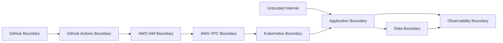

# Initial Threat Model and Data Classification — VisionOps Reliability Platform

## วัตถุประสงค์

เอกสารนี้กำหนด Initial Threat Model และ Data Classification ของ VisionOps Reliability Platform

Threat Model คือเอกสารที่ช่วยระบุว่า

- ระบบมี asset อะไรที่ต้องป้องกัน
- ข้อมูลประเภทใดถือว่า sensitive
- trust boundary ของระบบอยู่ตรงไหน
- threat หรือความเสี่ยงสำคัญมีอะไรบ้าง
- แต่ละ threat มีแนวทางป้องกัน ตรวจจับ และกู้คืนอย่างไร
- security control ใดอยู่ใน scope ของ phase นี้
- security control ใดจะถูก implement ใน phase ถัดไป

เอกสารนี้เป็นส่วนหนึ่งของ M0 — Safety & Design และเป็น design baseline ก่อนเริ่มสร้าง AWS resources, Terraform, Kubernetes, CI/CD หรือ Application จริง

เอกสารนี้อ้างอิงจาก:

- `docs/project-charter.md`
- `docs/requirements/functional-requirements.md`
- `docs/requirements/non-functional-requirements.md`
- `docs/architecture/system-architecture.md`
- `docs/architecture/network-architecture.md`

---

## Threat Model Status

| รายการ | ค่า |
|---|---|
| Version | v0 |
| Phase | M0 — Safety & Design |
| Status | Initial design baseline |
| Implementation status | Not implemented yet |
| Cloud resources created | No |
| Sensitive details recorded | No |
| Owner | Suphanat Chanlek |
| Last updated | 2026-09-07 |

---

## System Summary

VisionOps Reliability Platform เป็นโปรเจกต์แบบ Production-Oriented Lab สำหรับเรียนรู้ Cloud, DevOps, Platform Engineering และ Site Reliability Engineering หรือ SRE

ระบบใช้ **Synthetic Vision Event** เป็น workload กลาง โดยประกอบด้วย component หลัก เช่น

- Dashboard
- Event API
- Worker
- Queue
- Database
- Object Storage
- CI/CD
- GitOps
- Kubernetes
- AWS Infrastructure
- Observability Stack

ระบบนี้ยังไม่ใช่ production-grade service และยังไม่มีผู้ใช้จริงหรือข้อมูลจริงใน Core Scope

---

## Security Goals

เป้าหมายด้าน security ของโปรเจกต์นี้คือ

1. ป้องกัน AWS account และ cloud credit จากการใช้งานผิดพลาดหรือ credential leak
2. ป้องกันไม่ให้ secret, token, key, kubeconfig หรือ Terraform state ถูก commit ขึ้น GitHub
3. ป้องกันการเปิด public access ให้ storage, database หรือ internal service โดยไม่ตั้งใจ
4. ใช้ least privilege เป็นหลักในการออกแบบ IAM, pipeline และ workload permissions
5. ใช้ synthetic data เท่านั้น ไม่ใช้ข้อมูลจริงจากบุคคล บริษัท หรือระบบ production
6. ออกแบบ CI/CD และ GitOps ให้ตรวจสอบย้อนกลับได้
7. ออกแบบ logging และ observability โดยไม่บันทึกข้อมูลลับ
8. แยก Lab Implementation ออกจาก Production Reference Architecture อย่างชัดเจน

---

## Data Classification

| Class | คำอธิบาย | ตัวอย่าง | Policy |
|---|---|---|---|
| Public | ข้อมูลที่เผยแพร่ได้ใน GitHub public repository | README, architecture diagram, synthetic schema, documentation | Commit ได้ |
| Internal Lab | ข้อมูลที่ใช้ใน lab แต่ไม่ใช่ secret | non-sensitive config, fake endpoint, synthetic event example | Commit ได้ถ้าไม่มีข้อมูลอ่อนไหว |
| Sensitive | ข้อมูลที่อาจเปิดเผย context ของ account หรือ environment | AWS account ID, subnet ID, security group ID, billing detail บางส่วน, private endpoint | หลีกเลี่ยงการ commit หรือ redact ก่อนเผยแพร่ |
| Secret | ข้อมูลที่ใช้เข้าถึงระบบหรือควบคุม resource | AWS access key, secret access key, session token, private key, kubeconfig, DB password, MFA secret | ห้าม commit เด็ดขาด |
| Personal Data | ข้อมูลส่วนบุคคลจริง | email เต็ม, เบอร์โทร, รูปบุคคลจริง, customer data | ไม่ใช้ใน Core Scope |

---

## Data Handling Rules

### Allowed in GitHub

ข้อมูลต่อไปนี้สามารถ commit ได้:

- synthetic event schema
- fake sample payload
- architecture diagrams
- Mermaid diagrams
- Terraform examples ที่ไม่มี account-specific secret
- `.env.example`
- `terraform.tfvars.example`
- sanitized evidence
- documentation
- runbooks
- ADRs

### Not Allowed in GitHub

ห้าม commit ข้อมูลต่อไปนี้:

- AWS access key
- AWS secret access key
- AWS session token
- root credentials
- MFA QR code
- MFA secret
- one-time MFA code
- `.env` จริง
- private key เช่น `.pem`, `.key`
- kubeconfig
- Terraform state เช่น `terraform.tfstate`
- Terraform plan ที่มีข้อมูล sensitive
- database password
- real billing detail
- root email เต็ม
- account recovery detail
- real CCTV image
- personal image data
- source code หรือ dataset จากบริษัทที่เคยฝึกงาน

---

## Assets

| Asset | Description | Sensitivity | Protection Goal |
|---|---|---|---|
| AWS Account | Account ที่ใช้ทดลอง cloud resources | High | ป้องกัน unauthorized access และ cost overrun |
| AWS Root User | บัญชีที่มีสิทธิ์สูงสุด | Critical | ใช้เฉพาะ account-level security task |
| AWS Budget | ระบบเตือนค่าใช้จ่าย | Sensitive | ป้องกันค่าใช้จ่ายเกินงบ |
| IAM Roles / Policies | สิทธิ์ของ human, pipeline และ workload | High | ใช้ least privilege |
| GitHub Repositories | `visionops-app`, `visionops-infra`, `visionops-gitops` | Medium / High | ป้องกัน secret leak และ unauthorized change |
| GitHub Actions | CI/CD pipeline ในอนาคต | High | ป้องกัน credential misuse |
| Terraform State | บันทึก state ของ infrastructure | Critical | เก็บแบบ secure, ไม่ commit |
| Container Images | Application artifacts | Medium | ป้องกัน vulnerable หรือ tampered image |
| Kubernetes Cluster | kind local หรือ short-lived EKS | High | ป้องกัน unauthorized access และ misconfiguration |
| kubeconfig | credential สำหรับเข้าถึง cluster | Critical | ห้าม commit |
| S3 Buckets | object, backup, Terraform state ในอนาคต | High | block public access และใช้ encryption |
| SQS Queue / DLQ | event messages | Medium / High | ป้องกัน unauthorized read/write |
| Database | event metadata และ state | High | ห้าม public โดยไม่จำเป็น |
| Observability Data | metrics, logs, traces | Medium | ห้าม log secret และควบคุม retention |
| Evidence Artifacts | screenshots, reports, logs | Medium | ต้อง sanitize ก่อนเผยแพร่ |

---

## Trust Boundaries



| Boundary | ความหมาย |
|---|---|
| Untrusted Internet | client, browser, test traffic หรือ request ภายนอก |
| GitHub Boundary | repository, issues, project board และ pull requests |
| GitHub Actions Boundary | CI/CD runner และ workflow permissions |
| AWS IAM Boundary | roles, policies, identity federation และ permissions |
| AWS VPC Boundary | network boundary ของ cloud resources |
| Kubernetes Boundary | cluster, namespaces, service accounts และ workloads |
| Application Boundary | API, Dashboard, Worker และ Event Generator |
| Data Boundary | PostgreSQL, SQS, S3 และ DLQ |
| Observability Boundary | metrics, logs, traces, dashboards และ alerts |

---

## Threat Scenarios

| ID | Threat | Example | Impact | Prevent | Detect | Recover |
|---|---|---|---|---|---|---|
| T-001 | Root account compromise | Root password/MFA ถูกขโมย | Critical | เปิด MFA, ไม่ใช้ root ประจำ, ไม่มี root access key | AWS account alerts, login review | rotate credentials, review IAM, contact AWS support |
| T-002 | AWS access key leak | เผลอ commit key ขึ้น GitHub | Critical | ใช้ OIDC/temporary credentials, `.gitignore`, no static key | Gitleaks, GitHub secret scanning | revoke key, rotate secret, clean history |
| T-003 | Terraform state leak | `terraform.tfstate` ถูก commit | Critical | `.gitignore`, remote state, encryption | git status review, scanner | remove from repo, rotate secrets referenced in state |
| T-004 | Public S3 bucket | bucket เปิด public โดยไม่ตั้งใจ | High | Block Public Access, IaC policy check | AWS config review, scanner | close public access, review exposure |
| T-005 | Public database | Database เปิด inbound จาก Internet | High | Security group least privilege, private subnet direction | network scan, AWS console review | close inbound, rotate credentials |
| T-006 | Over-privileged IAM | ใช้ `Action:* Resource:*` โดยไม่จำเป็น | High | least privilege, role separation, ADR exception | IAM review, policy scan | tighten policy, rotate affected credentials |
| T-007 | GitHub Actions misuse | workflow ได้สิทธิ์ AWS มากเกินไป | High | OIDC trust condition, environment approval, least privilege | CloudTrail, workflow audit | revoke role trust, disable workflow |
| T-008 | Secret in logs | application log พิมพ์ token/password | High | log redaction, logging policy | log review, scanner | rotate leaked secret, purge logs where possible |
| T-009 | Container vulnerability | image มี critical CVE | Medium / High | base image pinning, Trivy scan | CI image scan | rebuild image, patch dependency |
| T-010 | Malicious dependency | dependency มี supply-chain risk | High | lock files, dependency review, scanner | Dependabot/Trivy reports | pin safe version, rebuild |
| T-011 | Kubernetes secret leak | secret manifest ถูก commit ใน GitOps repo | Critical | no plaintext secret, secret templates only | Gitleaks, PR review | rotate secret, remove file/history |
| T-012 | Unauthorized cluster access | kubeconfig หลุดหรือ RBAC กว้างเกินไป | High | RBAC, no kubeconfig in Git, short-lived access | audit logs, access review | revoke kubeconfig, rotate credentials |
| T-013 | Queue poisoning | malformed event ทำให้ worker fail ซ้ำ | Medium | schema validation, bounded retry, DLQ | DLQ alert, worker error metrics | inspect DLQ, patch validation, redrive safely |
| T-014 | Denial of Service | traffic spike ทำให้ API/worker ล่ม | Medium / High | rate/size limits, HPA direction, queue buffer | metrics, alerts, k6 tests | scale, throttle, rollback |
| T-015 | Cost overrun | EKS/ALB/RDS/NAT เปิดค้าง | High | AWS Budget, short-lived sessions, teardown checklist | budget alerts, cost review | destroy resources, audit orphan resources |
| T-016 | GitOps drift | live cluster ถูกแก้ด้วยมือแล้วต่างจาก Git | Medium | GitOps desired state, restrict manual changes | Argo CD drift detection | reconcile from Git, document break-glass |
| T-017 | Sensitive evidence exposure | screenshot มี account ID/email/billing | Medium / High | sanitize before upload, no sensitive screenshots | manual review | remove evidence, replace sanitized version |
| T-018 | Real data accidentally used | ใช้ภาพจริงหรือข้อมูลบริษัทจริง | High | synthetic-only rule, scope review | data review | delete data, replace synthetic sample |
| T-019 | Insecure failure mode | lab-only failure endpoint เปิดใน demo/public | Medium / High | disabled by default, env guard | config review, tests | disable endpoint, rotate if exposed |
| T-020 | Backup contains secrets | backup หรือ dump มีข้อมูลลับแล้ว commit | High | ignore backup files, sanitize fixtures | git status/scanner | remove backup, rotate secrets |

---

## Data Flow Security Notes

### Create Event Flow

```text
Client
  → Gateway / API
  → Validate payload
  → Database metadata write
  → Queue publish
  → Response with event_id
```

Security expectations:

- request body ต้องมี size limit
- payload ต้อง validate ก่อนบันทึก
- response ไม่เปิดเผย internal error detail เกินจำเป็น
- event ต้องใช้ synthetic data
- correlation ID ใช้สำหรับ debug แต่ไม่ควรเป็น secret

---

### Worker Processing Flow

```text
Queue
  → Worker
  → Database update
  → Synthetic processing
  → Object storage write
  → Queue delete
```

Security expectations:

- worker permission ต้องจำกัดเฉพาะ queue/bucket/table ที่จำเป็น
- delete message หลัง durable success เท่านั้น
- poison message ต้องไม่ทำให้ retry infinite
- error logs ต้องไม่พิมพ์ secret

---

### CI/CD and GitOps Flow

```text
GitHub PR
  → GitHub Actions
  → Build / test / scan
  → Container registry
  → GitOps repository
  → Argo CD
  → Kubernetes
```

Security expectations:

- ไม่ใช้ long-lived AWS access key เป็น baseline
- workflow permission ต้องจำกัด
- release artifact ต้อง trace กลับไป commit ได้
- GitOps repo ห้ามมี plaintext secret
- deployment ควรใช้ immutable image tag หรือ digest ใน phase ถัดไป

---

## Security Controls by Phase

| Phase | Control |
|---|---|
| M0 | Root MFA, root access keys = 0, AWS Budget, `.gitignore`, threat model, no secret evidence |
| M1 | Linux user permission, SSH key discipline, firewall, systemd hardening |
| M2 | input validation, structured logs, no real data, container baseline |
| M3 | Terraform state protection, IAM least privilege, S3/SQS security |
| M4 | Kubernetes RBAC, service accounts, security context, NetworkPolicy direction |
| M5 | GitHub OIDC, CI security scanning, image scanning, GitOps safety |
| M6 | EKS workload identity, ALB/SQS/S3 integration security |
| M7 | log redaction, observability access, alert safety |
| M8 | incident response, backup/restore security, GameDay safety |
| M9 | final security audit and sanitized evidence release |

---

## Initial Security Requirements Mapping

| Requirement | Related Threats |
|---|---|
| No secrets in Git | T-002, T-003, T-011, T-020 |
| Root MFA enabled | T-001 |
| Root access keys = 0 | T-001, T-002 |
| AWS Budget configured | T-015 |
| Synthetic data only | T-018 |
| No public storage/database | T-004, T-005 |
| Least privilege IAM | T-006, T-007 |
| Bounded retry and DLQ | T-013 |
| Observability without secrets | T-008, T-017 |
| GitOps desired state | T-016 |

---

## Current Controls Already Completed

| Control | Status | Evidence |
|---|---|---|
| GitHub repositories created | Completed | GitHub project / repositories |
| Project charter created | Completed | `docs/project-charter.md` |
| AWS root MFA enabled | Completed | Sanitized issue evidence |
| Root access keys count = 0 | Completed | Sanitized issue evidence |
| AWS Budget configured | Completed | Sanitized issue evidence |
| `.gitignore` baseline created | Completed | `.gitignore` |
| Version matrix created | Completed | `docs/version-matrix.md` |
| Functional and non-functional requirements created | Completed | `docs/requirements/` |
| Architecture v0 created | Completed | `docs/architecture/` |
| ADR-001 created | Completed | `docs/adrs/ADR-001-compute-platform.md` |

---

## Controls Not Implemented Yet

| Control | Planned Phase |
|---|---|
| GitHub Actions OIDC | M5 |
| Terraform remote state | M3 |
| IAM role separation | M3 / M5 |
| ECR image scanning | M5 |
| Trivy / Gitleaks / Checkov / TFLint | M3 / M5 |
| Kubernetes RBAC | M4 |
| Kubernetes NetworkPolicy | M4 |
| Workload identity for pods | M6 |
| Secret manager integration | Optional / later phase |
| Alerting and incident runbooks | M7 / M8 |
| Backup and restore validation | M8 |

---

## Security Assumptions

- ใช้ AWS account ส่วนตัวสำหรับ lab
- ใช้ synthetic data เท่านั้น
- ไม่มีข้อมูลผู้ใช้จริงใน Core Scope
- ไม่มี production traffic จริง
- ไม่มีการเปิด service 24/7
- EKS จะใช้แบบ short-lived lab
- GitHub repository เป็น public แต่ต้องไม่มี secret
- Evidence ต้อง sanitize ก่อนเผยแพร่
- Terraform และ Kubernetes ยังไม่ได้ implement ใน phase นี้

---

## Out of Scope

Threat Model รอบนี้ยังไม่ครอบคลุมแบบ production เต็มรูปแบบ เช่น

- external penetration test
- compliance audit เช่น ISO 27001, SOC 2, HIPAA
- multi-account AWS organization governance
- multi-region disaster recovery
- enterprise identity federation เต็มรูปแบบ
- real customer data privacy program
- production WAF tuning
- full secret rotation platform
- 24/7 incident response team
- legal SLA / contractual security requirements

---

## Security Review Checklist

ก่อนปิด Issue นี้ต้องตรวจว่า

- [ ] ไม่มี AWS account ID ในเอกสาร
- [ ] ไม่มี access key หรือ secret
- [ ] ไม่มี root email หรือเบอร์โทร
- [ ] ไม่มี MFA QR code หรือ secret
- [ ] ไม่มี kubeconfig
- [ ] ไม่มี Terraform state
- [ ] ไม่มี billing information
- [ ] ไม่มี private endpoint จริง
- [ ] ไม่มี screenshot ที่เปิดเผยข้อมูลอ่อนไหว
- [ ] ทุก evidence เป็น sanitized evidence

---

## Evidence

เอกสารนี้เป็น design baseline เท่านั้น ยังไม่มีการสร้าง AWS resource จริงจาก threat model นี้

| Evidence | Status |
|---|---|
| Threat model created | Yes |
| Data classification created | Yes |
| Assets listed | Yes |
| Trust boundaries defined | Yes |
| Threat scenarios listed | Yes |
| Prevent / Detect / Recover controls defined | Yes |
| Cloud resources created | No |
| Sensitive details recorded | No |

---

## Change Log

| Date | Change |
|---|---|
| 2026-09-07 | Created initial threat model and data classification |